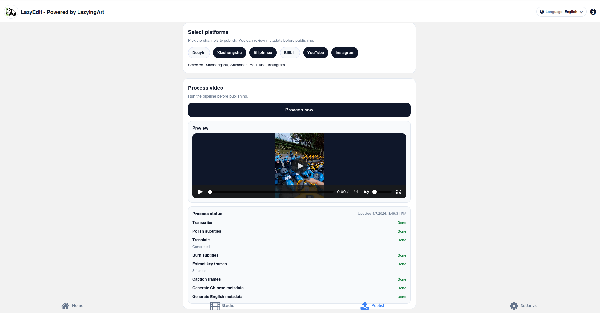
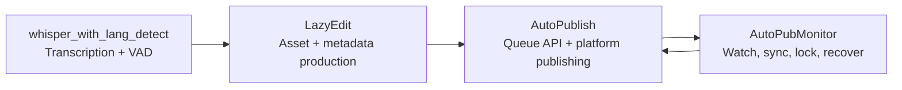

[English](README.md) · [العربية](i18n/README.ar.md) · [Español](i18n/README.es.md) · [Français](i18n/README.fr.md) · [日本語](i18n/README.ja.md) · [한국어](i18n/README.ko.md) · [Tiếng Việt](i18n/README.vi.md) · [中文 (简体)](i18n/README.zh-Hans.md) · [中文（繁體）](i18n/README.zh-Hant.md) · [Deutsch](i18n/README.de.md) · [Русский](i18n/README.ru.md)


[](https://github.com/lachlanchen/lachlanchen/blob/main/figs/banner.png)

# AutoPublication


<p align="center">
  
  <br />
  <sub>LazyEdit Studio inside the AutoPublication stack: platform selection, preview, process status, and publish queue.</sub>
</p>

Canonical root documentation for a pinned, submodule-based AI video workflow stack.

## 📌 At a Glance

| Area | Details |
| --- | --- |
| Repository type | Meta-repository with pinned git submodules |
| Root runtime role | Documentation + orchestration entrypoint |
| Core submodules | `AutoPubMonitor`, `LazyEdit`, `AutoPublish`, `whisper_with_lang_detect` |
| Canonical docs source | Root `README.md` |
| Language variants | `i18n/README.*.md` |
| Latest pipeline artifact snapshot | `.auto-readme-work/20260302_124338/` |

## 🧭 Overview

`AutoPublication` coordinates an end-to-end content automation pipeline:

1. Prepare, edit, and generate assets in `LazyEdit`.
2. Run standalone multilingual transcription/VAD workflows in `whisper_with_lang_detect`.
3. Publish assets to target platforms in `AutoPublish`.
4. Keep queue/watch/sync operations healthy with `AutoPubMonitor`.

The root repository intentionally pins submodule commits to preserve reproducibility across environments and deployment hosts.

### What this repository is

- Canonical root docs for setup, operations, and integration.
- Gitlink pinning layer for submodule versions.
- Multilingual documentation source (`i18n/README.*.md`).
- Pipeline trace and artifact history (`.auto-readme-work/*`).

### What this repository is not

- Not a single runtime package with one root dependency manifest.
- Not a replacement for each submodule's README/scripts.
- Not currently a root-level unified `.env` schema.

## ✨ Features

- Reproducible architecture via pinned submodule commits.
- Clear ownership boundaries between editing, publishing, and monitoring.
- Linux-first operations (`tmux`, optional `systemd`, FFmpeg, browser automation).
- Documentation-first workflow with i18n variants.
- Traceable README generation context under `.auto-readme-work/`.

## 🧱 Submodule Architecture

### Root module map

| Module | Role | Runtime profile | Typical entrypoints |
| --- | --- | --- | --- |
| `AutoPubMonitor` | Queue/watch/sync orchestration around publication workflows | Shell-first + Python helpers + `tmux`/optional `systemd` | `autopub_monitor/autopub_monitor_tmux_session.sh`, `autopub_monitor/process_queue.sh`, `autopub_monitor/monitor_autopublish.sh` |
| `LazyEdit` | AI-assisted media generation/editing/subtitle/metadata workflow | Tornado backend + Expo frontend + processing modules | `app.py`, `start_lazyedit.sh`, `app/`, `lazyedit/` |
| `AutoPublish` | Browser-driven multi-platform publishing and queue API service | Python scripts + Selenium + Tornado queue API | `autopub.py`, `app.py`, `pub_*.py`, `login_*.py` |
| `whisper_with_lang_detect` | Standalone multilingual transcription + Silero VAD toolchain | Python CLI + Whisper + torchaudio/soundfile audio IO | `vad_lang_subtitle.py`, `SCRIPT_LOGIC.md` |

### Dependency boundaries

| Boundary | In scope | Out of scope |
| --- | --- | --- |
| `LazyEdit` | Editing/generation pipeline, UI/backend, subtitle and metadata preparation | Platform login automation and per-platform publish actions |
| `whisper_with_lang_detect` | Reusable transcription/VAD pipeline and Whisper compatibility layer | Editor UI, publish automation, queue supervision |
| `AutoPublish` | Publisher adapters, auth/session handling, queue API, publish execution | Editing/transcription UI and most upstream transforms |
| `AutoPubMonitor` | Queue watchers, locks, sync jobs, tmux/service supervision | Editor UI behavior and deep per-platform browser flows |
| Root (`AutoPublication`) | Docs, version orchestration, submodule pinning policy | Unified runtime dependency management |

### Integration contracts

| Handoff | Producer | Consumer | Contract focus |
| --- | --- | --- | --- |
| Raw/normalized transcription artifacts | `whisper_with_lang_detect` | `LazyEdit` and operators | WAV/SRT/JSON conventions, Whisper model behavior, VAD segmentation |
| Prepared media assets | `LazyEdit` | `AutoPublish` | Directory conventions, filenames, media readiness |
| Metadata/captions | `LazyEdit` | `AutoPublish` | Title/description/tag schema and caption availability |
| Publish state and queue health | `AutoPublish` | `AutoPubMonitor` | API endpoint availability and queue semantics |
| Sync/watchdog control | `AutoPubMonitor` | `AutoPublish` + ops | Lock discipline, queue integrity, recoverable restarts |

### Runtime ownership flow



1. `whisper_with_lang_detect` provides the standalone transcription/VAD layer.
2. `LazyEdit` produces videos and metadata packages.
3. `AutoPublish` executes channel/platform publish actions.
4. `AutoPubMonitor` supervises queue and synchronization loops.

## 📦 Current Submodule Pins

Current root pins (`git submodule status`):

- `AutoPubMonitor`: `6daa87ce612c2dab75fac9478d4523abd418f69d`
- `AutoPublish`: `4f348ac342bfaff7bc435985085cedd9b448e1e8`
- `LazyEdit`: `5d515694d824d593e635713cafb7bb65955a1700`
- `whisper_with_lang_detect`: `aa8fed3d97322cbbc1dba6be38ec46d92b9c2624`

Check locally:

```bash
git submodule status
git submodule status --recursive
```

Nested note: `LazyEdit` still includes additional nested submodules (for example `furigana` and captioning repos). `whisper_with_lang_detect` is also pinned directly at the root so the transcription tool can be developed or updated independently of the full `LazyEdit` tree.

## 🗂️ Project Structure

```text
AutoPublication/
├── README.md
├── .gitmodules
├── .gitignore
├── i18n/
│   ├── README.ar.md
│   ├── README.de.md
│   ├── README.es.md
│   ├── README.fr.md
│   ├── README.ja.md
│   ├── README.ko.md
│   ├── README.ru.md
│   ├── README.vi.md
│   ├── README.zh-Hans.md
│   └── README.zh-Hant.md
├── AutoPubMonitor/                  # submodule
│   ├── README.md
│   └── autopub_monitor/
├── LazyEdit/                        # submodule
│   ├── README.md
│   ├── app.py
│   ├── app/
│   └── lazyedit/
├── AutoPublish/                     # submodule
│   ├── README.md
│   ├── app.py
│   ├── autopub.py
│   └── pub_*.py
├── whisper_with_lang_detect/        # submodule
│   ├── SCRIPT_LOGIC.md
│   └── vad_lang_subtitle.py
└── .auto-readme-work/
    └── <timestamp>/
        ├── pipeline-context.md
        ├── language-nav-root.md
        ├── language-nav-i18n.md
        ├── translation-plan.txt
        └── repo-structure-analysis.md
```

### Notable paths

| Path | Purpose |
| --- | --- |
| `.gitmodules` | Declares submodule remotes and paths |
| `i18n/README.*.md` | Localized root README variants |
| `.auto-readme-work/*` | README generation traces/artifacts |
| `AutoPubMonitor/autopub_monitor/autopub.config` | Monitor queue/sync/runtime config |
| `LazyEdit/config.py` | LazyEdit environment/path defaults |
| `AutoPublish/.env.example` | AutoPublish credential/env template |
| `whisper_with_lang_detect/vad_lang_subtitle.py` | Standalone transcription/VAD entrypoint |

## 🧰 Prerequisites

Linux-first baseline across modules:

- `git` (submodule-capable)
- `bash`
- Python `3.10+` (some monitor installers still assume `3.8` env names)
- `tmux`
- `ffmpeg` / `ffprobe`
- `inotify-tools`
- `rsync`
- Chrome/Chromium + compatible WebDriver
- Node.js + npm (for `LazyEdit/app` frontend)
- Optional: `systemd`, `conda`

Assumption: macOS/Windows require script/path/service adaptations.

## 🛠️ Installation and Bootstrap

### 1. Clone with submodules

```bash
git clone --recurse-submodules git@github.com:lachlanchen/AutoPublication.git
cd AutoPublication
```

If already cloned:

```bash
git submodule update --init --recursive
```

### 2. Sync and verify submodule alignment

```bash
git submodule sync --recursive
git submodule status --recursive
git submodule foreach --recursive 'git rev-parse --abbrev-ref HEAD; git rev-parse --short HEAD'
```

### 3. Setup flow by submodule

| Submodule | Primary config | Setup focus | First validation |
| --- | --- | --- | --- |
| `LazyEdit` | `config.py` (+ optional `.env`) | Python/backend deps, frontend deps, upload/output/API paths | `cd LazyEdit && python app.py` |
| `AutoPublish` | `.env` (from `.env.example`) | Credentials, browser driver, queue/API mode | `cd AutoPublish && python app.py --port 8081` |
| `AutoPubMonitor` | `autopub_monitor/autopub.config` | Queue/sync/lock paths, API target, tmux/service setup | `cd AutoPubMonitor && ./autopub_monitor/autopub_monitor_tmux_session.sh start` |

Authoritative module docs:

- `AutoPubMonitor/README.md`
- `LazyEdit/README.md`
- `AutoPublish/README.md`

## ▶️ Usage and Operations

Root usage is primarily orchestration and version alignment.

### Daily operator flow

```bash
# Keep checkout aligned to root pins
git submodule sync --recursive
git submodule update --init --recursive

# Verify current state
git submodule status --recursive
```

### End-to-end runtime flow

1. Start `LazyEdit` and prepare assets.
2. Start `AutoPublish` in API mode or CLI watcher mode.
3. Start `AutoPubMonitor` for queue/sync/watchdog continuity.

### Quick start commands

```bash
# LazyEdit
cd LazyEdit
python app.py
# optional frontend in second terminal:
# cd app && npx expo start --web

# AutoPublish
cd ../AutoPublish
python app.py --port 8081
# or CLI watcher mode:
# python autopub.py --help

# AutoPubMonitor
cd ../AutoPubMonitor
./autopub_monitor/autopub_monitor_tmux_session.sh start
```

## 🧪 Local Development Workflow

### Recommended loop

1. Re-align to root pins before coding.
2. Develop and test inside one submodule at a time.
3. Validate cross-submodule handoffs (`LazyEdit -> AutoPublish -> AutoPubMonitor`).
4. Commit implementation changes in submodule repos first.
5. Commit root pointer updates (`gitlinks`) last.

### Pointer bump flow (example)

```bash
# root align first
git submodule sync --recursive
git submodule update --init --recursive

# edit and commit in submodule
cd LazyEdit
git switch -c feature/<name>
# ...change/test...
git add -A && git commit -m "feat: <summary>"
cd ..

# capture new pointer in root
git add LazyEdit
git commit -m "chore(submodule): bump LazyEdit pointer"
```

### Commit boundary rules

- Root commits should focus on docs, orchestration conventions, and pointer bumps.
- Implementation changes should be committed in submodule repos first.
- Keep root pointer commits separate from large docs/content edits when possible.

## ⚙️ Configuration

There is no root unified runtime config. Configure each submodule directly:

### `AutoPubMonitor`

- File: `AutoPubMonitor/autopub_monitor/autopub.config`
- Typical values: queue files, lock files, sync paths, API base URL, conda env, script paths

### `LazyEdit`

- File: `LazyEdit/config.py` (plus optional `.env`)
- Typical values: upload/output directories, backend port, AutoPublish endpoint, subtitle/caption tools, timeouts

### `AutoPublish`

- File: `AutoPublish/.env.example` (copy to local `.env`)
- Typical values: platform credentials, browser/driver paths, SMTP/email settings, captcha service keys

Security recommendation: keep machine-specific config and secrets in ignored files/environment variables.

## 🔄 Submodule Update Strategy

### A. Initialize and sync to current pins

```bash
git submodule sync --recursive
git submodule update --init --recursive
```

### B. Update intentionally to remote tips

Use only when you explicitly intend to move pinned versions:

```bash
git submodule update --remote --recursive
```

Then verify and commit pointers:

```bash
git add AutoPubMonitor LazyEdit AutoPublish
git commit -m "chore(submodules): bump submodule pointers"
```

### C. Pin to explicit commit or tag

```bash
cd LazyEdit
git fetch origin
git checkout <commit-or-tag>
cd ..
git add LazyEdit
git commit -m "chore(submodule): pin LazyEdit to <commit-or-tag>"
```

Repeat for `AutoPubMonitor` and `AutoPublish` as needed.

### D. Review pointer deltas before merge

```bash
git diff --submodule=log
git submodule status --recursive
```

### E. Recommended release playbook

1. Sync/init recursively.
2. Update one submodule at a time.
3. Run submodule-level smoke tests.
4. Run integration smoke checks across handoff boundaries.
5. Stage only intended gitlink changes.
6. Commit with explicit module names and rationale.

### F. Pinning policy

- Keep root pinned to known-good commits.
- Avoid broad all-module bumps without integration validation.
- Use explicit pin messages (`chore(submodule): pin <module> to <sha>`).
- Treat root as the release manifest; treat submodule branches as implementation streams.

## 🔧 Troubleshooting (Submodule Sync and State)

### Submodule directory is empty or missing files

```bash
git submodule sync --recursive
git submodule update --init --recursive
```

### `fatal: no submodule mapping found in .gitmodules`

Usually stale metadata or a path mismatch:

```bash
cat .gitmodules
git submodule sync --recursive
git submodule update --init --recursive
```

### `git submodule status` shows `-`, `+`, or `U`

- `-`: submodule not initialized.
- `+`: checked-out commit differs from root pin.
- `U`: merge conflict in submodule pointer.

Recovery:

```bash
git submodule update --init --recursive
```

If divergence is intentional, commit gitlink updates in root.

### Detached HEAD inside submodule

Detached HEAD is normal for pinned submodules. Create a branch before development:

```bash
cd <submodule>
git switch -c feature/<name>
```

### Wrong remote URL for a submodule

```bash
git submodule sync --recursive
git submodule foreach --recursive 'git remote -v'
```

If `.gitmodules` changed, commit it and re-sync.

### Merge conflicts on submodule pointers

Pick intended commit pointers, then:

```bash
git add AutoPubMonitor LazyEdit AutoPublish
git commit
```

Validate selected SHAs:

```bash
git diff --submodule=log
git submodule status --recursive
```

### Clone/update authentication failures

Root `.gitmodules` currently uses SSH remotes (`git@github.com:...`).

- Ensure GitHub SSH keys are configured.
- Or switch to HTTPS remotes in `.gitmodules`, then run `git submodule sync --recursive`.

### Submodule appears dirty unexpectedly

```bash
git submodule foreach --recursive 'git status --short --branch'
```

Commit intentional changes in each submodule first, then update root pointers.

### Nested submodules in `LazyEdit` are not initialized

```bash
git submodule update --init --recursive
```

If only `LazyEdit` nested modules need refresh:

```bash
git -C LazyEdit submodule update --init --recursive
```

### Hard resync when metadata is stale

Use when standard sync/update does not recover state:

```bash
git submodule deinit -f --all
git submodule sync --recursive
git submodule update --init --recursive
```

## 🛠️ Development Notes

### i18n policy

- Keep exactly one language options line at the top.
- Propagate structural changes to `i18n/README.*.md`.

### Pipeline context artifacts

- Pipeline artifacts are stored in `.auto-readme-work/<timestamp>/`.
- Use them for traceability and doc generation history, not runtime inputs.

## 🗺️ Roadmap

- [ ] Add root orchestration scripts for common cross-submodule tasks.
- [ ] Add CI checks for submodule sync health and pin drift.
- [ ] Add automated root/i18n README parity checks.
- [ ] Add architecture diagram for end-to-end runtime flow.
- [ ] Add root `LICENSE` policy file if repository-level licensing is intended.

## 🤝 Contributing

Contributions are welcome for docs, architecture clarity, and workflow reliability.

```bash
# 1) create branch
git checkout -b docs/<short-description>

# 2) stage docs and/or intended pointer updates
git add README.md i18n/README.fr.md AutoPubMonitor LazyEdit AutoPublish

# 3) commit
git commit -m "docs: improve root architecture and submodule workflows"

# 4) push
git push -u origin docs/<short-description>
```

PR checklist:

- Keep root `README.md` canonical.
- Keep one language-options line and one support panel.
- Include `git submodule status` in PR notes when bumping pins.
- Document rationale for each submodule pointer update.

## Submodules

This repository includes these root-level git submodules:

| Submodule | Repository |
| --- | --- |
| `AutoPubMonitor` | https://github.com/lachlanchen/AutoPubMonitor |
| `LazyEdit` | https://github.com/lachlanchen/LazyEdit |
| `AutoPublish` | https://github.com/lachlanchen/AutoPublish |

## ❤️ Support

| Donate | PayPal | Stripe |
| --- | --- | --- |
| [](https://chat.lazying.art/donate) | [](https://paypal.me/RongzhouChen) | [](https://buy.stripe.com/aFadR8gIaflgfQV6T4fw400) |

## Contact

Use repository issues for questions, documentation corrections, and contribution coordination.

## 📄 License

No root-level `LICENSE` file is currently present in this repository snapshot.

Assumptions:

- Licensing may be delegated to individual submodules.
- Review each submodule license before redistribution or commercial use.
