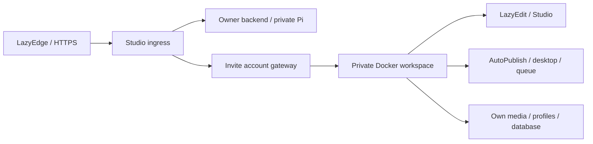

[English](README.md) · [العربية](i18n/README.ar.md) · [Español](i18n/README.es.md) · [Français](i18n/README.fr.md) · [日本語](i18n/README.ja.md) · [한국어](i18n/README.ko.md) · [Tiếng Việt](i18n/README.vi.md) · [中文 (简体)](i18n/README.zh-Hans.md) · [中文（繁體）](i18n/README.zh-Hant.md) · [Deutsch](i18n/README.de.md) · [Русский](i18n/README.ru.md)

[](https://github.com/lachlanchen/lachlanchen/blob/main/figs/banner.png)

# AutoPublication

*Edit, correct and publish video or music from one private workspace.*

[](https://edit.lazying.art) [](https://github.com/sponsors/lachlanchen)

AutoPublication integrates LazyEdit, AutoPublish, AutoPubMonitor and multilingual transcription through pinned source repositories. The invite-only Docker service provides each user with a private Linux desktop for platform login, an editing backend and a persistent publication queue.

| Donate | PayPal | Stripe |
| --- | --- | --- |
| [](https://chat.lazying.art/donate) | [](https://paypal.me/RongzhouChen) | [](https://buy.stripe.com/aFadR8gIaflgfQV6T4fw400) |

## How it works

The current service is [edit.lazying.art](https://edit.lazying.art); invited users enter at [/accounts](https://edit.lazying.art/accounts). The original owner keeps the existing backend and private Pi publisher. Other users receive separate Docker workers, media, settings, databases and browser profiles. A separate domain is optional for this trusted pilot.


```mermaid
flowchart LR
    E[LazyEdge / HTTPS] --> R[Studio ingress]
    R --> O[Owner backend / private Pi]
    R --> G[Invite account gateway]
    G --> W[Private Docker workspace]
    W --> L[LazyEdit / Studio]
    W --> A[AutoPublish / desktop / queue]
    W --> D[Own media / profiles / database]
```

## Pinned components

| Component | Commit | |
| --- | --- | --- |
| `LazyEdit` | `00e1d9c` | Editing, correction, Studio API and hosted containers |
| `AutoPublish` | `3cc34fd` | Platform adapters, login profiles and durable browser queue |
| `AutoPubMonitor` | `a097a054` | Existing watch/sync supervision |
| `whisper_with_lang_detect` | `5b02dceb` | Standalone transcription and VAD |

[docs/hosted-service.md](docs/hosted-service.md) · [LazyEdit](https://github.com/lachlanchen/LazyEdit) · [AutoPublish](https://github.com/lachlanchen/AutoPublish) · [AutoPubMonitor](https://github.com/lachlanchen/AutoPubMonitor) · [MultilingualWhisper](https://github.com/lachlanchen/MultilingualWhisper)

## Quick start

Linux x86-64, Docker/Compose, Node 22 and a suitable Python environment are required for hosted operation. Build/init/start recipes and current LazyEdge routing are in the deployment guide; cloning does not deploy a service.

```bash
git clone https://github.com/lachlanchen/AutoPublication.git
cd AutoPublication
git submodule update --init --recursive
scripts/autopublication --help
```

## Operation and privacy

Keep passwords, keys, tokens, cookies, profiles, account databases and private media outside Git. Each workspace shares one canonical media store between editing and publishing; completed uploads are renamed and terminal extraction scratch is cleaned. Source, edited master and reusable ZIP remain distinct artifacts. Changes here do not restart the owner’s pipeline.

[AGENTS.md](AGENTS.md) · [docs/hosted-service.md](docs/hosted-service.md)

## Validation

Run account/transport tests and the public-file check before publishing code. Actual platform submissions are excluded from smoke tests. Implement and push fixes in the owning repository first, then update these pins.

```bash
npm ci --prefix LazyEdit/app --no-audit --no-fund
scripts/autopublication test
python scripts/check_public_files.py
```

## Status and scope

Invite-only pilot deployed through the existing HTTPS/LazyEdge route. Account provisioning, private WSS desktop, scoped API login, resumable upload and owner isolation were verified. CPU Whisper is the tested runtime. Fresh platform accounts require their own QR/2FA login. Billing, account recovery, hard storage quotas and hostile-tenant hardening are not implemented.

## Citation

GitHub reads [CITATION.cff](CITATION.cff) to provide the repository citation. Use the stable entry below when referencing this software.

```bibtex
@software{chen_autopublication_2026,
  author = {Chen, Lachlan},
  title = {AutoPublication: account-isolated video and music publishing},
  year = {2026},
  url = {https://github.com/lachlanchen/AutoPublication}
}
```

## Support

Support maintenance through [GitHub Sponsors](https://github.com/sponsors/lachlanchen) or the links above.
