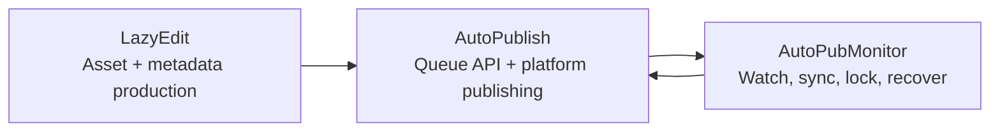

[English](../README.md) · [العربية](README.ar.md) · [Español](README.es.md) · [Français](README.fr.md) · [日本語](README.ja.md) · [한국어](README.ko.md) · [Tiếng Việt](README.vi.md) · [中文 (简体)](README.zh-Hans.md) · [中文（繁體）](README.zh-Hant.md) · [Deutsch](README.de.md) · [Русский](README.ru.md)


[](https://github.com/lachlanchen/lachlanchen/blob/main/figs/banner.png)

# AutoPublication


الوثيقة الجذرية المرجعية لبنية عمل مؤتمتة للفيديو بالذكاء الاصطناعي، تعتمد على submodules مثبتة (pinned).

## 📌 لمحة سريعة

| المجال | التفاصيل |
| --- | --- |
| نوع المستودع | مستودع وصفي (Meta-repository) مع git submodules مثبتة |
| دور الجذر أثناء التشغيل | التوثيق + نقطة دخول للتنسيق (orchestration) |
| الوحدات الفرعية الأساسية | `AutoPubMonitor`، `LazyEdit`، `AutoPublish` |
| المصدر المرجعي للوثائق | الملف الجذري `README.md` |
| النسخ اللغوية | `i18n/README.*.md` |
| أحدث لقطة من نواتج خط الأنابيب | `.auto-readme-work/20260302_124338/` |

## 🧭 نظرة عامة

يُنسّق `AutoPublication` خطًا متكاملًا لأتمتة المحتوى من البداية إلى النهاية:

1. التحضير والتحرير وتوليد الأصول داخل `LazyEdit`.
2. نشر الأصول إلى المنصات المستهدفة عبر `AutoPublish`.
3. الحفاظ على سلامة عمليات الطوابير/المراقبة/المزامنة عبر `AutoPubMonitor`.

يعمد المستودع الجذري عمدًا إلى تثبيت commit محددة للوحدات الفرعية لضمان قابلية إعادة الإنتاج عبر البيئات ومضيفي النشر.

### ما الذي يمثله هذا المستودع

- توثيق جذري مرجعي للإعداد والتشغيل والتكامل.
- طبقة تثبيت إصدارات الوحدات الفرعية عبر gitlinks.
- مصدر الوثائق متعددة اللغات (`i18n/README.*.md`).
- تتبّع خط الأنابيب وسجل النواتج (`.auto-readme-work/*`).

### ما الذي لا يمثله هذا المستودع

- ليس حزمة تشغيل واحدة بملف تبعيات جذري موحّد.
- ليس بديلًا عن README أو السكربتات الخاصة بكل وحدة فرعية.
- لا يوفّر حاليًا مخطط `.env` موحّدًا على مستوى الجذر.

## ✨ الميزات

- بنية قابلة لإعادة الإنتاج عبر commits مثبتة للوحدات الفرعية.
- حدود ملكية واضحة بين التحرير والنشر والمراقبة.
- تشغيل موجّه أساسًا للينكس (`tmux`، `systemd` اختياريًا، FFmpeg، وأتمتة المتصفح).
- سير عمل قائم على التوثيق مع نسخ i18n.
- سياق قابل للتتبع لتوليد README ضمن `.auto-readme-work/`.

## 🧱 معمارية الوحدات الفرعية

### خريطة الوحدات على مستوى الجذر

| الوحدة | الدور | ملف التشغيل | نقاط الدخول الشائعة |
| --- | --- | --- | --- |
| `AutoPubMonitor` | تنسيق queue/watch/sync حول سير النشر | Shell-first + مساعدات Python + `tmux`/`systemd` اختياري | `autopub_monitor/autopub_monitor_tmux_session.sh`، `autopub_monitor/process_queue.sh`، `autopub_monitor/monitor_autopublish.sh` |
| `LazyEdit` | سير عمل توليد/تحرير الوسائط/الترجمة/البيانات الوصفية بمساعدة الذكاء الاصطناعي | Backend بـ Tornado + Frontend بـ Expo + وحدات معالجة | `app.py`، `start_lazyedit.sh`، `app/`، `lazyedit/` |
| `AutoPublish` | نشر متعدد المنصات عبر المتصفح مع خدمة Queue API | سكربتات Python + Selenium + Queue API عبر Tornado | `autopub.py`، `app.py`، `pub_*.py`، `login_*.py` |

### حدود التبعيات

| الحد | ضمن النطاق | خارج النطاق |
| --- | --- | --- |
| `LazyEdit` | خط تحرير/توليد، واجهة ومخدم، إعداد الترجمة والبيانات الوصفية | أتمتة تسجيل الدخول للمنصات وإجراءات النشر الخاصة بكل منصة |
| `AutoPublish` | موائمات النشر، إدارة auth/session، Queue API، تنفيذ النشر | واجهة التحرير/التفريغ ومعظم التحويلات في المنبع |
| `AutoPubMonitor` | مراقبة الطوابير، الأقفال، مهام المزامنة، إشراف tmux/service | سلوك واجهة المحرر وتدفّقات المتصفح العميقة لكل منصة |
| الجذر (`AutoPublication`) | التوثيق، تنسيق الإصدارات، سياسة تثبيت الوحدات الفرعية | إدارة تبعيات تشغيل موحّدة |

### عقود التكامل

| التسليم | المنتج | المستهلك | محور العقد |
| --- | --- | --- | --- |
| أصول وسائط مجهّزة | `LazyEdit` | `AutoPublish` | اصطلاحات المجلدات، أسماء الملفات، جاهزية الوسائط |
| البيانات الوصفية/التسميات | `LazyEdit` | `AutoPublish` | مخطط العنوان/الوصف/الوسوم وتوفّر التسميات |
| حالة النشر وصحة الطابور | `AutoPublish` | `AutoPubMonitor` | توافر نقاط API ودلالات الطابور |
| تحكم sync/watchdog | `AutoPubMonitor` | `AutoPublish` + العمليات | انضباط الأقفال، سلامة الطابور، إعادة تشغيل قابلة للتعافي |

### تدفق ملكية التشغيل



1. ينتج `LazyEdit` ملفات الفيديو وحزم البيانات الوصفية.
2. ينفّذ `AutoPublish` إجراءات النشر على القنوات/المنصات.
3. يشرف `AutoPubMonitor` على حلقات الطابور والمزامنة.

## 📦 التثبيت الحالي للوحدات الفرعية

التثبيتات الحالية على الجذر (`git submodule status`):

- `AutoPubMonitor`: `6daa87ce612c2dab75fac9478d4523abd418f69d`
- `AutoPublish`: `4f348ac342bfaff7bc435985085cedd9b448e1e8`
- `LazyEdit`: `dc503d6db63b13db812fef5d9c8ffe0a882d725e`

تحقق محليًا:

```bash
git submodule status
git submodule status --recursive
```

ملاحظة nested: يتضمن `LazyEdit` وحدات فرعية متداخلة إضافية (مثل `whisper_with_lang_detect` و`furigana` ومستودعات captioning)، لذا يُفضّل استخدام `--recursive` في كثير من عمليات الجذر.

## 🗂️ بنية المشروع

```text
AutoPublication/
├── README.md
├── .gitmodules
├── .gitignore
├── i18n/
│   ├── README.ar.md
│   ├── README.de.md
│   ├── README.es.md
│   ├── README.fr.md
│   ├── README.ja.md
│   ├── README.ko.md
│   ├── README.ru.md
│   ├── README.vi.md
│   ├── README.zh-Hans.md
│   └── README.zh-Hant.md
├── AutoPubMonitor/                  # submodule
│   ├── README.md
│   └── autopub_monitor/
├── LazyEdit/                        # submodule
│   ├── README.md
│   ├── app.py
│   ├── app/
│   └── lazyedit/
├── AutoPublish/                     # submodule
│   ├── README.md
│   ├── app.py
│   ├── autopub.py
│   └── pub_*.py
└── .auto-readme-work/
    └── <timestamp>/
        ├── pipeline-context.md
        ├── language-nav-root.md
        ├── language-nav-i18n.md
        ├── translation-plan.txt
        └── repo-structure-analysis.md
```

### مسارات مهمّة

| المسار | الغرض |
| --- | --- |
| `.gitmodules` | يعرّف المسارات وremotes الخاصة بالوحدات الفرعية |
| `i18n/README.*.md` | نسخ README الجذرية المترجمة |
| `.auto-readme-work/*` | آثار/ناتج توليد README |
| `AutoPubMonitor/autopub_monitor/autopub.config` | إعدادات queue/sync/runtime للمراقب |
| `LazyEdit/config.py` | القيم الافتراضية للبيئة/المسارات في LazyEdit |
| `AutoPublish/.env.example` | قالب بيانات الاعتماد/البيئة لـ AutoPublish |

## 🧰 المتطلبات المسبقة

الحد الأدنى عبر الوحدات موجه للينكس:

- `git` (يدعم submodules)
- `bash`
- Python `3.10+` (بعض مثبّتات monitor لا تزال تفترض أسماء بيئة `3.8`)
- `tmux`
- `ffmpeg` / `ffprobe`
- `inotify-tools`
- `rsync`
- Chrome/Chromium + WebDriver متوافق
- Node.js + npm (لواجهة `LazyEdit/app`)
- اختياري: `systemd`، `conda`

افتراض: يحتاج macOS/Windows إلى تكييفات في السكربتات/المسارات/الخدمات.

## 🛠️ التثبيت والتهيئة الأولية

### 1. الاستنساخ مع الوحدات الفرعية

```bash
git clone --recurse-submodules git@github.com:lachlanchen/AutoPublication.git
cd AutoPublication
```

إذا كان المستودع مستنسخًا بالفعل:

```bash
git submodule update --init --recursive
```

### 2. مزامنة والتحقق من محاذاة الوحدات الفرعية

```bash
git submodule sync --recursive
git submodule status --recursive
git submodule foreach --recursive 'git rev-parse --abbrev-ref HEAD; git rev-parse --short HEAD'
```

### 3. تدفق الإعداد لكل وحدة فرعية

| Submodule | الإعداد الأساسي | محور الإعداد | أول تحقق |
| --- | --- | --- | --- |
| `LazyEdit` | `config.py` (+ `.env` اختياري) | تبعيات Python/backend، تبعيات الواجهة، مسارات الرفع/الإخراج/API | `cd LazyEdit && python app.py` |
| `AutoPublish` | `.env` (من `.env.example`) | بيانات الاعتماد، مشغل المتصفح، وضع queue/API | `cd AutoPublish && python app.py --port 8081` |
| `AutoPubMonitor` | `autopub_monitor/autopub.config` | مسارات queue/sync/lock، هدف API، إعداد tmux/service | `cd AutoPubMonitor && ./autopub_monitor/autopub_monitor_tmux_session.sh start` |

وثائق الوحدات المعتمدة:

- `AutoPubMonitor/README.md`
- `LazyEdit/README.md`
- `AutoPublish/README.md`

## ▶️ الاستخدام والتشغيل

استخدام الجذر يتمحور أساسًا حول التنسيق ومحاذاة الإصدارات.

### تدفق التشغيل اليومي

```bash
# Keep checkout aligned to root pins
git submodule sync --recursive
git submodule update --init --recursive

# Verify current state
git submodule status --recursive
```

### تدفق التشغيل الكامل

1. شغّل `LazyEdit` وجهّز الأصول.
2. شغّل `AutoPublish` في وضع API أو وضع CLI watcher.
3. شغّل `AutoPubMonitor` لضمان استمرارية queue/sync/watchdog.

### أوامر بدء سريعة

```bash
# LazyEdit
cd LazyEdit
python app.py
# optional frontend in second terminal:
# cd app && npx expo start --web

# AutoPublish
cd ../AutoPublish
python app.py --port 8081
# or CLI watcher mode:
# python autopub.py --help

# AutoPubMonitor
cd ../AutoPubMonitor
./autopub_monitor/autopub_monitor_tmux_session.sh start
```

## 🧪 سير عمل التطوير المحلي

### الحلقة الموصى بها

1. أعد المحاذاة مع تثبيتات الجذر قبل كتابة الكود.
2. طوّر واختبر داخل وحدة فرعية واحدة في كل مرة.
3. تحقّق من عمليات التسليم بين الوحدات (`LazyEdit -> AutoPublish -> AutoPubMonitor`).
4. نفّذ commit لتغييرات التنفيذ داخل مستودعات الوحدات الفرعية أولًا.
5. نفّذ commit لتحديثات المؤشرات في الجذر (`gitlinks`) أخيرًا.

### تدفق ترقية المؤشر (مثال)

```bash
# root align first
git submodule sync --recursive
git submodule update --init --recursive

# edit and commit in submodule
cd LazyEdit
git switch -c feature/<name>
# ...change/test...
git add -A && git commit -m "feat: <summary>"
cd ..

# capture new pointer in root
git add LazyEdit
git commit -m "chore(submodule): bump LazyEdit pointer"
```

### قواعد حدود الالتزام (Commit)

- يجب أن تركز التزامات الجذر على التوثيق، واصطلاحات التنسيق، وترقيات المؤشرات.
- يجب الالتزام بتغييرات التنفيذ داخل مستودعات الوحدات الفرعية أولًا.
- عند الإمكان، افصل التزامات مؤشرات الجذر عن تعديلات التوثيق/المحتوى الكبيرة.

## ⚙️ الإعدادات

لا يوجد إعداد تشغيل موحّد على مستوى الجذر. اضبط كل وحدة فرعية مباشرة:

### `AutoPubMonitor`

- الملف: `AutoPubMonitor/autopub_monitor/autopub.config`
- قيم شائعة: ملفات queue، ملفات lock، مسارات sync، عنوان API base URL، بيئة conda، مسارات السكربتات

### `LazyEdit`

- الملف: `LazyEdit/config.py` (مع `.env` اختياري)
- قيم شائعة: مجلدات الرفع/الإخراج، منفذ backend، endpoint الخاص بـ AutoPublish، أدوات subtitle/caption، المهلات الزمنية

### `AutoPublish`

- الملف: `AutoPublish/.env.example` (انسخه إلى `.env` محلي)
- قيم شائعة: بيانات اعتماد المنصات، مسارات المتصفح/المشغّل، إعدادات SMTP/email، مفاتيح خدمات captcha

توصية أمنية: احتفظ بالإعدادات الخاصة بالجهاز والأسرار في ملفات متجاهلة أو متغيرات البيئة.

## 🔄 استراتيجية تحديث الوحدات الفرعية

### A. التهيئة والمزامنة مع التثبيتات الحالية

```bash
git submodule sync --recursive
git submodule update --init --recursive
```

### B. التحديث المتعمد إلى أحدث فروع remote

استخدم هذا فقط عندما تنوي صراحةً نقل الإصدارات المثبتة:

```bash
git submodule update --remote --recursive
```

ثم تحقّق ونفّذ commit للمؤشرات:

```bash
git add AutoPubMonitor LazyEdit AutoPublish
git commit -m "chore(submodules): bump submodule pointers"
```

### C. تثبيت على commit أو tag محدد

```bash
cd LazyEdit
git fetch origin
git checkout <commit-or-tag>
cd ..
git add LazyEdit
git commit -m "chore(submodule): pin LazyEdit to <commit-or-tag>"
```

كرّر ذلك لـ `AutoPubMonitor` و`AutoPublish` حسب الحاجة.

### D. مراجعة فروقات المؤشرات قبل الدمج

```bash
git diff --submodule=log
git submodule status --recursive
```

### E. دليل إصدار موصى به

1. نفّذ sync/init بشكل recursive.
2. حدّث وحدة فرعية واحدة في كل مرة.
3. شغّل smoke tests على مستوى الوحدة الفرعية.
4. شغّل smoke checks للتكامل عبر حدود التسليم.
5. قم بعمل stage لتغييرات gitlink المقصودة فقط.
6. نفّذ commit بأسماء وحدات واضحة مع سبب التغيير.

### F. سياسة التثبيت (Pinning)

- أبقِ الجذر مثبتًا على commits معروفة الاستقرار.
- تجنّب ترقيات شاملة لكل الوحدات دون تحقق تكاملي.
- استخدم رسائل تثبيت صريحة (`chore(submodule): pin <module> to <sha>`).
- اعتبر الجذر بمثابة manifest للإصدار، واعتبر فروع الوحدات الفرعية تدفقات تنفيذ.

## 🔧 استكشاف الأخطاء وإصلاحها (مزامنة وحالة الوحدات الفرعية)

### مجلد وحدة فرعية فارغ أو ملفات مفقودة

```bash
git submodule sync --recursive
git submodule update --init --recursive
```

### `fatal: no submodule mapping found in .gitmodules`

غالبًا تكون المشكلة بيانات وصفية قديمة أو عدم تطابق المسار:

```bash
cat .gitmodules
git submodule sync --recursive
git submodule update --init --recursive
```

### ظهور `-` أو `+` أو `U` في `git submodule status`

- `-`: الوحدة الفرعية غير مهيأة.
- `+`: الـ commit الحالي يختلف عن تثبيت الجذر.
- `U`: تعارض دمج في مؤشر الوحدة الفرعية.

الاستعادة:

```bash
git submodule update --init --recursive
```

إذا كان الاختلاف مقصودًا، نفّذ commit لتحديث gitlink في الجذر.

### Detached HEAD داخل الوحدة الفرعية

حالة Detached HEAD طبيعية في الوحدات المثبتة. أنشئ فرعًا قبل التطوير:

```bash
cd <submodule>
git switch -c feature/<name>
```

### عنوان remote خاطئ لوحدة فرعية

```bash
git submodule sync --recursive
git submodule foreach --recursive 'git remote -v'
```

إذا تغيّر `.gitmodules`، قم بعمل commit له ثم أعد المزامنة.

### تعارضات دمج في مؤشرات الوحدات الفرعية

اختر المؤشرات المقصودة، ثم:

```bash
git add AutoPubMonitor LazyEdit AutoPublish
git commit
```

تحقق من SHAs المختارة:

```bash
git diff --submodule=log
git submodule status --recursive
```

### فشل المصادقة عند clone/update

يستخدم `.gitmodules` في الجذر حاليًا SSH remotes (`git@github.com:...`).

- تأكد من إعداد مفاتيح GitHub SSH.
- أو بدّل إلى HTTPS remotes داخل `.gitmodules`، ثم شغّل `git submodule sync --recursive`.

### ظهور الوحدة الفرعية بحالة dirty دون قصد

```bash
git submodule foreach --recursive 'git status --short --branch'
```

نفّذ commit للتغييرات المقصودة داخل كل وحدة فرعية أولًا، ثم حدّث مؤشرات الجذر.

### الوحدات الفرعية المتداخلة في `LazyEdit` غير مهيأة

```bash
git submodule update --init --recursive
```

إذا كانت الحاجة فقط لتحديث الوحدات المتداخلة داخل `LazyEdit`:

```bash
git -C LazyEdit submodule update --init --recursive
```

### إعادة مزامنة قاسية عند تقادم البيانات الوصفية

استخدمها عندما لا تحل sync/update الاعتيادية المشكلة:

```bash
git submodule deinit -f --all
git submodule sync --recursive
git submodule update --init --recursive
```

## 🛠️ ملاحظات التطوير

### سياسة i18n

- حافظ على سطر واحد فقط لخيارات اللغة في الأعلى.
- اعتبر `README.md` الإنجليزي في الجذر هو المرجع الأساسي.
- انقل التغييرات البنيوية إلى `i18n/README.*.md`.

### نواتج سياق خط الأنابيب

- تُخزَّن نواتج خط الأنابيب في `.auto-readme-work/<timestamp>/`.
- استخدمها للتتبع وسجل توليد الوثائق، وليس كمدخلات وقت التشغيل.

## 🗺️ خارطة الطريق

- [ ] إضافة سكربتات تنسيق جذرية لمهام شائعة عبر الوحدات الفرعية.
- [ ] إضافة فحوصات CI لصحة مزامنة الوحدات وانجراف التثبيت.
- [ ] إضافة فحوصات تلقائية للتطابق بين README الجذري ونسخ i18n.
- [ ] إضافة مخطط معمارية لتدفق التشغيل الشامل.
- [ ] إضافة ملف سياسة `LICENSE` على مستوى الجذر إذا كان الترخيص على مستوى المستودع مقصودًا.

## 🤝 المساهمة

نرحب بالمساهمات في التوثيق، ووضوح المعمارية، وموثوقية سير العمل.

```bash
# 1) create branch
git checkout -b docs/<short-description>

# 2) stage docs and/or intended pointer updates
git add README.md i18n/README.fr.md AutoPubMonitor LazyEdit AutoPublish

# 3) commit
git commit -m "docs: improve root architecture and submodule workflows"

# 4) push
git push -u origin docs/<short-description>
```

قائمة التحقق قبل PR:

- أبقِ `README.md` الجذري هو المرجع الأساسي.
- حافظ على سطر واحد لخيارات اللغة ولوحة دعم واحدة.
- ضمّن `git submodule status` في ملاحظات PR عند ترقية التثبيتات.
- وثّق المبرر لكل تحديث في مؤشرات الوحدات الفرعية.

## Submodules

يتضمن هذا المستودع الوحدات الفرعية التالية على مستوى الجذر:

| Submodule | Repository |
| --- | --- |
| `AutoPubMonitor` | https://github.com/lachlanchen/AutoPubMonitor |
| `LazyEdit` | https://github.com/lachlanchen/LazyEdit |
| `AutoPublish` | https://github.com/lachlanchen/AutoPublish |

## ❤️ Support

| Donate | PayPal | Stripe |
| --- | --- | --- |
| [](https://chat.lazying.art/donate) | [](https://paypal.me/RongzhouChen) | [](https://buy.stripe.com/aFadR8gIaflgfQV6T4fw400) |

## Contact

استخدم Issues في المستودع للأسئلة وتصحيحات التوثيق وتنسيق المساهمات.

## 📄 الترخيص

لا يوجد حاليًا ملف `LICENSE` على مستوى الجذر في لقطة هذا المستودع.

افتراضات:

- قد يكون الترخيص مفوضًا لكل وحدة فرعية على حدة.
- راجع ترخيص كل وحدة فرعية قبل إعادة التوزيع أو الاستخدام التجاري.
