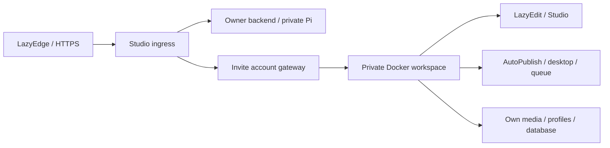

[English](../README.md) · [العربية](README.ar.md) · [Español](README.es.md) · [Français](README.fr.md) · [日本語](README.ja.md) · [한국어](README.ko.md) · [Tiếng Việt](README.vi.md) · [中文 (简体)](README.zh-Hans.md) · [中文（繁體）](README.zh-Hant.md) · [Deutsch](README.de.md) · [Русский](README.ru.md)

[](https://github.com/lachlanchen/lachlanchen/blob/main/figs/banner.png)

# AutoPublication

*حرّر وصحّح وانشر الفيديو أو الموسيقى من مساحة عمل خاصة.*

[](https://edit.lazying.art) [](https://github.com/sponsors/lachlanchen)

يجمع AutoPublication بين LazyEdit وAutoPublish وAutoPubMonitor والنسخ متعدد اللغات عبر مستودعات مصدر ذات إصدارات مثبتة. توفر خدمة Docker بالدعوة لكل مستخدم سطح مكتب Linux خاصًا لتسجيل الدخول إلى المنصات وخادم تحرير وطابور نشر دائمًا.

تعديل الفيديو ومعاينته هما تجربة الأعضاء الأساسية، ولا يحتاجان إلى حسابات اجتماعية. يفعّل المشغّل النشر للحسابات المعتمدة بشكل منفصل. يحصل المراجعون على مساحة تعديل خاصة بهم، دون الوصول إلى جهاز Pi أو القنوات أو الوسائط الخاصة بالمالك. حدود المعالجة الشهرية هي 10/60/150 دقيقة من الفيديو المصدر، ويبقى الدفع معطلاً حتى اختبار الشراء الفعلي.

| Donate | PayPal | Stripe |
| --- | --- | --- |
| [](https://chat.lazying.art/donate) | [](https://paypal.me/RongzhouChen) | [](https://buy.stripe.com/aFadR8gIaflgfQV6T4fw400) |

## طريقة العمل

الخدمة الحالية هي [edit.lazying.art](https://edit.lazying.art)، ويدخل المدعوون عبر [/accounts](https://edit.lazying.art/accounts). يحتفظ المالك بالخادم وPi الخاص الموجودين. يحصل الآخرون على عمال Docker ووسائط وإعدادات وقواعد بيانات وملفات متصفح مستقلة. النطاق المنفصل اختياري لهذه التجربة الموثوقة بالدعوة.

تتضمن واجهات iOS وAndroid وMac الأصلية إحدى عشرة لغة، وضوابط خاصة لتسجيل الدخول إلى المنصات، وحذف حساب العضو. يظل جهاز Pi الخاص بالمالك حصريًا لـ lachlanchen. اجتاز ربط Google وتسجيل الدخول وإلغاء التفويض اختبارات المتصفح الفعلية ضمن مشروع اختبار للهوية فقط؛ إعداد Apple جاهز وينتظر اختبار الدخول الفعلي. تبقى الفوترة معطلة حتى تحديد حدود الاستخدام وإجراء اختبارات الشراء الفعلية.


```mermaid
flowchart LR
    E[LazyEdge / HTTPS] --> R[Studio ingress]
    R --> O[Owner backend / private Pi]
    R --> G[Invite account gateway]
    G --> W[Private Docker workspace]
    W --> L[LazyEdit / Studio]
    W --> A[AutoPublish / desktop / queue]
    W --> D[Own media / profiles / database]
```

## المكونات المثبتة

| المكون | الإصدار | |
| --- | --- | --- |
| `LazyEdit` | `ade9de4` | التحرير والتصحيح وStudio API والحاويات |
| `AutoPublish` | `c7bcbe9` | موائمات المنصات والدخول وطابور المتصفح الدائم |
| `AutoPubMonitor` | `a097a054` | المراقبة والمزامنة الموجودتان |
| `whisper_with_lang_detect` | `5b02dceb` | النسخ المستقل وVAD |

[docs/hosted-service.md](../docs/hosted-service.md) · [LazyEdit](https://github.com/lachlanchen/LazyEdit) · [AutoPublish](https://github.com/lachlanchen/AutoPublish) · [AutoPubMonitor](https://github.com/lachlanchen/AutoPubMonitor) · [MultilingualWhisper](https://github.com/lachlanchen/MultilingualWhisper)

## البدء السريع

يلزم Linux x86-64 وDocker/Compose وNode 22 وبيئة Python مناسبة. يشرح دليل النشر البناء والتهيئة والتشغيل ومسارات LazyEdge. استنساخ المصدر لا ينشر خدمة تلقائيًا.

```bash
git clone https://github.com/lachlanchen/AutoPublication.git
cd AutoPublication
git submodule update --init --recursive
scripts/autopublication --help
```

## التشغيل والخصوصية

احتفظ بكلمات المرور والمفاتيح والرموز وملفات الارتباط وملفات المتصفح وقواعد الحسابات والوسائط الخاصة خارج Git. يشترك التحرير والنشر في مخزن وسائط أصلي واحد؛ تُعاد تسمية التحميلات المكتملة وتُحذف ملفات فك الضغط المؤقتة للمهام المنتهية. المصدر والنسخة المعالجة وZIP القابل لإعادة الاستخدام نواتج مختلفة. تحديث هذا المستودع لا يعيد تشغيل مسار المالك.

[AGENTS.md](../AGENTS.md) · [docs/hosted-service.md](../docs/hosted-service.md)

## التحقق

شغّل اختبارات الحساب والنقل وفحص الملفات العامة قبل نشر الكود. اختبارات التجربة لا تنشر محتوى اجتماعيًا حقيقيًا. أصلح واختبر وادفع في المستودع المسؤول أولًا ثم حدّث المراجع المثبتة هنا.

```bash
npm ci --prefix LazyEdit/app --no-audit --no-fund
scripts/autopublication test
python scripts/check_public_files.py
```

## الحالة والنطاق

تجربة بالدعوة منشورة عبر HTTPS/LazyEdge الحاليين. تم التحقق من إنشاء الحساب وسطح WSS الخاص ودخول API المحدود والتحميل القابل للاستئناف وفصل المالك. CPU Whisper هو بيئة التشغيل المختبرة. تحتاج حسابات المنصات الجديدة إلى QR/2FA الخاصة بها. الفوترة والاسترداد وحصص التخزين الصارمة والحماية من المستخدمين العدائيين غير منفذة.

## الاستشهاد

يقرأ GitHub ملف [CITATION.cff](../CITATION.cff). استخدم المرجع الثابت أدناه للاستشهاد بالبرنامج.

```bibtex
@software{chen_autopublication_2026,
  author = {Chen, Lachlan},
  title = {AutoPublication: account-isolated video and music publishing},
  year = {2026},
  url = {https://github.com/lachlanchen/AutoPublication}
}
```

## الدعم

ادعم الصيانة عبر [GitHub Sponsors](https://github.com/sponsors/lachlanchen) أو الروابط أعلاه.
