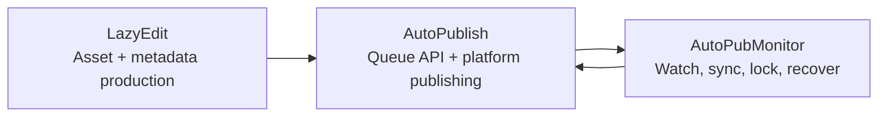

[English](../README.md) · [العربية](README.ar.md) · [Español](README.es.md) · [Français](README.fr.md) · [日本語](README.ja.md) · [한국어](README.ko.md) · [Tiếng Việt](README.vi.md) · [中文 (简体)](README.zh-Hans.md) · [中文（繁體）](README.zh-Hant.md) · [Deutsch](README.de.md) · [Русский](README.ru.md)


[](https://github.com/lachlanchen/lachlanchen/blob/main/figs/banner.png)

# AutoPublication


Kanonische Root-Dokumentation für einen fest gepinnten, submodulbasierten KI-Video-Workflow-Stack.

## 📌 Auf einen Blick

| Bereich | Details |
| --- | --- |
| Repository-Typ | Meta-Repository mit gepinnten Git-Submodulen |
| Root-Laufzeitrolle | Dokumentation + Orchestrierungs-Einstiegspunkt |
| Kern-Submodule | `AutoPubMonitor`, `LazyEdit`, `AutoPublish` |
| Kanonische Doku-Quelle | Root-`README.md` |
| Sprachvarianten | `i18n/README.*.md` |
| Letzter Pipeline-Artefakt-Snapshot | `.auto-readme-work/20260302_124338/` |

## 🧭 Überblick

`AutoPublication` koordiniert eine End-to-End-Content-Automation-Pipeline:

1. Assets in `LazyEdit` vorbereiten, bearbeiten und generieren.
2. Assets in `AutoPublish` auf Zielplattformen veröffentlichen.
3. Queue/Watch/Sync-Operationen mit `AutoPubMonitor` stabil halten.

Das Root-Repository pinnt Submodul-Commits bewusst, um Reproduzierbarkeit über Umgebungen und Deployment-Hosts hinweg sicherzustellen.

### Was dieses Repository ist

- Kanonische Root-Doku für Setup, Betrieb und Integration.
- Gitlink-Pinning-Schicht für Submodul-Versionen.
- Quelle für mehrsprachige Dokumentation (`i18n/README.*.md`).
- Pipeline-Trace- und Artefakthistorie (`.auto-readme-work/*`).

### Was dieses Repository nicht ist

- Kein einzelnes Laufzeitpaket mit einem einzigen Root-Abhängigkeitsmanifest.
- Kein Ersatz für README/Skripte der einzelnen Submodule.
- Aktuell kein einheitliches Root-`.env`-Schema.

## ✨ Features

- Reproduzierbare Architektur über gepinnte Submodul-Commits.
- Klare Verantwortungsgrenzen zwischen Editing, Publishing und Monitoring.
- Linux-first-Betrieb (`tmux`, optional `systemd`, FFmpeg, Browser-Automatisierung).
- Dokumentationszentrierter Workflow mit i18n-Varianten.
- Nachvollziehbarer README-Generierungskontext unter `.auto-readme-work/`.

## 🧱 Submodul-Architektur

### Root-Modulübersicht

| Modul | Rolle | Laufzeitprofil | Typische Einstiegspunkte |
| --- | --- | --- | --- |
| `AutoPubMonitor` | Queue/Watch/Sync-Orchestrierung rund um Publishing-Workflows | Shell-first + Python-Helfer + `tmux`/optional `systemd` | `autopub_monitor/autopub_monitor_tmux_session.sh`, `autopub_monitor/process_queue.sh`, `autopub_monitor/monitor_autopublish.sh` |
| `LazyEdit` | KI-unterstützter Media-Generierungs-/Editing-/Untertitel-/Metadaten-Workflow | Tornado-Backend + Expo-Frontend + Processing-Module | `app.py`, `start_lazyedit.sh`, `app/`, `lazyedit/` |
| `AutoPublish` | Browsergesteuertes Multi-Plattform-Publishing und Queue-API-Service | Python-Skripte + Selenium + Tornado-Queue-API | `autopub.py`, `app.py`, `pub_*.py`, `login_*.py` |

### Abhängigkeitsgrenzen

| Grenze | In Scope | Out of Scope |
| --- | --- | --- |
| `LazyEdit` | Editing/Generierungspipeline, UI/Backend, Untertitel- und Metadatenvorbereitung | Plattform-Login-Automatisierung und plattformspezifische Publishing-Aktionen |
| `AutoPublish` | Publisher-Adapter, Auth/Session-Handling, Queue-API, Publishing-Ausführung | Editing-/Transkriptions-UI und die meisten Upstream-Transformationen |
| `AutoPubMonitor` | Queue-Watcher, Locks, Sync-Jobs, `tmux`/Service-Supervision | Editor-UI-Verhalten und tiefe plattformspezifische Browser-Flows |
| Root (`AutoPublication`) | Doku, Versions-Orchestrierung, Submodul-Pinning-Policy | Einheitliches Laufzeit-Abhängigkeitsmanagement |

### Integrationsverträge

| Übergabe | Producer | Consumer | Vertragsfokus |
| --- | --- | --- | --- |
| Vorbereitete Media-Assets | `LazyEdit` | `AutoPublish` | Verzeichnis-Konventionen, Dateinamen, Medienbereitschaft |
| Metadaten/Untertitel | `LazyEdit` | `AutoPublish` | Titel-/Beschreibung-/Tag-Schema und Untertitelverfügbarkeit |
| Publish-Status und Queue-Gesundheit | `AutoPublish` | `AutoPubMonitor` | Verfügbarkeit von API-Endpunkten und Queue-Semantik |
| Sync/Watchdog-Steuerung | `AutoPubMonitor` | `AutoPublish` + Ops | Lock-Disziplin, Queue-Integrität, recoverable Restarts |

### Laufzeit-Verantwortungsfluss



1. `LazyEdit` erzeugt Videos und Metadatenpakete.
2. `AutoPublish` führt Channel-/Plattform-Publishing-Aktionen aus.
3. `AutoPubMonitor` überwacht Queue- und Synchronisationsschleifen.

## 📦 Aktuelle Submodul-Pins

Aktuelle Root-Pins (`git submodule status`):

- `AutoPubMonitor`: `6daa87ce612c2dab75fac9478d4523abd418f69d`
- `AutoPublish`: `4f348ac342bfaff7bc435985085cedd9b448e1e8`
- `LazyEdit`: `dc503d6db63b13db812fef5d9c8ffe0a882d725e`

Lokal prüfen:

```bash
git submodule status
git submodule status --recursive
```

Hinweis zu verschachtelten Modulen: `LazyEdit` enthält zusätzliche verschachtelte Submodule (zum Beispiel `whisper_with_lang_detect`, `furigana`, Captioning-Repos), daher sollten viele Root-Operationen mit `--recursive` ausgeführt werden.

## 🗂️ Projektstruktur

```text
AutoPublication/
├── README.md
├── .gitmodules
├── .gitignore
├── i18n/
│   ├── README.ar.md
│   ├── README.de.md
│   ├── README.es.md
│   ├── README.fr.md
│   ├── README.ja.md
│   ├── README.ko.md
│   ├── README.ru.md
│   ├── README.vi.md
│   ├── README.zh-Hans.md
│   └── README.zh-Hant.md
├── AutoPubMonitor/                  # submodule
│   ├── README.md
│   └── autopub_monitor/
├── LazyEdit/                        # submodule
│   ├── README.md
│   ├── app.py
│   ├── app/
│   └── lazyedit/
├── AutoPublish/                     # submodule
│   ├── README.md
│   ├── app.py
│   ├── autopub.py
│   └── pub_*.py
└── .auto-readme-work/
    └── <timestamp>/
        ├── pipeline-context.md
        ├── language-nav-root.md
        ├── language-nav-i18n.md
        ├── translation-plan.txt
        └── repo-structure-analysis.md
```

### Wichtige Pfade

| Pfad | Zweck |
| --- | --- |
| `.gitmodules` | Deklariert Submodul-Remotes und -Pfade |
| `i18n/README.*.md` | Lokalisierte Root-README-Varianten |
| `.auto-readme-work/*` | README-Generierungs-Traces/Artefakte |
| `AutoPubMonitor/autopub_monitor/autopub.config` | Monitor-Queue/Sync/Laufzeit-Konfiguration |
| `LazyEdit/config.py` | LazyEdit-Umgebungs-/Pfad-Defaults |
| `AutoPublish/.env.example` | AutoPublish-Credential/Env-Template |

## 🧰 Voraussetzungen

Linux-first-Basis über alle Module hinweg:

- `git` (mit Submodul-Unterstützung)
- `bash`
- Python `3.10+` (einige Monitor-Installer setzen weiterhin `3.8`-Env-Namen voraus)
- `tmux`
- `ffmpeg` / `ffprobe`
- `inotify-tools`
- `rsync`
- Chrome/Chromium + kompatibler WebDriver
- Node.js + npm (für `LazyEdit/app`-Frontend)
- Optional: `systemd`, `conda`

Annahme: macOS/Windows erfordern Anpassungen bei Skripten, Pfaden und Services.

## 🛠️ Installation und Bootstrap

### 1. Mit Submodulen klonen

```bash
git clone --recurse-submodules git@github.com:lachlanchen/AutoPublication.git
cd AutoPublication
```

Falls bereits geklont:

```bash
git submodule update --init --recursive
```

### 2. Submodul-Ausrichtung synchronisieren und verifizieren

```bash
git submodule sync --recursive
git submodule status --recursive
git submodule foreach --recursive 'git rev-parse --abbrev-ref HEAD; git rev-parse --short HEAD'
```

### 3. Setup-Flow pro Submodul

| Submodul | Primäre Konfiguration | Setup-Fokus | Erste Validierung |
| --- | --- | --- | --- |
| `LazyEdit` | `config.py` (+ optional `.env`) | Python-/Backend-Dependencies, Frontend-Dependencies, Upload-/Output-/API-Pfade | `cd LazyEdit && python app.py` |
| `AutoPublish` | `.env` (aus `.env.example`) | Credentials, Browser-Driver, Queue-/API-Modus | `cd AutoPublish && python app.py --port 8081` |
| `AutoPubMonitor` | `autopub_monitor/autopub.config` | Queue-/Sync-/Lock-Pfade, API-Ziel, `tmux`/Service-Setup | `cd AutoPubMonitor && ./autopub_monitor/autopub_monitor_tmux_session.sh start` |

Maßgebliche Modul-Dokumentationen:

- `AutoPubMonitor/README.md`
- `LazyEdit/README.md`
- `AutoPublish/README.md`

## ▶️ Nutzung und Betrieb

Die Root-Nutzung dient primär der Orchestrierung und Versionsausrichtung.

### Täglicher Operator-Flow

```bash
# Checkout an Root-Pins ausrichten
git submodule sync --recursive
git submodule update --init --recursive

# Aktuellen Zustand prüfen
git submodule status --recursive
```

### End-to-End-Laufzeitfluss

1. `LazyEdit` starten und Assets vorbereiten.
2. `AutoPublish` im API-Modus oder CLI-Watcher-Modus starten.
3. `AutoPubMonitor` für Queue-/Sync-/Watchdog-Kontinuität starten.

### Quick-Start-Befehle

```bash
# LazyEdit
cd LazyEdit
python app.py
# optional frontend in second terminal:
# cd app && npx expo start --web

# AutoPublish
cd ../AutoPublish
python app.py --port 8081
# or CLI watcher mode:
# python autopub.py --help

# AutoPubMonitor
cd ../AutoPubMonitor
./autopub_monitor/autopub_monitor_tmux_session.sh start
```

## 🧪 Lokaler Entwicklungs-Workflow

### Empfohlene Schleife

1. Vor dem Coden wieder auf Root-Pins ausrichten.
2. Entwicklung und Tests jeweils nur in einem Submodul gleichzeitig durchführen.
3. Übergaben zwischen Submodulen validieren (`LazyEdit -> AutoPublish -> AutoPubMonitor`).
4. Implementierungsänderungen zuerst in Submodul-Repositories committen.
5. Root-Pointer-Updates (`gitlinks`) zuletzt committen.

### Pointer-Bump-Flow (Beispiel)

```bash
# root align first
git submodule sync --recursive
git submodule update --init --recursive

# edit and commit in submodule
cd LazyEdit
git switch -c feature/<name>
# ...change/test...
git add -A && git commit -m "feat: <summary>"
cd ..

# capture new pointer in root
git add LazyEdit
git commit -m "chore(submodule): bump LazyEdit pointer"
```

### Commit-Grenzregeln

- Root-Commits sollten sich auf Doku, Orchestrierungs-Konventionen und Pointer-Bumps fokussieren.
- Implementierungsänderungen sollten zuerst in Submodul-Repositories committed werden.
- Root-Pointer-Commits nach Möglichkeit von größeren Doku-/Inhaltsänderungen trennen.

## ⚙️ Konfiguration

Es gibt keine einheitliche Root-Laufzeitkonfiguration. Konfiguriere jedes Submodul direkt:

### `AutoPubMonitor`

- Datei: `AutoPubMonitor/autopub_monitor/autopub.config`
- Typische Werte: Queue-Dateien, Lock-Dateien, Sync-Pfade, API-Basis-URL, Conda-Env, Skriptpfade

### `LazyEdit`

- Datei: `LazyEdit/config.py` (plus optionale `.env`)
- Typische Werte: Upload-/Output-Verzeichnisse, Backend-Port, AutoPublish-Endpunkt, Untertitel-/Caption-Tools, Timeouts

### `AutoPublish`

- Datei: `AutoPublish/.env.example` (nach lokaler `.env` kopieren)
- Typische Werte: Plattform-Credentials, Browser-/Driver-Pfade, SMTP/E-Mail-Einstellungen, Captcha-Service-Keys

Sicherheitsempfehlung: maschinenspezifische Konfiguration und Secrets in ignorierten Dateien/Umgebungsvariablen halten.

## 🔄 Submodul-Update-Strategie

### A. Initialisieren und mit aktuellen Pins synchronisieren

```bash
git submodule sync --recursive
git submodule update --init --recursive
```

### B. Gezielt auf Remote-Tips aktualisieren

Nur verwenden, wenn gepinnte Versionen explizit verschoben werden sollen:

```bash
git submodule update --remote --recursive
```

Danach Pointer verifizieren und committen:

```bash
git add AutoPubMonitor LazyEdit AutoPublish
git commit -m "chore(submodules): bump submodule pointers"
```

### C. Auf expliziten Commit oder Tag pinnen

```bash
cd LazyEdit
git fetch origin
git checkout <commit-or-tag>
cd ..
git add LazyEdit
git commit -m "chore(submodule): pin LazyEdit to <commit-or-tag>"
```

Für `AutoPubMonitor` und `AutoPublish` bei Bedarf wiederholen.

### D. Pointer-Deltas vor dem Merge prüfen

```bash
git diff --submodule=log
git submodule status --recursive
```

### E. Empfohlenes Release-Playbook

1. Rekursiv sync/init ausführen.
2. Immer nur ein Submodul gleichzeitig aktualisieren.
3. Smoke-Tests auf Submodul-Ebene ausführen.
4. Integrations-Smoke-Checks über Übergabegrenzen hinweg ausführen.
5. Nur beabsichtigte Gitlink-Änderungen stagen.
6. Mit expliziten Modulnamen und Begründung committen.

### F. Pinning-Policy

- Root auf bekannte, stabile Commits gepinnt halten.
- Breite All-Modul-Bumps ohne Integrationsvalidierung vermeiden.
- Explizite Pin-Messages nutzen (`chore(submodule): pin <module> to <sha>`).
- Root als Release-Manifest behandeln, Submodul-Branches als Implementierungsströme.

## 🔧 Troubleshooting (Submodul-Sync und Status)

### Submodul-Verzeichnis ist leer oder Dateien fehlen

```bash
git submodule sync --recursive
git submodule update --init --recursive
```

### `fatal: no submodule mapping found in .gitmodules`

Meist veraltete Metadaten oder ein Pfad-Mismatch:

```bash
cat .gitmodules
git submodule sync --recursive
git submodule update --init --recursive
```

### `git submodule status` zeigt `-`, `+` oder `U`

- `-`: Submodul nicht initialisiert.
- `+`: Ausgecheckter Commit weicht vom Root-Pin ab.
- `U`: Merge-Konflikt im Submodul-Pointer.

Recovery:

```bash
git submodule update --init --recursive
```

Wenn die Abweichung beabsichtigt ist, Gitlink-Updates im Root committen.

### Detached HEAD im Submodul

Detached HEAD ist bei gepinnten Submodulen normal. Vor der Entwicklung einen Branch erstellen:

```bash
cd <submodule>
git switch -c feature/<name>
```

### Falsche Remote-URL für ein Submodul

```bash
git submodule sync --recursive
git submodule foreach --recursive 'git remote -v'
```

Wenn `.gitmodules` geändert wurde: committen und erneut synchronisieren.

### Merge-Konflikte bei Submodul-Pointern

Gewünschte Commit-Pointer auswählen, dann:

```bash
git add AutoPubMonitor LazyEdit AutoPublish
git commit
```

Gewählte SHAs validieren:

```bash
git diff --submodule=log
git submodule status --recursive
```

### Authentifizierungsfehler bei Clone/Update

Root-`.gitmodules` verwendet aktuell SSH-Remotes (`git@github.com:...`).

- Sicherstellen, dass GitHub-SSH-Keys konfiguriert sind.
- Oder in `.gitmodules` auf HTTPS-Remotes umstellen, dann `git submodule sync --recursive` ausführen.

### Submodul wirkt unerwartet dirty

```bash
git submodule foreach --recursive 'git status --short --branch'
```

Beabsichtigte Änderungen zuerst in jedem Submodul committen, danach Root-Pointer aktualisieren.

### Verschachtelte Submodule in `LazyEdit` sind nicht initialisiert

```bash
git submodule update --init --recursive
```

Wenn nur verschachtelte Module in `LazyEdit` aktualisiert werden sollen:

```bash
git -C LazyEdit submodule update --init --recursive
```

### Harte Neusynchronisierung bei veralteten Metadaten

Verwenden, wenn standardmäßiges Sync/Update den Zustand nicht repariert:

```bash
git submodule deinit -f --all
git submodule sync --recursive
git submodule update --init --recursive
```

## 🛠️ Entwicklungsnotizen

### i18n-Policy

- Genau eine Sprachoptionszeile am Anfang beibehalten.
- Englisches Root-`README.md` als kanonisch behandeln.
- Strukturelle Änderungen auf `i18n/README.*.md` übertragen.

### Pipeline-Kontext-Artefakte

- Pipeline-Artefakte liegen unter `.auto-readme-work/<timestamp>/`.
- Für Nachvollziehbarkeit und Doku-Generierungshistorie nutzen, nicht als Runtime-Input.

## 🗺️ Roadmap

- [ ] Root-Orchestrierungsskripte für häufige modulübergreifende Aufgaben ergänzen.
- [ ] CI-Checks für Submodul-Sync-Gesundheit und Pin-Drift ergänzen.
- [ ] Automatisierte Root/i18n-README-Paritätsprüfungen ergänzen.
- [ ] Architekturdiagramm für den End-to-End-Laufzeitfluss ergänzen.
- [ ] Root-`LICENSE`-Policy-Datei ergänzen, falls Repository-Level-Lizenzierung vorgesehen ist.

## 🤝 Beiträge

Beiträge zu Doku, Architekturklarheit und Workflow-Zuverlässigkeit sind willkommen.

```bash
# 1) create branch
git checkout -b docs/<short-description>

# 2) stage docs and/or intended pointer updates
git add README.md i18n/README.fr.md AutoPubMonitor LazyEdit AutoPublish

# 3) commit
git commit -m "docs: improve root architecture and submodule workflows"

# 4) push
git push -u origin docs/<short-description>
```

PR-Checkliste:

- Root-`README.md` kanonisch halten.
- Eine Sprachoptionszeile und ein Support-Panel beibehalten.
- Beim Bumpen von Pins `git submodule status` in den PR-Notizen ergänzen.
- Begründung für jedes Submodul-Pointer-Update dokumentieren.

## Submodule

Dieses Repository enthält folgende Git-Submodule auf Root-Ebene:

| Submodul | Repository |
| --- | --- |
| `AutoPubMonitor` | https://github.com/lachlanchen/AutoPubMonitor |
| `LazyEdit` | https://github.com/lachlanchen/LazyEdit |
| `AutoPublish` | https://github.com/lachlanchen/AutoPublish |

## Kontakt

Für Fragen, Doku-Korrekturen und die Abstimmung von Beiträgen bitte Repository-Issues verwenden.

## 📄 Lizenz

In diesem Repository-Snapshot ist aktuell keine Root-`LICENSE`-Datei vorhanden.

Annahmen:

- Die Lizenzierung kann an einzelne Submodule delegiert sein.
- Vor Weiterverteilung oder kommerzieller Nutzung die jeweilige Submodul-Lizenz prüfen.


## ❤️ Support

| Donate | PayPal | Stripe |
| --- | --- | --- |
| [](https://chat.lazying.art/donate) | [](https://paypal.me/RongzhouChen) | [](https://buy.stripe.com/aFadR8gIaflgfQV6T4fw400) |
