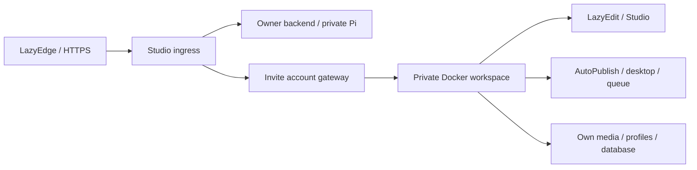

[English](../README.md) · [العربية](README.ar.md) · [Español](README.es.md) · [Français](README.fr.md) · [日本語](README.ja.md) · [한국어](README.ko.md) · [Tiếng Việt](README.vi.md) · [中文 (简体)](README.zh-Hans.md) · [中文（繁體）](README.zh-Hant.md) · [Deutsch](README.de.md) · [Русский](README.ru.md)

[](https://github.com/lachlanchen/lachlanchen/blob/main/figs/banner.png)

# AutoPublication

*Videos und Musik im eigenen privaten Arbeitsbereich bearbeiten, korrigieren und veröffentlichen.*

[](https://edit.lazying.art) [](https://github.com/sponsors/lachlanchen)

AutoPublication verbindet LazyEdit, AutoPublish, AutoPubMonitor und mehrsprachige Transkription über festgelegte Quellstände. Der Docker-Dienst auf Einladung bietet jedem Nutzer einen privaten Linux-Desktop für Plattformanmeldungen, ein Bearbeitungsbackend und eine dauerhafte Veröffentlichungswarteschlange.

Mitglieder können Videos ohne Social-Media-Konten bearbeiten und prüfen. Der Betreiber aktiviert die Veröffentlichung separat für zugelassene Konten. Prüfer erhalten einen eigenen Arbeitsbereich, ohne Zugriff auf den Pi, die Kanäle oder privaten Medien des Eigentümers. Die monatlichen Grenzen betragen 10/60/150 Minuten Quellvideo; Zahlungen bleiben bis zu echten Kauftests deaktiviert.

| Donate | PayPal | Stripe |
| --- | --- | --- |
| [](https://chat.lazying.art/donate) | [](https://paypal.me/RongzhouChen) | [](https://buy.stripe.com/aFadR8gIaflgfQV6T4fw400) |

## Funktionsweise

Der aktuelle Dienst läuft auf [edit.lazying.art](https://edit.lazying.art); Einladungen führen zu [/accounts](https://edit.lazying.art/accounts). Der Eigentümer behält sein Backend und seinen privaten Pi. Andere Nutzer erhalten getrennte Docker-Worker, Medien, Einstellungen, Datenbanken und Browserprofile. Eine weitere Domain ist für diesen vertrauensbasierten Pilot optional.

Die nativen Oberflächen für iOS, Android und Mac bieten elf Sprachen, private Plattform-Anmeldung und die Löschung des Mitgliedskontos. Der bisherige Pi bleibt ausschließlich lachlanchen vorbehalten. Google-Verknüpfung, Anmeldung und Widerruf wurden im echten Browser mit einem reinen Identitäts-Testprojekt geprüft; Apple wartet auf die echte Anmeldeprüfung. Die Abrechnung bleibt bis zur Festlegung der Nutzungslimits und echten Kauftests deaktiviert.


```mermaid
flowchart LR
    E[LazyEdge / HTTPS] --> R[Studio ingress]
    R --> O[Owner backend / private Pi]
    R --> G[Invite account gateway]
    G --> W[Private Docker workspace]
    W --> L[LazyEdit / Studio]
    W --> A[AutoPublish / desktop / queue]
    W --> D[Own media / profiles / database]
```

## Festgelegte Komponenten

| Komponente | Commit | |
| --- | --- | --- |
| `LazyEdit` | `cb80417` | Bearbeitung, Korrektur, Studio-API und Container |
| `AutoPublish` | `c7bcbe9` | Plattformadapter, Anmeldung und dauerhafte Browserwarteschlange |
| `AutoPubMonitor` | `a097a054` | Bestehende Überwachung und Synchronisierung |
| `whisper_with_lang_detect` | `5b02dceb` | Eigenständige Transkription und VAD |

[docs/hosted-service.md](../docs/hosted-service.md) · [LazyEdit](https://github.com/lachlanchen/LazyEdit) · [AutoPublish](https://github.com/lachlanchen/AutoPublish) · [AutoPubMonitor](https://github.com/lachlanchen/AutoPubMonitor) · [MultilingualWhisper](https://github.com/lachlanchen/MultilingualWhisper)

## Schnellstart

Benötigt werden Linux x86-64, Docker/Compose, Node 22 und eine passende Python-Umgebung. Aufbau, Initialisierung, Start und LazyEdge-Routen stehen im Betriebsleitfaden. Klonen allein stellt keinen Dienst bereit.

```bash
git clone https://github.com/lachlanchen/AutoPublication.git
cd AutoPublication
git submodule update --init --recursive
scripts/autopublication --help
```

## Betrieb und Datenschutz

Passwörter, Schlüssel, Tokens, Cookies, Profile, Kontodatenbanken und private Medien bleiben außerhalb von Git. Bearbeitung und Veröffentlichung teilen einen kanonischen Speicher; fertige Uploads werden umbenannt und abgeschlossene temporäre Entpackungen bereinigt. Quelle, bearbeitetes Master und ZIP sind verschiedene Artefakte. Dieses Repository startet die bestehende Pipeline nicht neu.

[AGENTS.md](../AGENTS.md) · [docs/hosted-service.md](../docs/hosted-service.md)

## Validierung

Vor der Veröffentlichung Konto-/Transporttests und die Prüfung öffentlicher Dateien ausführen. Smoke-Tests veröffentlichen keine echten Beiträge. Änderungen zuerst im zuständigen Repository testen und pushen, dann die Pins aktualisieren.

```bash
npm ci --prefix LazyEdit/app --no-audit --no-fund
scripts/autopublication test
python scripts/check_public_files.py
```

## Status und Umfang

Einladungspilot über die bestehende HTTPS/LazyEdge-Route. Bereitstellung, privater WSS-Desktop, eingeschränkte API-Anmeldung, fortsetzbarer Upload und Eigentümertrennung wurden geprüft. CPU Whisper ist die getestete Laufzeit. Neue Plattformkonten brauchen eigenes QR/2FA. Abrechnung, Wiederherstellung, harte Speicherquoten und Schutz gegen feindliche Nutzer sind nicht implementiert.

## Zitation

GitHub liest [CITATION.cff](../CITATION.cff). Für Zitationen kann der folgende stabile Eintrag verwendet werden.

```bibtex
@software{chen_autopublication_2026,
  author = {Chen, Lachlan},
  title = {AutoPublication: account-isolated video and music publishing},
  year = {2026},
  url = {https://github.com/lachlanchen/AutoPublication}
}
```

## Unterstützung

Unterstützen Sie die Wartung über [GitHub Sponsors](https://github.com/sponsors/lachlanchen) oder die Links oben.
