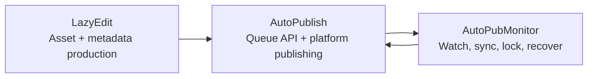

[English](../README.md) · [العربية](README.ar.md) · [Español](README.es.md) · [Français](README.fr.md) · [日本語](README.ja.md) · [한국어](README.ko.md) · [Tiếng Việt](README.vi.md) · [中文 (简体)](README.zh-Hans.md) · [中文（繁體）](README.zh-Hant.md) · [Deutsch](README.de.md) · [Русский](README.ru.md)


[](https://github.com/lachlanchen/lachlanchen/blob/main/figs/banner.png)

# AutoPublication


Documentación raíz canónica para una pila de flujo de trabajo de video con IA basada en submódulos fijados.

## 📌 Resumen Rápido

| Área | Detalles |
| --- | --- |
| Tipo de repositorio | Meta-repositorio con submódulos git fijados |
| Rol de ejecución en raíz | Punto de entrada de documentación + orquestación |
| Submódulos principales | `AutoPubMonitor`, `LazyEdit`, `AutoPublish` |
| Fuente documental canónica | `README.md` en la raíz |
| Variantes de idioma | `i18n/README.*.md` |
| Último snapshot de artefactos del pipeline | `.auto-readme-work/20260302_124338/` |

## 🧭 Visión General

`AutoPublication` coordina un pipeline de automatización de contenido de extremo a extremo:

1. Preparar, editar y generar recursos en `LazyEdit`.
2. Publicar recursos en plataformas objetivo con `AutoPublish`.
3. Mantener sanas las operaciones de cola/vigilancia/sincronización con `AutoPubMonitor`.

El repositorio raíz fija intencionalmente commits de submódulos para preservar la reproducibilidad entre entornos y hosts de despliegue.

### Qué es este repositorio

- Documentación raíz canónica para configuración, operación e integración.
- Capa de fijación de versiones de submódulos mediante gitlink.
- Fuente de documentación multilingüe (`i18n/README.*.md`).
- Historial de trazas y artefactos del pipeline (`.auto-readme-work/*`).

### Qué no es este repositorio

- No es un único paquete de ejecución con un solo manifiesto de dependencias en raíz.
- No reemplaza los README/scripts propios de cada submódulo.
- No incluye actualmente un esquema unificado de `.env` a nivel raíz.

## ✨ Características

- Arquitectura reproducible mediante commits fijados de submódulos.
- Límites claros de responsabilidad entre edición, publicación y monitoreo.
- Operación orientada a Linux (`tmux`, `systemd` opcional, FFmpeg, automatización de navegador).
- Flujo de trabajo orientado a documentación con variantes i18n.
- Contexto trazable de generación de README bajo `.auto-readme-work/`.

## 🧱 Arquitectura de Submódulos

### Mapa de módulos raíz

| Module | Role | Runtime profile | Typical entrypoints |
| --- | --- | --- | --- |
| `AutoPubMonitor` | Orquestación de cola/vigilancia/sincronización alrededor de flujos de publicación | Shell-first + helpers Python + `tmux`/`systemd` opcional | `autopub_monitor/autopub_monitor_tmux_session.sh`, `autopub_monitor/process_queue.sh`, `autopub_monitor/monitor_autopublish.sh` |
| `LazyEdit` | Flujo de trabajo asistido por IA para generación/edición de medios/subtítulos/metadatos | Backend Tornado + frontend Expo + módulos de procesamiento | `app.py`, `start_lazyedit.sh`, `app/`, `lazyedit/` |
| `AutoPublish` | Publicación multiplaforma con navegador y servicio API de cola | Scripts Python + Selenium + API de cola Tornado | `autopub.py`, `app.py`, `pub_*.py`, `login_*.py` |

### Límites de dependencias

| Boundary | In scope | Out of scope |
| --- | --- | --- |
| `LazyEdit` | Pipeline de edición/generación, UI/backend, preparación de subtítulos y metadatos | Automatización de login en plataformas y acciones de publicación por plataforma |
| `AutoPublish` | Adaptadores de publicación, manejo de auth/sesión, API de cola, ejecución de publicación | UI de edición/transcripción y la mayoría de transformaciones upstream |
| `AutoPubMonitor` | Vigilancia de cola, locks, trabajos de sincronización, supervisión de tmux/servicios | Comportamiento de la UI del editor y flujos profundos de navegador por plataforma |
| Root (`AutoPublication`) | Documentación, orquestación de versiones, política de pinning de submódulos | Gestión unificada de dependencias de ejecución |

### Contratos de integración

| Handoff | Producer | Consumer | Contract focus |
| --- | --- | --- | --- |
| Recursos multimedia preparados | `LazyEdit` | `AutoPublish` | Convenciones de directorios, nombres de archivos, estado listo del medio |
| Metadatos/subtítulos | `LazyEdit` | `AutoPublish` | Esquema de título/descripción/tags y disponibilidad de subtítulos |
| Estado de publicación y salud de cola | `AutoPublish` | `AutoPubMonitor` | Disponibilidad de endpoints API y semántica de la cola |
| Control de sincronización/watchdog | `AutoPubMonitor` | `AutoPublish` + ops | Disciplina de locks, integridad de cola, reinicios recuperables |

### Flujo de responsabilidades en ejecución



1. `LazyEdit` produce videos y paquetes de metadatos.
2. `AutoPublish` ejecuta acciones de publicación por canal/plataforma.
3. `AutoPubMonitor` supervisa cola y bucles de sincronización.

## 📦 Pines Actuales de Submódulos

Pines actuales en raíz (`git submodule status`):

- `AutoPubMonitor`: `6daa87ce612c2dab75fac9478d4523abd418f69d`
- `AutoPublish`: `4f348ac342bfaff7bc435985085cedd9b448e1e8`
- `LazyEdit`: `dc503d6db63b13db812fef5d9c8ffe0a882d725e`

Verificar localmente:

```bash
git submodule status
git submodule status --recursive
```

Nota de anidamiento: `LazyEdit` incluye submódulos anidados adicionales (por ejemplo `whisper_with_lang_detect`, `furigana`, repos de subtitulado), por lo que muchas operaciones en raíz deberían usar `--recursive`.

## 🗂️ Estructura del Proyecto

```text
AutoPublication/
├── README.md
├── .gitmodules
├── .gitignore
├── i18n/
│   ├── README.ar.md
│   ├── README.de.md
│   ├── README.es.md
│   ├── README.fr.md
│   ├── README.ja.md
│   ├── README.ko.md
│   ├── README.ru.md
│   ├── README.vi.md
│   ├── README.zh-Hans.md
│   └── README.zh-Hant.md
├── AutoPubMonitor/                  # submodule
│   ├── README.md
│   └── autopub_monitor/
├── LazyEdit/                        # submodule
│   ├── README.md
│   ├── app.py
│   ├── app/
│   └── lazyedit/
├── AutoPublish/                     # submodule
│   ├── README.md
│   ├── app.py
│   ├── autopub.py
│   └── pub_*.py
└── .auto-readme-work/
    └── <timestamp>/
        ├── pipeline-context.md
        ├── language-nav-root.md
        ├── language-nav-i18n.md
        ├── translation-plan.txt
        └── repo-structure-analysis.md
```

### Rutas destacadas

| Path | Purpose |
| --- | --- |
| `.gitmodules` | Declara remotos y rutas de submódulos |
| `i18n/README.*.md` | Variantes localizadas del README raíz |
| `.auto-readme-work/*` | Trazas/artefactos de generación de README |
| `AutoPubMonitor/autopub_monitor/autopub.config` | Configuración de cola/sincronización/ejecución del monitor |
| `LazyEdit/config.py` | Valores por defecto de entorno/rutas de LazyEdit |
| `AutoPublish/.env.example` | Plantilla de credenciales/entorno de AutoPublish |

## 🧰 Requisitos Previos

Base Linux-first en todos los módulos:

- `git` (con soporte para submódulos)
- `bash`
- Python `3.10+` (algunos instaladores del monitor aún asumen nombres de entorno `3.8`)
- `tmux`
- `ffmpeg` / `ffprobe`
- `inotify-tools`
- `rsync`
- Chrome/Chromium + WebDriver compatible
- Node.js + npm (para frontend `LazyEdit/app`)
- Opcional: `systemd`, `conda`

Suposición: macOS/Windows requieren adaptar scripts/rutas/servicios.

## 🛠️ Instalación y Bootstrap

### 1. Clonar con submódulos

```bash
git clone --recurse-submodules git@github.com:lachlanchen/AutoPublication.git
cd AutoPublication
```

Si ya está clonado:

```bash
git submodule update --init --recursive
```

### 2. Sincronizar y verificar alineación de submódulos

```bash
git submodule sync --recursive
git submodule status --recursive
git submodule foreach --recursive 'git rev-parse --abbrev-ref HEAD; git rev-parse --short HEAD'
```

### 3. Flujo de setup por submódulo

| Submodule | Primary config | Setup focus | First validation |
| --- | --- | --- | --- |
| `LazyEdit` | `config.py` (+ `.env` opcional) | Dependencias de Python/backend, dependencias frontend, rutas de upload/output/API | `cd LazyEdit && python app.py` |
| `AutoPublish` | `.env` (desde `.env.example`) | Credenciales, driver del navegador, modo cola/API | `cd AutoPublish && python app.py --port 8081` |
| `AutoPubMonitor` | `autopub_monitor/autopub.config` | Rutas de cola/sincronización/locks, API target, setup de tmux/servicio | `cd AutoPubMonitor && ./autopub_monitor/autopub_monitor_tmux_session.sh start` |

Documentación autoritativa de módulos:

- `AutoPubMonitor/README.md`
- `LazyEdit/README.md`
- `AutoPublish/README.md`

## ▶️ Uso y Operaciones

El uso en raíz se centra principalmente en orquestación y alineación de versiones.

### Flujo diario de operación

```bash
# Keep checkout aligned to root pins
git submodule sync --recursive
git submodule update --init --recursive

# Verify current state
git submodule status --recursive
```

### Flujo de ejecución end-to-end

1. Inicia `LazyEdit` y prepara recursos.
2. Inicia `AutoPublish` en modo API o modo watcher CLI.
3. Inicia `AutoPubMonitor` para continuidad de cola/sincronización/watchdog.

### Comandos de inicio rápido

```bash
# LazyEdit
cd LazyEdit
python app.py
# optional frontend in second terminal:
# cd app && npx expo start --web

# AutoPublish
cd ../AutoPublish
python app.py --port 8081
# or CLI watcher mode:
# python autopub.py --help

# AutoPubMonitor
cd ../AutoPubMonitor
./autopub_monitor/autopub_monitor_tmux_session.sh start
```

## 🧪 Flujo de Desarrollo Local

### Bucle recomendado

1. Realinea con los pines de raíz antes de programar.
2. Desarrolla y prueba dentro de un submódulo a la vez.
3. Valida handoffs entre submódulos (`LazyEdit -> AutoPublish -> AutoPubMonitor`).
4. Confirma primero los cambios de implementación en repos de submódulos.
5. Confirma al final las actualizaciones de punteros raíz (`gitlinks`).

### Flujo de actualización de puntero (ejemplo)

```bash
# root align first
git submodule sync --recursive
git submodule update --init --recursive

# edit and commit in submodule
cd LazyEdit
git switch -c feature/<name>
# ...change/test...
git add -A && git commit -m "feat: <summary>"
cd ..

# capture new pointer in root
git add LazyEdit
git commit -m "chore(submodule): bump LazyEdit pointer"
```

### Reglas de límite de commits

- Los commits en raíz deben enfocarse en docs, convenciones de orquestación y bumps de punteros.
- Los cambios de implementación deben confirmarse primero en repos de submódulos.
- Mantén separados, cuando sea posible, los commits de punteros raíz y los cambios grandes de documentación/contenido.

## ⚙️ Configuración

No hay una configuración de ejecución unificada en raíz. Configura cada submódulo directamente:

### `AutoPubMonitor`

- Archivo: `AutoPubMonitor/autopub_monitor/autopub.config`
- Valores típicos: archivos de cola, archivos lock, rutas de sincronización, API base URL, entorno conda, rutas de scripts

### `LazyEdit`

- Archivo: `LazyEdit/config.py` (más `.env` opcional)
- Valores típicos: directorios upload/output, puerto del backend, endpoint de AutoPublish, herramientas de subtítulo/caption, timeouts

### `AutoPublish`

- Archivo: `AutoPublish/.env.example` (copiar a `.env` local)
- Valores típicos: credenciales de plataforma, rutas de browser/driver, ajustes SMTP/email, claves de servicio captcha

Recomendación de seguridad: guarda configuración específica de máquina y secretos en archivos ignorados/variables de entorno.

## 🔄 Estrategia de Actualización de Submódulos

### A. Inicializar y sincronizar a pines actuales

```bash
git submodule sync --recursive
git submodule update --init --recursive
```

### B. Actualizar intencionalmente a puntas remotas

Úsalo solo cuando quieras mover versiones fijadas de forma explícita:

```bash
git submodule update --remote --recursive
```

Luego verifica y confirma punteros:

```bash
git add AutoPubMonitor LazyEdit AutoPublish
git commit -m "chore(submodules): bump submodule pointers"
```

### C. Fijar a commit o tag explícito

```bash
cd LazyEdit
git fetch origin
git checkout <commit-or-tag>
cd ..
git add LazyEdit
git commit -m "chore(submodule): pin LazyEdit to <commit-or-tag>"
```

Repite para `AutoPubMonitor` y `AutoPublish` según sea necesario.

### D. Revisar deltas de punteros antes de merge

```bash
git diff --submodule=log
git submodule status --recursive
```

### E. Playbook de release recomendado

1. Sincroniza/inicializa recursivamente.
2. Actualiza un submódulo a la vez.
3. Ejecuta smoke tests a nivel submódulo.
4. Ejecuta verificaciones smoke de integración en los límites de handoff.
5. Stagea solo los cambios de gitlink intencionados.
6. Haz commit con nombres de módulo y justificación explícitos.

### F. Política de pinning

- Mantén la raíz fijada a commits known-good.
- Evita bumps amplios de todos los módulos sin validación de integración.
- Usa mensajes de pin explícitos (`chore(submodule): pin <module> to <sha>`).
- Trata la raíz como manifiesto de release; trata las ramas de submódulos como streams de implementación.

## 🔧 Solución de Problemas (Sincronización y Estado de Submódulos)

### El directorio del submódulo está vacío o faltan archivos

```bash
git submodule sync --recursive
git submodule update --init --recursive
```

### `fatal: no submodule mapping found in .gitmodules`

Suele indicar metadatos obsoletos o desajuste de ruta:

```bash
cat .gitmodules
git submodule sync --recursive
git submodule update --init --recursive
```

### `git submodule status` muestra `-`, `+` o `U`

- `-`: submódulo no inicializado.
- `+`: el commit checkout difiere del pin en raíz.
- `U`: conflicto de merge en puntero de submódulo.

Recuperación:

```bash
git submodule update --init --recursive
```

Si la divergencia es intencional, confirma las actualizaciones de gitlink en raíz.

### Detached HEAD dentro de un submódulo

Detached HEAD es normal en submódulos fijados. Crea una rama antes de desarrollar:

```bash
cd <submodule>
git switch -c feature/<name>
```

### URL remota incorrecta para un submódulo

```bash
git submodule sync --recursive
git submodule foreach --recursive 'git remote -v'
```

Si `.gitmodules` cambió, confírmalo y vuelve a sincronizar.

### Conflictos de merge en punteros de submódulos

Elige los punteros de commit esperados y luego:

```bash
git add AutoPubMonitor LazyEdit AutoPublish
git commit
```

Valida los SHAs elegidos:

```bash
git diff --submodule=log
git submodule status --recursive
```

### Fallos de autenticación al clonar/actualizar

Actualmente `.gitmodules` en raíz usa remotos SSH (`git@github.com:...`).

- Asegúrate de tener configuradas las claves SSH de GitHub.
- O cambia a remotos HTTPS en `.gitmodules`, luego ejecuta `git submodule sync --recursive`.

### El submódulo aparece sucio inesperadamente

```bash
git submodule foreach --recursive 'git status --short --branch'
```

Confirma primero en cada submódulo los cambios intencionados y luego actualiza punteros en raíz.

### Los submódulos anidados en `LazyEdit` no están inicializados

```bash
git submodule update --init --recursive
```

Si solo necesitas refrescar anidados de `LazyEdit`:

```bash
git -C LazyEdit submodule update --init --recursive
```

### Resincronización fuerte cuando los metadatos están obsoletos

Úsalo cuando sync/update estándar no recupera el estado:

```bash
git submodule deinit -f --all
git submodule sync --recursive
git submodule update --init --recursive
```

## 🛠️ Notas de Desarrollo

### Política i18n

- Mantén exactamente una línea de opciones de idioma en la parte superior.
- Trata el `README.md` en inglés de la raíz como canónico.
- Propaga los cambios estructurales a `i18n/README.*.md`.

### Artefactos de contexto del pipeline

- Los artefactos del pipeline se almacenan en `.auto-readme-work/<timestamp>/`.
- Úsalos para trazabilidad e historial de generación de documentación, no como entradas de runtime.

## 🗺️ Hoja de Ruta

- [ ] Añadir scripts de orquestación en raíz para tareas comunes entre submódulos.
- [ ] Añadir checks CI para salud de sincronización de submódulos y deriva de pines.
- [ ] Añadir comprobaciones automáticas de paridad README raíz/i18n.
- [ ] Añadir diagrama de arquitectura para el flujo de ejecución end-to-end.
- [ ] Añadir archivo de política `LICENSE` en raíz si se pretende licencia a nivel repositorio.

## 🤝 Contribuciones

Se aceptan contribuciones para documentación, claridad arquitectónica y confiabilidad del flujo de trabajo.

```bash
# 1) create branch
git checkout -b docs/<short-description>

# 2) stage docs and/or intended pointer updates
git add README.md i18n/README.fr.md AutoPubMonitor LazyEdit AutoPublish

# 3) commit
git commit -m "docs: improve root architecture and submodule workflows"

# 4) push
git push -u origin docs/<short-description>
```

Checklist de PR:

- Mantén canónico el `README.md` raíz.
- Mantén una línea de opciones de idioma y un único panel de soporte.
- Incluye `git submodule status` en notas del PR cuando actualices pines.
- Documenta la justificación de cada actualización de puntero de submódulo.

## Submodules

Este repositorio incluye estos submódulos git en nivel raíz:

| Submodule | Repository |
| --- | --- |
| `AutoPubMonitor` | https://github.com/lachlanchen/AutoPubMonitor |
| `LazyEdit` | https://github.com/lachlanchen/LazyEdit |
| `AutoPublish` | https://github.com/lachlanchen/AutoPublish |

## ❤️ Support

| Donate | PayPal | Stripe |
| --- | --- | --- |
| [](https://chat.lazying.art/donate) | [](https://paypal.me/RongzhouChen) | [](https://buy.stripe.com/aFadR8gIaflgfQV6T4fw400) |

## Contact

Usa los issues del repositorio para preguntas, correcciones de documentación y coordinación de contribuciones.

## 📄 Licencia

Actualmente no hay un archivo `LICENSE` a nivel raíz en este snapshot del repositorio.

Suposiciones:

- La licencia puede estar delegada a submódulos individuales.
- Revisa la licencia de cada submódulo antes de redistribuir o usar comercialmente.
