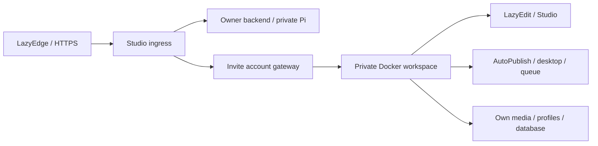

[English](../README.md) · [العربية](README.ar.md) · [Español](README.es.md) · [Français](README.fr.md) · [日本語](README.ja.md) · [한국어](README.ko.md) · [Tiếng Việt](README.vi.md) · [中文 (简体)](README.zh-Hans.md) · [中文（繁體）](README.zh-Hant.md) · [Deutsch](README.de.md) · [Русский](README.ru.md)

[](https://github.com/lachlanchen/lachlanchen/blob/main/figs/banner.png)

# AutoPublication

*Edita, corrige y publica vídeos o música desde tu espacio privado.*

[](https://edit.lazying.art) [](https://github.com/sponsors/lachlanchen)

AutoPublication integra LazyEdit, AutoPublish, AutoPubMonitor y transcripción multilingüe mediante repositorios fijados. El servicio Docker por invitación ofrece a cada usuario un escritorio Linux privado para iniciar sesión, un backend de edición y una cola de publicación persistente.

La edición y la vista previa son la experiencia normal de los miembros; no requieren cuentas sociales. El operador habilita la publicación por separado para cuentas aprobadas. Los revisores reciben su propio espacio de edición, sin acceso al Pi, los canales ni los medios privados del propietario. Los límites mensuales son 10/60/150 minutos de vídeo fuente; los cobros siguen desactivados hasta probar compras reales.

| Donate | PayPal | Stripe |
| --- | --- | --- |
| [](https://chat.lazying.art/donate) | [](https://paypal.me/RongzhouChen) | [](https://buy.stripe.com/aFadR8gIaflgfQV6T4fw400) |

## Funcionamiento

El servicio actual es [edit.lazying.art](https://edit.lazying.art); los invitados entran en [/accounts](https://edit.lazying.art/accounts). El propietario conserva su backend y Pi privado. Los demás tienen workers Docker, medios, ajustes, bases y perfiles independientes. Otro dominio es opcional para este piloto de confianza.

Las interfaces nativas para iOS, Android y Mac incluyen once idiomas, controles privados de inicio de sesión y eliminación de la cuenta del miembro. El Pi del propietario sigue siendo exclusivo de lachlanchen. La vinculación, el acceso y la revocación de Google pasaron pruebas reales del navegador en un proyecto de pruebas exclusivo de identidad; Apple espera la prueba real de acceso. La facturación sigue desactivada hasta definir límites y probar compras reales.


```mermaid
flowchart LR
    E[LazyEdge / HTTPS] --> R[Studio ingress]
    R --> O[Owner backend / private Pi]
    R --> G[Invite account gateway]
    G --> W[Private Docker workspace]
    W --> L[LazyEdit / Studio]
    W --> A[AutoPublish / desktop / queue]
    W --> D[Own media / profiles / database]
```

## Componentes fijados

| Componente | Commit | |
| --- | --- | --- |
| `LazyEdit` | `cb80417` | Edición, corrección, API Studio y contenedores |
| `AutoPublish` | `c7bcbe9` | Adaptadores, acceso y cola persistente del navegador |
| `AutoPubMonitor` | `a097a054` | Supervisión y sincronización existentes |
| `whisper_with_lang_detect` | `5b02dceb` | Transcripción independiente y VAD |

[docs/hosted-service.md](../docs/hosted-service.md) · [LazyEdit](https://github.com/lachlanchen/LazyEdit) · [AutoPublish](https://github.com/lachlanchen/AutoPublish) · [AutoPubMonitor](https://github.com/lachlanchen/AutoPubMonitor) · [MultilingualWhisper](https://github.com/lachlanchen/MultilingualWhisper)

## Inicio rápido

Se necesitan Linux x86-64, Docker/Compose, Node 22 y un entorno Python adecuado. La guía explica construcción, inicialización, arranque y rutas LazyEdge. Clonar no despliega el servicio.

```bash
git clone https://github.com/lachlanchen/AutoPublication.git
cd AutoPublication
git submodule update --init --recursive
scripts/autopublication --help
```

## Operación y privacidad

Mantén contraseñas, claves, tokens, cookies, perfiles, bases de cuentas y medios privados fuera de Git. Edición y publicación comparten almacenamiento canónico; las cargas se renombran y las extracciones temporales terminadas se limpian. Fuente, máster editado y ZIP reutilizable son artefactos distintos. Este repositorio no reinicia el flujo del propietario.

[AGENTS.md](../AGENTS.md) · [docs/hosted-service.md](../docs/hosted-service.md)

## Validación

Ejecuta las pruebas de cuentas/transporte y el control de archivos públicos antes de publicar código. Las pruebas básicas excluyen publicaciones reales. Corrige y sube primero al repositorio responsable y después actualiza estos commits fijados.

```bash
npm ci --prefix LazyEdit/app --no-audit --no-fund
scripts/autopublication test
python scripts/check_public_files.py
```

## Estado y alcance

Piloto por invitación desplegado en HTTPS/LazyEdge existente. Se verificaron cuentas, escritorio WSS privado, acceso API limitado, carga reanudable y aislamiento del propietario. CPU Whisper es el entorno probado. Las cuentas nuevas necesitan su propio QR/2FA. No hay facturación, recuperación, cuotas estrictas ni endurecimiento frente a usuarios hostiles.

## Cita

GitHub lee [CITATION.cff](../CITATION.cff). Usa la entrada estable siguiente para citar el software.

```bibtex
@software{chen_autopublication_2026,
  author = {Chen, Lachlan},
  title = {AutoPublication: account-isolated video and music publishing},
  year = {2026},
  url = {https://github.com/lachlanchen/AutoPublication}
}
```

## Apoyo

Apoya el mantenimiento con [GitHub Sponsors](https://github.com/sponsors/lachlanchen) o los enlaces anteriores.
