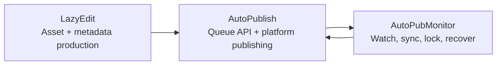

[English](../README.md) · [العربية](README.ar.md) · [Español](README.es.md) · [Français](README.fr.md) · [日本語](README.ja.md) · [한국어](README.ko.md) · [Tiếng Việt](README.vi.md) · [中文 (简体)](README.zh-Hans.md) · [中文（繁體）](README.zh-Hant.md) · [Deutsch](README.de.md) · [Русский](README.ru.md)


[](https://github.com/lachlanchen/lachlanchen/blob/main/figs/banner.png)

# AutoPublication


Documentation racine canonique pour une pile de workflow vidéo IA basée sur des sous-modules épinglés.

## 📌 En bref

| Domaine | Détails |
| --- | --- |
| Type de dépôt | Méta-dépôt avec sous-modules git épinglés |
| Rôle d'exécution à la racine | Documentation + point d'entrée d'orchestration |
| Sous-modules principaux | `AutoPubMonitor`, `LazyEdit`, `AutoPublish` |
| Source documentaire canonique | `README.md` à la racine |
| Variantes linguistiques | `i18n/README.*.md` |
| Dernier instantané d'artefacts pipeline | `.auto-readme-work/20260302_124338/` |

## 🧭 Vue d'ensemble

`AutoPublication` coordonne un pipeline d'automatisation de contenu de bout en bout :

1. Préparer, éditer et générer les ressources dans `LazyEdit`.
2. Publier les ressources vers les plateformes cibles dans `AutoPublish`.
3. Maintenir la santé des opérations de file/veille/synchronisation avec `AutoPubMonitor`.

Le dépôt racine épingle volontairement les commits des sous-modules pour préserver la reproductibilité entre environnements et hôtes de déploiement.

### Ce que ce dépôt est

- Documentation racine canonique pour l'installation, l'exploitation et l'intégration.
- Couche d'épinglage gitlink pour les versions des sous-modules.
- Source de documentation multilingue (`i18n/README.*.md`).
- Historique des traces et artefacts pipeline (`.auto-readme-work/*`).

### Ce que ce dépôt n'est pas

- Ce n'est pas un package d'exécution unique avec un seul manifeste de dépendances à la racine.
- Ce n'est pas un remplacement des README/scripts de chaque sous-module.
- Ce n'est pas, à ce stade, un schéma `.env` unifié au niveau racine.

## ✨ Fonctionnalités

- Architecture reproductible via des commits de sous-modules épinglés.
- Frontières de responsabilité claires entre édition, publication et supervision.
- Exploitation orientée Linux (`tmux`, `systemd` optionnel, FFmpeg, automatisation navigateur).
- Workflow centré sur la documentation avec variantes i18n.
- Contexte de génération README traçable sous `.auto-readme-work/`.

## 🧱 Architecture des sous-modules

### Cartographie des modules racine

| Module | Rôle | Profil d'exécution | Points d'entrée typiques |
| --- | --- | --- | --- |
| `AutoPubMonitor` | Orchestration file/veille/synchronisation autour des workflows de publication | Shell d'abord + assistants Python + `tmux`/`systemd` optionnel | `autopub_monitor/autopub_monitor_tmux_session.sh`, `autopub_monitor/process_queue.sh`, `autopub_monitor/monitor_autopublish.sh` |
| `LazyEdit` | Workflow de génération/édition/sous-titres/métadonnées assisté par IA | Backend Tornado + frontend Expo + modules de traitement | `app.py`, `start_lazyedit.sh`, `app/`, `lazyedit/` |
| `AutoPublish` | Publication multi-plateforme pilotée par navigateur et service API de file | Scripts Python + Selenium + API de file Tornado | `autopub.py`, `app.py`, `pub_*.py`, `login_*.py` |

### Frontières de dépendances

| Frontière | Dans le périmètre | Hors périmètre |
| --- | --- | --- |
| `LazyEdit` | Pipeline d'édition/génération, UI/backend, préparation des sous-titres et métadonnées | Automatisation de connexion aux plateformes et actions de publication par plateforme |
| `AutoPublish` | Adaptateurs de publication, gestion auth/session, API de file, exécution de publication | UI d'édition/transcription et la plupart des transformations amont |
| `AutoPubMonitor` | Observateurs de file, verrous, jobs de synchronisation, supervision `tmux`/service | Comportement UI de l'éditeur et flux navigateur profonds par plateforme |
| Racine (`AutoPublication`) | Documentation, orchestration des versions, politique d'épinglage des sous-modules | Gestion unifiée des dépendances d'exécution |

### Contrats d'intégration

| Passage | Producteur | Consommateur | Focalisation du contrat |
| --- | --- | --- | --- |
| Ressources média préparées | `LazyEdit` | `AutoPublish` | Conventions de dossiers, noms de fichiers, état de préparation média |
| Métadonnées/sous-titres | `LazyEdit` | `AutoPublish` | Schéma titre/description/tags et disponibilité des sous-titres |
| État de publication et santé de file | `AutoPublish` | `AutoPubMonitor` | Disponibilité des endpoints API et sémantique de file |
| Contrôle sync/watchdog | `AutoPubMonitor` | `AutoPublish` + ops | Discipline des verrous, intégrité de la file, redémarrages récupérables |

### Flux de responsabilité d'exécution



1. `LazyEdit` produit les vidéos et paquets de métadonnées.
2. `AutoPublish` exécute les actions de publication canal/plateforme.
3. `AutoPubMonitor` supervise la file et les boucles de synchronisation.

## 📦 Épingles actuelles des sous-modules

Épingles racine actuelles (`git submodule status`) :

- `AutoPubMonitor`: `6daa87ce612c2dab75fac9478d4523abd418f69d`
- `AutoPublish`: `4f348ac342bfaff7bc435985085cedd9b448e1e8`
- `LazyEdit`: `dc503d6db63b13db812fef5d9c8ffe0a882d725e`

Vérifier localement :

```bash
git submodule status
git submodule status --recursive
```

Note sur l'imbrication : `LazyEdit` inclut des sous-modules imbriqués supplémentaires (par exemple `whisper_with_lang_detect`, `furigana`, dépôts de sous-titrage), donc de nombreuses opérations racine doivent utiliser `--recursive`.

## 🗂️ Structure du projet

```text
AutoPublication/
├── README.md
├── .gitmodules
├── .gitignore
├── i18n/
│   ├── README.ar.md
│   ├── README.de.md
│   ├── README.es.md
│   ├── README.fr.md
│   ├── README.ja.md
│   ├── README.ko.md
│   ├── README.ru.md
│   ├── README.vi.md
│   ├── README.zh-Hans.md
│   └── README.zh-Hant.md
├── AutoPubMonitor/                  # submodule
│   ├── README.md
│   └── autopub_monitor/
├── LazyEdit/                        # submodule
│   ├── README.md
│   ├── app.py
│   ├── app/
│   └── lazyedit/
├── AutoPublish/                     # submodule
│   ├── README.md
│   ├── app.py
│   ├── autopub.py
│   └── pub_*.py
└── .auto-readme-work/
    └── <timestamp>/
        ├── pipeline-context.md
        ├── language-nav-root.md
        ├── language-nav-i18n.md
        ├── translation-plan.txt
        └── repo-structure-analysis.md
```

### Chemins notables

| Chemin | Objectif |
| --- | --- |
| `.gitmodules` | Déclare les remotes et chemins des sous-modules |
| `i18n/README.*.md` | Variantes localisées du README racine |
| `.auto-readme-work/*` | Traces/artefacts de génération du README |
| `AutoPubMonitor/autopub_monitor/autopub.config` | Configuration monitor file/sync/exécution |
| `LazyEdit/config.py` | Valeurs par défaut d'environnement/chemins de LazyEdit |
| `AutoPublish/.env.example` | Modèle credentials/env d'AutoPublish |

## 🧰 Prérequis

Base Linux-first sur l'ensemble des modules :

- `git` (avec prise en charge des sous-modules)
- `bash`
- Python `3.10+` (certains installateurs monitor supposent encore des noms d'env `3.8`)
- `tmux`
- `ffmpeg` / `ffprobe`
- `inotify-tools`
- `rsync`
- Chrome/Chromium + WebDriver compatible
- Node.js + npm (pour le frontend `LazyEdit/app`)
- Optionnel : `systemd`, `conda`

Hypothèse : macOS/Windows exigent des adaptations de scripts/chemins/services.

## 🛠️ Installation et bootstrap

### 1. Cloner avec les sous-modules

```bash
git clone --recurse-submodules git@github.com:lachlanchen/AutoPublication.git
cd AutoPublication
```

Si déjà cloné :

```bash
git submodule update --init --recursive
```

### 2. Synchroniser et vérifier l'alignement des sous-modules

```bash
git submodule sync --recursive
git submodule status --recursive
git submodule foreach --recursive 'git rev-parse --abbrev-ref HEAD; git rev-parse --short HEAD'
```

### 3. Flux de configuration par sous-module

| Sous-module | Config principale | Axe de configuration | Première validation |
| --- | --- | --- | --- |
| `LazyEdit` | `config.py` (+ `.env` optionnel) | Dépendances Python/backend, dépendances frontend, chemins upload/output/API | `cd LazyEdit && python app.py` |
| `AutoPublish` | `.env` (à partir de `.env.example`) | Identifiants, driver navigateur, mode queue/API | `cd AutoPublish && python app.py --port 8081` |
| `AutoPubMonitor` | `autopub_monitor/autopub.config` | Chemins file/sync/verrou, cible API, setup tmux/service | `cd AutoPubMonitor && ./autopub_monitor/autopub_monitor_tmux_session.sh start` |

Documentation de référence des modules :

- `AutoPubMonitor/README.md`
- `LazyEdit/README.md`
- `AutoPublish/README.md`

## ▶️ Utilisation et exploitation

L'usage à la racine concerne principalement l'orchestration et l'alignement des versions.

### Flux opérateur quotidien

```bash
# Keep checkout aligned to root pins
git submodule sync --recursive
git submodule update --init --recursive

# Verify current state
git submodule status --recursive
```

### Flux d'exécution de bout en bout

1. Démarrer `LazyEdit` et préparer les ressources.
2. Démarrer `AutoPublish` en mode API ou watcher CLI.
3. Démarrer `AutoPubMonitor` pour assurer la continuité file/sync/watchdog.

### Commandes de démarrage rapide

```bash
# LazyEdit
cd LazyEdit
python app.py
# optional frontend in second terminal:
# cd app && npx expo start --web

# AutoPublish
cd ../AutoPublish
python app.py --port 8081
# or CLI watcher mode:
# python autopub.py --help

# AutoPubMonitor
cd ../AutoPubMonitor
./autopub_monitor/autopub_monitor_tmux_session.sh start
```

## 🧪 Workflow de développement local

### Boucle recommandée

1. Se réaligner sur les épingles racine avant de coder.
2. Développer et tester dans un seul sous-module à la fois.
3. Valider les passages inter-sous-modules (`LazyEdit -> AutoPublish -> AutoPubMonitor`).
4. Committer d'abord les changements d'implémentation dans les dépôts de sous-modules.
5. Committer les mises à jour de pointeurs racine (`gitlinks`) en dernier.

### Flux de bump de pointeur (exemple)

```bash
# root align first
git submodule sync --recursive
git submodule update --init --recursive

# edit and commit in submodule
cd LazyEdit
git switch -c feature/<name>
# ...change/test...
git add -A && git commit -m "feat: <summary>"
cd ..

# capture new pointer in root
git add LazyEdit
git commit -m "chore(submodule): bump LazyEdit pointer"
```

### Règles de frontière de commit

- Les commits racine doivent se concentrer sur la doc, les conventions d'orchestration et les bumps de pointeurs.
- Les changements d'implémentation doivent être commités d'abord dans les dépôts de sous-modules.
- Séparer autant que possible les commits de pointeurs racine des gros changements de doc/contenu.

## ⚙️ Configuration

Il n'existe pas de configuration d'exécution unifiée à la racine. Configurez chaque sous-module directement :

### `AutoPubMonitor`

- Fichier : `AutoPubMonitor/autopub_monitor/autopub.config`
- Valeurs typiques : fichiers de file, fichiers de verrou, chemins de synchronisation, URL de base API, env conda, chemins de scripts

### `LazyEdit`

- Fichier : `LazyEdit/config.py` (plus `.env` optionnel)
- Valeurs typiques : répertoires upload/output, port backend, endpoint AutoPublish, outils de sous-titres/captions, timeouts

### `AutoPublish`

- Fichier : `AutoPublish/.env.example` (à copier vers `.env` local)
- Valeurs typiques : identifiants de plateforme, chemins navigateur/driver, paramètres SMTP/email, clés de service captcha

Recommandation sécurité : garder la config spécifique machine et les secrets dans des fichiers ignorés/variables d'environnement.

## 🔄 Stratégie de mise à jour des sous-modules

### A. Initialiser et synchroniser avec les épingles actuelles

```bash
git submodule sync --recursive
git submodule update --init --recursive
```

### B. Mettre à jour volontairement vers les pointes distantes

À utiliser uniquement si vous souhaitez explicitement déplacer les versions épinglées :

```bash
git submodule update --remote --recursive
```

Puis vérifier et committer les pointeurs :

```bash
git add AutoPubMonitor LazyEdit AutoPublish
git commit -m "chore(submodules): bump submodule pointers"
```

### C. Épingler sur un commit ou tag explicite

```bash
cd LazyEdit
git fetch origin
git checkout <commit-or-tag>
cd ..
git add LazyEdit
git commit -m "chore(submodule): pin LazyEdit to <commit-or-tag>"
```

Répéter pour `AutoPubMonitor` et `AutoPublish` selon le besoin.

### D. Examiner les deltas de pointeurs avant fusion

```bash
git diff --submodule=log
git submodule status --recursive
```

### E. Playbook de release recommandé

1. Sync/init en mode récursif.
2. Mettre à jour un sous-module à la fois.
3. Exécuter des smoke tests au niveau sous-module.
4. Exécuter des vérifications d'intégration sur les frontières de passage.
5. Stager uniquement les changements de gitlink voulus.
6. Committer avec des noms de modules explicites et la justification.

### F. Politique d'épinglage

- Garder la racine épinglée sur des commits connus comme stables.
- Éviter les bumps globaux de tous les modules sans validation d'intégration.
- Utiliser des messages d'épinglage explicites (`chore(submodule): pin <module> to <sha>`).
- Considérer la racine comme manifeste de release, et les branches des sous-modules comme flux d'implémentation.

## 🔧 Dépannage (synchronisation et état des sous-modules)

### Dossier de sous-module vide ou fichiers manquants

```bash
git submodule sync --recursive
git submodule update --init --recursive
```

### `fatal: no submodule mapping found in .gitmodules`

Cause fréquente : métadonnées obsolètes ou mismatch de chemin :

```bash
cat .gitmodules
git submodule sync --recursive
git submodule update --init --recursive
```

### `git submodule status` affiche `-`, `+` ou `U`

- `-` : sous-module non initialisé.
- `+` : le commit checkout diffère de l'épingle racine.
- `U` : conflit de fusion sur le pointeur de sous-module.

Récupération :

```bash
git submodule update --init --recursive
```

Si la divergence est intentionnelle, committer les mises à jour de gitlink à la racine.

### Detached HEAD dans un sous-module

Un detached HEAD est normal pour des sous-modules épinglés. Créer une branche avant de développer :

```bash
cd <submodule>
git switch -c feature/<name>
```

### Mauvaise URL remote pour un sous-module

```bash
git submodule sync --recursive
git submodule foreach --recursive 'git remote -v'
```

Si `.gitmodules` a changé, le committer puis resynchroniser.

### Conflits de fusion sur les pointeurs de sous-modules

Choisir les pointeurs de commit attendus, puis :

```bash
git add AutoPubMonitor LazyEdit AutoPublish
git commit
```

Valider les SHA sélectionnés :

```bash
git diff --submodule=log
git submodule status --recursive
```

### Échecs d'authentification clone/update

Le `.gitmodules` racine utilise actuellement des remotes SSH (`git@github.com:...`).

- Vérifier que les clés SSH GitHub sont configurées.
- Ou basculer vers des remotes HTTPS dans `.gitmodules`, puis lancer `git submodule sync --recursive`.

### Sous-module inattendument en état dirty

```bash
git submodule foreach --recursive 'git status --short --branch'
```

Committer d'abord les changements intentionnels dans chaque sous-module, puis mettre à jour les pointeurs racine.

### Sous-modules imbriqués de `LazyEdit` non initialisés

```bash
git submodule update --init --recursive
```

Si seuls les modules imbriqués de `LazyEdit` doivent être rafraîchis :

```bash
git -C LazyEdit submodule update --init --recursive
```

### Resynchronisation complète quand les métadonnées sont obsolètes

À utiliser quand le couple sync/update standard ne rétablit pas l'état :

```bash
git submodule deinit -f --all
git submodule sync --recursive
git submodule update --init --recursive
```

## 🛠️ Notes de développement

### Politique i18n

- Garder exactement une ligne d'options de langue en tête.
- Traiter le `README.md` anglais racine comme canonique.
- Répercuter les changements structurels dans `i18n/README.*.md`.

### Artefacts de contexte pipeline

- Les artefacts pipeline sont stockés dans `.auto-readme-work/<timestamp>/`.
- Les utiliser pour la traçabilité et l'historique de génération documentaire, pas comme entrées runtime.

## 🗺️ Feuille de route

- [ ] Ajouter des scripts d'orchestration racine pour les tâches inter-sous-modules courantes.
- [ ] Ajouter des vérifications CI pour la santé de sync des sous-modules et la dérive des épingles.
- [ ] Ajouter des contrôles automatiques de parité README racine/i18n.
- [ ] Ajouter un diagramme d'architecture pour le flux runtime bout en bout.
- [ ] Ajouter un fichier de politique `LICENSE` racine si une licence au niveau dépôt est souhaitée.

## 🤝 Contribution

Les contributions sont bienvenues pour la documentation, la clarté d'architecture et la fiabilité des workflows.

```bash
# 1) create branch
git checkout -b docs/<short-description>

# 2) stage docs and/or intended pointer updates
git add README.md i18n/README.fr.md AutoPubMonitor LazyEdit AutoPublish

# 3) commit
git commit -m "docs: improve root architecture and submodule workflows"

# 4) push
git push -u origin docs/<short-description>
```

Checklist PR :

- Garder `README.md` racine comme source canonique.
- Conserver une seule ligne d'options de langue et un seul panneau de support.
- Inclure `git submodule status` dans les notes de PR lors des bumps d'épingles.
- Documenter la justification de chaque mise à jour de pointeur de sous-module.

## Sous-modules

Ce dépôt inclut ces sous-modules git à la racine :

| Sous-module | Dépôt |
| --- | --- |
| `AutoPubMonitor` | https://github.com/lachlanchen/AutoPubMonitor |
| `LazyEdit` | https://github.com/lachlanchen/LazyEdit |
| `AutoPublish` | https://github.com/lachlanchen/AutoPublish |

## ❤️ Support

| Donate | PayPal | Stripe |
| --- | --- | --- |
| [](https://chat.lazying.art/donate) | [](https://paypal.me/RongzhouChen) | [](https://buy.stripe.com/aFadR8gIaflgfQV6T4fw400) |

## Contact

Utilisez les issues du dépôt pour les questions, corrections de documentation et coordination des contributions.

## 📄 Licence

Aucun fichier `LICENSE` au niveau racine n'est actuellement présent dans cet instantané du dépôt.

Hypothèses :

- La licence peut être déléguée aux sous-modules individuels.
- Vérifier la licence de chaque sous-module avant redistribution ou usage commercial.
