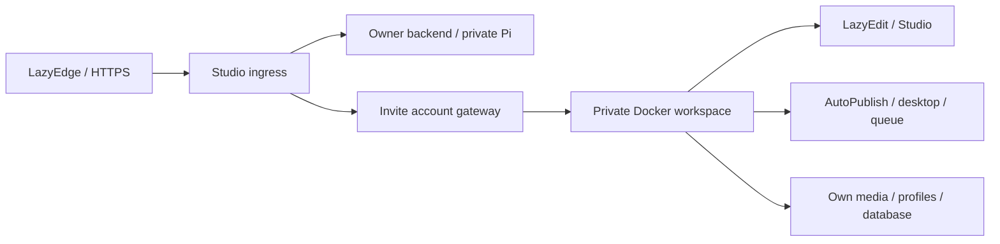

[English](../README.md) · [العربية](README.ar.md) · [Español](README.es.md) · [Français](README.fr.md) · [日本語](README.ja.md) · [한국어](README.ko.md) · [Tiếng Việt](README.vi.md) · [中文 (简体)](README.zh-Hans.md) · [中文（繁體）](README.zh-Hant.md) · [Deutsch](README.de.md) · [Русский](README.ru.md)

[](https://github.com/lachlanchen/lachlanchen/blob/main/figs/banner.png)

# AutoPublication

*Montez, corrigez et publiez vidéos ou musique dans votre espace privé.*

[](https://edit.lazying.art) [](https://github.com/sponsors/lachlanchen)

AutoPublication intègre LazyEdit, AutoPublish, AutoPubMonitor et la transcription multilingue avec des dépôts sources figés. Le service Docker sur invitation fournit à chaque utilisateur un bureau Linux privé pour ses connexions, un backend de montage et une file de publication persistante.

| Donate | PayPal | Stripe |
| --- | --- | --- |
| [](https://chat.lazying.art/donate) | [](https://paypal.me/RongzhouChen) | [](https://buy.stripe.com/aFadR8gIaflgfQV6T4fw400) |

## Fonctionnement

Le service actuel est [edit.lazying.art](https://edit.lazying.art) ; les invités passent par [/accounts](https://edit.lazying.art/accounts). Le propriétaire conserve son backend et son Pi privé. Les autres disposent de workers Docker, médias, réglages, bases et profils distincts. Un domaine séparé est facultatif pour ce pilote de confiance.

Les interfaces natives iOS, Android et Mac incluent onze langues, des contrôles privés de connexion aux plateformes et la suppression du compte membre. Le Pi du propriétaire reste réservé à lachlanchen. La liaison, la connexion et la révocation Google ont passé les tests réels du navigateur dans un projet de test dédié à l’identité ; Apple attend le test de connexion réel. La facturation reste désactivée en attendant les limites d’usage et les tests d’achat réels.


```mermaid
flowchart LR
    E[LazyEdge / HTTPS] --> R[Studio ingress]
    R --> O[Owner backend / private Pi]
    R --> G[Invite account gateway]
    G --> W[Private Docker workspace]
    W --> L[LazyEdit / Studio]
    W --> A[AutoPublish / desktop / queue]
    W --> D[Own media / profiles / database]
```

## Composants figés

| Composant | Commit | |
| --- | --- | --- |
| `LazyEdit` | `a212e32` | Montage, correction, API Studio et conteneurs |
| `AutoPublish` | `c7bcbe9` | Adaptateurs, connexions et file navigateur persistante |
| `AutoPubMonitor` | `a097a054` | Surveillance et synchronisation existantes |
| `whisper_with_lang_detect` | `5b02dceb` | Transcription autonome et VAD |

[docs/hosted-service.md](../docs/hosted-service.md) · [LazyEdit](https://github.com/lachlanchen/LazyEdit) · [AutoPublish](https://github.com/lachlanchen/AutoPublish) · [AutoPubMonitor](https://github.com/lachlanchen/AutoPubMonitor) · [MultilingualWhisper](https://github.com/lachlanchen/MultilingualWhisper)

## Démarrage rapide

Linux x86-64, Docker/Compose, Node 22 et un environnement Python adapté sont nécessaires. Consultez le guide pour construire, initialiser, démarrer et conserver le routage LazyEdge. Cloner ne déploie aucun service.

```bash
git clone https://github.com/lachlanchen/AutoPublication.git
cd AutoPublication
git submodule update --init --recursive
scripts/autopublication --help
```

## Exploitation et confidentialité

Gardez mots de passe, clés, jetons, cookies, profils, bases de comptes et médias privés hors de Git. Montage et publication partagent un stockage canonique ; les téléversements sont renommés et les extractions temporaires terminées sont nettoyées. Source, master et ZIP réutilisable restent des artefacts distincts. Ce dépôt ne redémarre pas le pipeline du propriétaire.

[AGENTS.md](../AGENTS.md) · [docs/hosted-service.md](../docs/hosted-service.md)

## Validation

Exécutez les tests de comptes/transport et le contrôle des fichiers publics avant publication. Les tests de fumée excluent les vrais posts. Corrigez et poussez dans le dépôt responsable avant de mettre à jour ses références ici.

```bash
npm ci --prefix LazyEdit/app --no-audit --no-fund
scripts/autopublication test
python scripts/check_public_files.py
```

## État et périmètre

Pilote sur invitation déployé via HTTPS/LazyEdge existant. Provisionnement, bureau WSS privé, connexion API limitée, upload reprenable et isolation du propriétaire ont été vérifiés. CPU Whisper est le runtime testé. Chaque nouveau compte nécessite son propre QR/2FA. Facturation, récupération, quotas stricts et durcissement contre des utilisateurs hostiles ne sont pas implémentés.

## Citation

GitHub lit [CITATION.cff](../CITATION.cff). Utilisez la référence stable ci-dessous pour citer ce logiciel.

```bibtex
@software{chen_autopublication_2026,
  author = {Chen, Lachlan},
  title = {AutoPublication: account-isolated video and music publishing},
  year = {2026},
  url = {https://github.com/lachlanchen/AutoPublication}
}
```

## Soutien

Soutenez la maintenance via [GitHub Sponsors](https://github.com/sponsors/lachlanchen) ou les liens ci-dessus.
