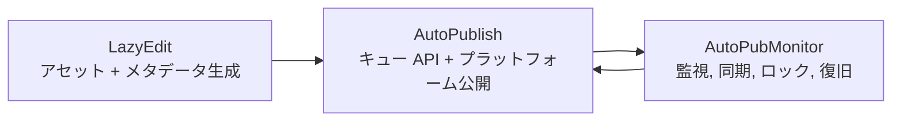

[English](../README.md) · [العربية](README.ar.md) · [Español](README.es.md) · [Français](README.fr.md) · [日本語](README.ja.md) · [한국어](README.ko.md) · [Tiếng Việt](README.vi.md) · [中文 (简体)](README.zh-Hans.md) · [中文（繁體）](README.zh-Hant.md) · [Deutsch](README.de.md) · [Русский](README.ru.md)


[](https://github.com/lachlanchen/lachlanchen/blob/main/figs/banner.png)

# AutoPublication


ピン留めされたサブモジュール構成の AI 動画ワークフロースタックを扱う、正準のルートドキュメントです。

## 📌 概要

| 項目 | 内容 |
| --- | --- |
| リポジトリ種別 | ピン留めされた git submodule を持つメタリポジトリ |
| ルートの実行時ロール | ドキュメント + オーケストレーションのエントリポイント |
| 中核サブモジュール | `AutoPubMonitor`, `LazyEdit`, `AutoPublish` |
| 正準ドキュメントソース | ルート `README.md` |
| 多言語版 | `i18n/README.*.md` |
| 最新パイプライン成果物スナップショット | `.auto-readme-work/20260302_124338/` |

## 🧭 全体像

`AutoPublication` は、コンテンツ自動化パイプライン全体を連携します。

1. `LazyEdit` でアセットを準備・編集・生成する。
2. `AutoPublish` で対象プラットフォームへ公開する。
3. `AutoPubMonitor` でキュー監視・同期処理の健全性を維持する。

ルートリポジトリでは、環境やデプロイ先をまたいだ再現性を維持するため、サブモジュールのコミットを意図的にピン留めしています。

### このリポジトリが担うもの

- セットアップ、運用、統合のための正準ルートドキュメント。
- サブモジュールバージョンを固定する gitlink ピン留めレイヤー。
- 多言語ドキュメントソース（`i18n/README.*.md`）。
- パイプライン追跡と成果物履歴（`.auto-readme-work/*`）。

### このリポジトリが担わないもの

- ルート単体で依存関係を一元管理する実行パッケージではありません。
- 各サブモジュールの README やスクリプトを置き換えるものではありません。
- 現時点でルート共通の統一 `.env` スキーマはありません。

## ✨ 特徴

- ピン留めされたサブモジュールコミットによる再現可能な構成。
- 編集・公開・監視の責務境界が明確。
- Linux ファースト運用（`tmux`、任意の `systemd`、FFmpeg、ブラウザ自動化）。
- i18n バリアントを前提としたドキュメント中心ワークフロー。
- `.auto-readme-work/` 下で README 生成コンテキストを追跡可能。

## 🧱 サブモジュールアーキテクチャ

### ルートモジュールマップ

| モジュール | 役割 | 実行プロファイル | 主なエントリポイント |
| --- | --- | --- | --- |
| `AutoPubMonitor` | 公開ワークフロー周辺のキュー監視・同期オーケストレーション | Shell 主体 + Python ヘルパー + `tmux`/任意の `systemd` | `autopub_monitor/autopub_monitor_tmux_session.sh`, `autopub_monitor/process_queue.sh`, `autopub_monitor/monitor_autopublish.sh` |
| `LazyEdit` | AI 支援によるメディア生成・編集・字幕・メタデータワークフロー | Tornado バックエンド + Expo フロントエンド + 処理モジュール | `app.py`, `start_lazyedit.sh`, `app/`, `lazyedit/` |
| `AutoPublish` | ブラウザ駆動のマルチプラットフォーム公開とキュー API サービス | Python スクリプト + Selenium + Tornado キュー API | `autopub.py`, `app.py`, `pub_*.py`, `login_*.py` |

### 依存境界

| 境界 | 対象範囲 | 対象外 |
| --- | --- | --- |
| `LazyEdit` | 編集/生成パイプライン、UI/バックエンド、字幕とメタデータ準備 | プラットフォームログイン自動化、プラットフォーム別公開処理 |
| `AutoPublish` | パブリッシャーアダプター、認証/セッション処理、キュー API、公開実行 | 編集/文字起こし UI、上流変換処理の大半 |
| `AutoPubMonitor` | キュー監視、ロック、同期ジョブ、tmux/サービス監督 | エディタ UI 挙動、プラットフォームごとの詳細ブラウザフロー |
| ルート（`AutoPublication`） | ドキュメント、バージョンオーケストレーション、サブモジュールピン留め方針 | 実行時依存関係の統合管理 |

### 統合契約

| 受け渡し | 提供側 | 受領側 | 契約の焦点 |
| --- | --- | --- | --- |
| 準備済みメディアアセット | `LazyEdit` | `AutoPublish` | ディレクトリ規約、ファイル名、メディア準備完了性 |
| メタデータ/字幕 | `LazyEdit` | `AutoPublish` | タイトル/説明/タグのスキーマ、字幕の可用性 |
| 公開状態とキュー健全性 | `AutoPublish` | `AutoPubMonitor` | API エンドポイント可用性、キューの意味論 |
| 同期/ウォッチドッグ制御 | `AutoPubMonitor` | `AutoPublish` + 運用 | ロック規律、キュー整合性、復旧可能な再起動 |

### 実行時の責務フロー



1. `LazyEdit` が動画とメタデータパッケージを生成します。
2. `AutoPublish` がチャネル/プラットフォームへの公開処理を実行します。
3. `AutoPubMonitor` がキューと同期ループを監督します。

## 📦 現在のサブモジュールピン

現在のルートピン（`git submodule status`）:

- `AutoPubMonitor`: `6daa87ce612c2dab75fac9478d4523abd418f69d`
- `AutoPublish`: `4f348ac342bfaff7bc435985085cedd9b448e1e8`
- `LazyEdit`: `dc503d6db63b13db812fef5d9c8ffe0a882d725e`

ローカル確認:

```bash
git submodule status
git submodule status --recursive
```

入れ子サブモジュールに関する注記: `LazyEdit` には追加のネストされたサブモジュール（例: `whisper_with_lang_detect`、`furigana`、字幕関連リポジトリ）が含まれるため、ルート操作の多くで `--recursive` を使う必要があります。

## 🗂️ プロジェクト構成

```text
AutoPublication/
├── README.md
├── .gitmodules
├── .gitignore
├── i18n/
│   ├── README.ar.md
│   ├── README.de.md
│   ├── README.es.md
│   ├── README.fr.md
│   ├── README.ja.md
│   ├── README.ko.md
│   ├── README.ru.md
│   ├── README.vi.md
│   ├── README.zh-Hans.md
│   └── README.zh-Hant.md
├── AutoPubMonitor/                  # submodule
│   ├── README.md
│   └── autopub_monitor/
├── LazyEdit/                        # submodule
│   ├── README.md
│   ├── app.py
│   ├── app/
│   └── lazyedit/
├── AutoPublish/                     # submodule
│   ├── README.md
│   ├── app.py
│   ├── autopub.py
│   └── pub_*.py
└── .auto-readme-work/
    └── <timestamp>/
        ├── pipeline-context.md
        ├── language-nav-root.md
        ├── language-nav-i18n.md
        ├── translation-plan.txt
        └── repo-structure-analysis.md
```

### 主要パス

| パス | 用途 |
| --- | --- |
| `.gitmodules` | サブモジュールのリモートとパス定義 |
| `i18n/README.*.md` | ルート README のローカライズ版 |
| `.auto-readme-work/*` | README 生成トレース/成果物 |
| `AutoPubMonitor/autopub_monitor/autopub.config` | Monitor のキュー/同期/実行時設定 |
| `LazyEdit/config.py` | LazyEdit の環境/パス既定値 |
| `AutoPublish/.env.example` | AutoPublish の資格情報/環境変数テンプレート |

## 🧰 前提条件

モジュール全体で Linux ファーストの基本要件:

- `git`（submodule 対応）
- `bash`
- Python `3.10+`（一部 monitor インストーラは `3.8` 環境名を前提）
- `tmux`
- `ffmpeg` / `ffprobe`
- `inotify-tools`
- `rsync`
- Chrome/Chromium + 互換 WebDriver
- Node.js + npm（`LazyEdit/app` フロントエンド用）
- 任意: `systemd`, `conda`

前提: macOS/Windows ではスクリプト/パス/サービス周りの調整が必要です。

## 🛠️ インストールとブートストラップ

### 1. サブモジュール込みで clone

```bash
git clone --recurse-submodules git@github.com:lachlanchen/AutoPublication.git
cd AutoPublication
```

既に clone 済みの場合:

```bash
git submodule update --init --recursive
```

### 2. サブモジュール整合を同期・検証

```bash
git submodule sync --recursive
git submodule status --recursive
git submodule foreach --recursive 'git rev-parse --abbrev-ref HEAD; git rev-parse --short HEAD'
```

### 3. サブモジュール別セットアップフロー

| サブモジュール | 主設定 | セットアップの焦点 | 最初の検証 |
| --- | --- | --- | --- |
| `LazyEdit` | `config.py`（+ 任意の `.env`） | Python/バックエンド依存、フロントエンド依存、upload/output/API パス | `cd LazyEdit && python app.py` |
| `AutoPublish` | `.env`（`.env.example` から作成） | 資格情報、ブラウザドライバ、キュー/API モード | `cd AutoPublish && python app.py --port 8081` |
| `AutoPubMonitor` | `autopub_monitor/autopub.config` | キュー/同期/ロックパス、API ターゲット、tmux/サービス設定 | `cd AutoPubMonitor && ./autopub_monitor/autopub_monitor_tmux_session.sh start` |

権威ドキュメント:

- `AutoPubMonitor/README.md`
- `LazyEdit/README.md`
- `AutoPublish/README.md`

## ▶️ 使い方と運用

ルートでの利用は主にオーケストレーションとバージョン整合の維持です。

### 日次オペレーションフロー

```bash
# ルートピンへ整合
git submodule sync --recursive
git submodule update --init --recursive

# 現在状態の確認
git submodule status --recursive
```

### エンドツーエンド実行フロー

1. `LazyEdit` を起動してアセットを準備する。
2. `AutoPublish` を API モードまたは CLI watcher モードで起動する。
3. `AutoPubMonitor` を起動してキュー/同期/ウォッチドッグの継続性を確保する。

### クイックスタートコマンド

```bash
# LazyEdit
cd LazyEdit
python app.py
# optional frontend in second terminal:
# cd app && npx expo start --web

# AutoPublish
cd ../AutoPublish
python app.py --port 8081
# or CLI watcher mode:
# python autopub.py --help

# AutoPubMonitor
cd ../AutoPubMonitor
./autopub_monitor/autopub_monitor_tmux_session.sh start
```

## 🧪 ローカル開発ワークフロー

### 推奨ループ

1. コーディング前にルートピンへ再整合する。
2. 1 回に 1 つのサブモジュール内で開発・検証する。
3. サブモジュール間の受け渡し（`LazyEdit -> AutoPublish -> AutoPubMonitor`）を検証する。
4. 実装変更は先にサブモジュール側リポジトリでコミットする。
5. ルートのポインタ更新（`gitlinks`）は最後にコミットする。

### ポインタ更新フロー（例）

```bash
# root align first
git submodule sync --recursive
git submodule update --init --recursive

# edit and commit in submodule
cd LazyEdit
git switch -c feature/<name>
# ...change/test...
git add -A && git commit -m "feat: <summary>"
cd ..

# capture new pointer in root
git add LazyEdit
git commit -m "chore(submodule): bump LazyEdit pointer"
```

### コミット境界ルール

- ルートコミットは docs、オーケストレーション規約、ポインタ更新に集中させる。
- 実装変更は先にサブモジュール側リポジトリでコミットする。
- 可能な限り、ルートのポインタコミットと大規模 docs/content 編集を分離する。

## ⚙️ 設定

ルートには統一された実行時設定はありません。各サブモジュールを直接設定します。

### `AutoPubMonitor`

- ファイル: `AutoPubMonitor/autopub_monitor/autopub.config`
- 典型値: キューファイル、ロックファイル、同期パス、API ベース URL、conda env、スクリプトパス

### `LazyEdit`

- ファイル: `LazyEdit/config.py`（+ 任意の `.env`）
- 典型値: upload/output ディレクトリ、バックエンドポート、AutoPublish エンドポイント、字幕ツール、タイムアウト

### `AutoPublish`

- ファイル: `AutoPublish/.env.example`（ローカル `.env` にコピー）
- 典型値: プラットフォーム資格情報、ブラウザ/ドライバパス、SMTP/メール設定、CAPTCHA サービスキー

セキュリティ推奨: マシン固有設定とシークレットは、ignore 対象ファイルまたは環境変数で管理してください。

## 🔄 サブモジュール更新戦略

### A. 現在ピンへの初期化と同期

```bash
git submodule sync --recursive
git submodule update --init --recursive
```

### B. リモート先端への意図的アップデート

ピン留めバージョンを移動させる意思が明確な場合にのみ実行します。

```bash
git submodule update --remote --recursive
```

その後、ポインタを検証してコミット:

```bash
git add AutoPubMonitor LazyEdit AutoPublish
git commit -m "chore(submodules): bump submodule pointers"
```

### C. 明示コミットまたはタグへピン留め

```bash
cd LazyEdit
git fetch origin
git checkout <commit-or-tag>
cd ..
git add LazyEdit
git commit -m "chore(submodule): pin LazyEdit to <commit-or-tag>"
```

必要に応じて `AutoPubMonitor` と `AutoPublish` にも繰り返します。

### D. マージ前にポインタ差分を確認

```bash
git diff --submodule=log
git submodule status --recursive
```

### E. 推奨リリース手順

1. 再帰的に sync/init を実行する。
2. サブモジュールを 1 つずつ更新する。
3. サブモジュール単体のスモークテストを実行する。
4. 受け渡し境界をまたぐ統合スモークチェックを実行する。
5. 意図した gitlink 変更だけを stage する。
6. モジュール名と理由を明記してコミットする。

### F. ピン留めポリシー

- ルートは既知の安定コミットにピン留めする。
- 統合検証なしの全モジュール一括更新を避ける。
- 明示的な pin メッセージを使う（`chore(submodule): pin <module> to <sha>`）。
- ルートをリリースマニフェスト、サブモジュールブランチを実装ストリームとして扱う。

## 🔧 トラブルシューティング（サブモジュール同期と状態）

### サブモジュールディレクトリが空、またはファイルがない

```bash
git submodule sync --recursive
git submodule update --init --recursive
```

### `fatal: no submodule mapping found in .gitmodules`

多くの場合、古いメタデータかパス不一致です。

```bash
cat .gitmodules
git submodule sync --recursive
git submodule update --init --recursive
```

### `git submodule status` が `-`、`+`、`U` を表示する

- `-`: サブモジュールが未初期化。
- `+`: チェックアウト済みコミットがルートピンと異なる。
- `U`: サブモジュールポインタでマージ競合。

復旧:

```bash
git submodule update --init --recursive
```

差分が意図的な場合は、ルートで gitlink 更新をコミットします。

### サブモジュール内が Detached HEAD

ピン留めサブモジュールでは Detached HEAD は通常です。開発前にブランチを作成してください。

```bash
cd <submodule>
git switch -c feature/<name>
```

### サブモジュールのリモート URL が誤っている

```bash
git submodule sync --recursive
git submodule foreach --recursive 'git remote -v'
```

`.gitmodules` を変更した場合はコミットし、再同期してください。

### サブモジュールポインタのマージ競合

意図したコミットポインタを選んだあと、以下を実行します。

```bash
git add AutoPubMonitor LazyEdit AutoPublish
git commit
```

選択 SHA の検証:

```bash
git diff --submodule=log
git submodule status --recursive
```

### clone/update 時の認証失敗

現在のルート `.gitmodules` は SSH リモート（`git@github.com:...`）を使います。

- GitHub SSH キーが設定済みであることを確認する。
- もしくは `.gitmodules` を HTTPS リモートへ変更後、`git submodule sync --recursive` を実行する。

### サブモジュールが予期せず dirty に見える

```bash
git submodule foreach --recursive 'git status --short --branch'
```

意図した変更は先に各サブモジュールでコミットし、その後ルートポインタを更新してください。

### `LazyEdit` のネストされたサブモジュールが初期化されていない

```bash
git submodule update --init --recursive
```

`LazyEdit` 配下だけを更新する場合:

```bash
git -C LazyEdit submodule update --init --recursive
```

### メタデータが古い場合の強制再同期

通常の sync/update で復旧できないときに使用します。

```bash
git submodule deinit -f --all
git submodule sync --recursive
git submodule update --init --recursive
```

## 🛠️ 開発ノート

### i18n ポリシー

- 先頭の言語オプション行は必ず 1 行だけにする。
- ルート英語版 `README.md` を正準として扱う。
- 構造変更は `i18n/README.*.md` へ反映する。

### パイプラインコンテキスト成果物

- パイプライン成果物は `.auto-readme-work/<timestamp>/` に保存されます。
- 実行時入力ではなく、トレーサビリティとドキュメント生成履歴に使用します。

## 🗺️ ロードマップ

- [ ] サブモジュール横断の共通作業向けルートオーケストレーションスクリプトを追加する。
- [ ] サブモジュール同期健全性とピンドリフトを検出する CI チェックを追加する。
- [ ] ルート/i18n README の整合性チェックを自動化する。
- [ ] エンドツーエンド実行フローのアーキテクチャ図を追加する。
- [ ] リポジトリレベルのライセンス方針を明確化する場合、ルート `LICENSE` ファイルを追加する。

## 🤝 コントリビューション

ドキュメント改善、アーキテクチャ明確化、ワークフロー信頼性向上へのコントリビューションを歓迎します。

```bash
# 1) create branch
git checkout -b docs/<short-description>

# 2) stage docs and/or intended pointer updates
git add README.md i18n/README.fr.md AutoPubMonitor LazyEdit AutoPublish

# 3) commit
git commit -m "docs: improve root architecture and submodule workflows"

# 4) push
git push -u origin docs/<short-description>
```

PR チェックリスト:

- ルート `README.md` を正準として維持する。
- 言語オプション行は 1 行、サポートパネルは 1 つだけにする。
- ピン更新を含む PR では `git submodule status` を PR ノートに含める。
- 各サブモジュールポインタ更新の理由を記載する。

## サブモジュール

このリポジトリには、以下のルートレベル git submodule が含まれます。

| Submodule | Repository |
| --- | --- |
| `AutoPubMonitor` | https://github.com/lachlanchen/AutoPubMonitor |
| `LazyEdit` | https://github.com/lachlanchen/LazyEdit |
| `AutoPublish` | https://github.com/lachlanchen/AutoPublish |

## 連絡先

質問、ドキュメント修正、コントリビューション調整にはリポジトリの Issues を利用してください。

## 📄 ライセンス

このリポジトリの現行スナップショットには、ルートレベルの `LICENSE` ファイルはありません。

前提:

- ライセンスは各サブモジュールに委譲されている可能性があります。
- 再配布や商用利用前に、各サブモジュールのライセンスを確認してください。


## ❤️ Support

| Donate | PayPal | Stripe |
| --- | --- | --- |
| [](https://chat.lazying.art/donate) | [](https://paypal.me/RongzhouChen) | [](https://buy.stripe.com/aFadR8gIaflgfQV6T4fw400) |
