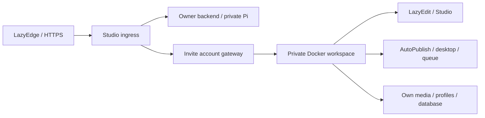

[English](../README.md) · [العربية](README.ar.md) · [Español](README.es.md) · [Français](README.fr.md) · [日本語](README.ja.md) · [한국어](README.ko.md) · [Tiếng Việt](README.vi.md) · [中文 (简体)](README.zh-Hans.md) · [中文（繁體）](README.zh-Hant.md) · [Deutsch](README.de.md) · [Русский](README.ru.md)

[](https://github.com/lachlanchen/lachlanchen/blob/main/figs/banner.png)

# AutoPublication

*自分専用のワークスペースで動画や音楽を編集・修正・公開。*

[](https://edit.lazying.art) [](https://github.com/sponsors/lachlanchen)

AutoPublication は LazyEdit、AutoPublish、AutoPubMonitor、多言語文字起こしを固定されたソースで統合します。招待制 Docker サービスは、プラットフォームへのログイン用 Linux デスクトップ、編集バックエンド、永続的な公開キューをユーザーごとに提供します。

| Donate | PayPal | Stripe |
| --- | --- | --- |
| [](https://chat.lazying.art/donate) | [](https://paypal.me/RongzhouChen) | [](https://buy.stripe.com/aFadR8gIaflgfQV6T4fw400) |

## 仕組み

現在のサービスは [edit.lazying.art](https://edit.lazying.art)、招待ユーザーの入口は [/accounts](https://edit.lazying.art/accounts) です。所有者は既存のバックエンドと専用 Pi を継続利用します。他のユーザーの Docker ワーカー、メディア、設定、データベース、ブラウザプロファイルは独立しています。信頼できる招待制の試験運用では別ドメインは任意です。

ネイティブの iOS・Android・Mac 画面は11言語に対応し、専用のプラットフォームログイン操作と会員アカウント削除を備えます。所有者の Pi は lachlanchen 専用です。Apple/Google ログインとストア課金は準備済みですが、プロバイダー設定・利用制限・実際のストアテストが完了するまで無効です。


```mermaid
flowchart LR
    E[LazyEdge / HTTPS] --> R[Studio ingress]
    R --> O[Owner backend / private Pi]
    R --> G[Invite account gateway]
    G --> W[Private Docker workspace]
    W --> L[LazyEdit / Studio]
    W --> A[AutoPublish / desktop / queue]
    W --> D[Own media / profiles / database]
```

## 固定された構成要素

| 構成要素 | コミット | |
| --- | --- | --- |
| `LazyEdit` | `8f2378e` | 編集・修正・Studio API・コンテナ |
| `AutoPublish` | `c7bcbe9` | プラットフォーム対応・ログイン・永続キュー |
| `AutoPubMonitor` | `a097a054` | 既存の監視と同期 |
| `whisper_with_lang_detect` | `5b02dceb` | 文字起こしと VAD |

[docs/hosted-service.md](../docs/hosted-service.md) · [LazyEdit](https://github.com/lachlanchen/LazyEdit) · [AutoPublish](https://github.com/lachlanchen/AutoPublish) · [AutoPubMonitor](https://github.com/lachlanchen/AutoPubMonitor) · [MultilingualWhisper](https://github.com/lachlanchen/MultilingualWhisper)

## クイックスタート

Linux x86-64、Docker/Compose、Node 22、適切な Python 環境が必要です。ビルド・初期化・起動と LazyEdge の設定は運用ガイドを参照してください。clone だけでは配備されません。

```bash
git clone https://github.com/lachlanchen/AutoPublication.git
cd AutoPublication
git submodule update --init --recursive
scripts/autopublication --help
```

## 運用とプライバシー

パスワード、キー、トークン、Cookie、プロファイル、アカウント DB、非公開メディアは Git 外に置きます。編集と公開で同じメディア領域を共有し、アップロード完了時は移動、終了した展開作業は削除します。元動画、編集済みマスター、再利用 ZIP は別の成果物です。このリポジトリの変更で所有者の処理は再起動されません。

[AGENTS.md](../AGENTS.md) · [docs/hosted-service.md](../docs/hosted-service.md)

## 検証

公開前にアカウント・通信テストと公開ファイル検査を実行します。実際の投稿はスモークテストから除外します。修正は担当リポジトリで検証・push してから固定コミットを更新します。

```bash
npm ci --prefix LazyEdit/app --no-audit --no-fund
scripts/autopublication test
python scripts/check_public_files.py
```

## 現状と範囲

既存 HTTPS/LazyEdge 経由の招待制パイロットです。アカウント作成、専用 WSS デスクトップ、限定 API ログイン、再開可能アップロード、所有者との分離を検証しました。CPU Whisper が検証済みです。各プラットフォームの QR/2FA は本人が行います。課金、復旧、厳格な容量制限、敵対的ユーザー向け防御は未実装です。

## 引用

GitHub は [CITATION.cff](../CITATION.cff) を読みます。引用には次の共通エントリを使用してください。

```bibtex
@software{chen_autopublication_2026,
  author = {Chen, Lachlan},
  title = {AutoPublication: account-isolated video and music publishing},
  year = {2026},
  url = {https://github.com/lachlanchen/AutoPublication}
}
```

## 支援

[GitHub Sponsors](https://github.com/sponsors/lachlanchen) または上記リンクで保守をご支援ください。
