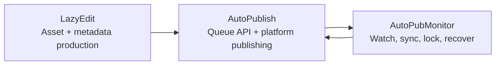

[English](../README.md) · [العربية](README.ar.md) · [Español](README.es.md) · [Français](README.fr.md) · [日本語](README.ja.md) · [한국어](README.ko.md) · [Tiếng Việt](README.vi.md) · [中文 (简体)](README.zh-Hans.md) · [中文（繁體）](README.zh-Hant.md) · [Deutsch](README.de.md) · [Русский](README.ru.md)


[](https://github.com/lachlanchen/lachlanchen/blob/main/figs/banner.png)

# AutoPublication


고정된 서브모듈 기반 AI 영상 워크플로 스택을 위한 정식 루트 문서입니다.

## 📌 한눈에 보기

| 영역 | 내용 |
| --- | --- |
| 저장소 유형 | 고정된 git 서브모듈을 사용하는 메타 저장소 |
| 루트 런타임 역할 | 문서화 + 오케스트레이션 진입점 |
| 핵심 서브모듈 | `AutoPubMonitor`, `LazyEdit`, `AutoPublish` |
| 정식 문서 원본 | 루트 `README.md` |
| 다국어 문서 | `i18n/README.*.md` |
| 최신 파이프라인 아티팩트 스냅샷 | `.auto-readme-work/20260302_124338/` |

## 🧭 개요

`AutoPublication`은 엔드투엔드 콘텐츠 자동화 파이프라인을 조율합니다.

1. `LazyEdit`에서 에셋을 준비, 편집, 생성합니다.
2. `AutoPublish`에서 대상 플랫폼으로 게시합니다.
3. `AutoPubMonitor`로 큐/감시/동기화 작업의 안정성을 유지합니다.

루트 저장소는 환경과 배포 호스트 전반의 재현성을 보장하기 위해 의도적으로 서브모듈 커밋을 고정(pin)합니다.

### 이 저장소가 하는 일

- 설정, 운영, 통합을 위한 정식 루트 문서 제공
- 서브모듈 버전을 위한 gitlink 고정 계층 제공
- 다국어 문서 소스 관리 (`i18n/README.*.md`)
- 파이프라인 추적 및 아티팩트 이력 관리 (`.auto-readme-work/*`)

### 이 저장소가 하지 않는 일

- 단일 루트 의존성 매니페스트를 가진 하나의 런타임 패키지가 아님
- 각 서브모듈의 README/스크립트를 대체하지 않음
- 현재 루트 레벨 통합 `.env` 스키마를 제공하지 않음

## ✨ 주요 기능

- 고정된 서브모듈 커밋으로 재현 가능한 아키텍처 제공
- 편집, 게시, 모니터링 간 명확한 책임 경계
- Linux 중심 운영 (`tmux`, 선택적 `systemd`, FFmpeg, 브라우저 자동화)
- i18n 변형을 포함한 문서 중심 워크플로
- `.auto-readme-work/` 하위의 추적 가능한 README 생성 컨텍스트

## 🧱 서브모듈 아키텍처

### 루트 모듈 맵

| 모듈 | 역할 | 런타임 프로필 | 대표 진입점 |
| --- | --- | --- | --- |
| `AutoPubMonitor` | 게시 워크플로 주변의 큐/감시/동기화 오케스트레이션 | 셸 중심 + Python 헬퍼 + `tmux`/선택적 `systemd` | `autopub_monitor/autopub_monitor_tmux_session.sh`, `autopub_monitor/process_queue.sh`, `autopub_monitor/monitor_autopublish.sh` |
| `LazyEdit` | AI 보조 미디어 생성/편집/자막/메타데이터 워크플로 | Tornado 백엔드 + Expo 프런트엔드 + 처리 모듈 | `app.py`, `start_lazyedit.sh`, `app/`, `lazyedit/` |
| `AutoPublish` | 브라우저 기반 멀티플랫폼 게시 및 큐 API 서비스 | Python 스크립트 + Selenium + Tornado 큐 API | `autopub.py`, `app.py`, `pub_*.py`, `login_*.py` |

### 의존성 경계

| 경계 | 범위 내 | 범위 밖 |
| --- | --- | --- |
| `LazyEdit` | 편집/생성 파이프라인, UI/백엔드, 자막 및 메타데이터 준비 | 플랫폼 로그인 자동화, 플랫폼별 게시 실행 |
| `AutoPublish` | 퍼블리셔 어댑터, 인증/세션 처리, 큐 API, 게시 실행 | 편집/전사 UI 및 대부분의 업스트림 변환 |
| `AutoPubMonitor` | 큐 감시, 락, 동기화 작업, tmux/서비스 감독 | 에디터 UI 동작, 플랫폼별 심층 브라우저 플로 |
| 루트 (`AutoPublication`) | 문서, 버전 오케스트레이션, 서브모듈 핀 정책 | 통합 런타임 의존성 관리 |

### 통합 계약

| 핸드오프 | Producer | Consumer | 계약 핵심 |
| --- | --- | --- | --- |
| 준비된 미디어 에셋 | `LazyEdit` | `AutoPublish` | 디렉터리 규약, 파일명, 미디어 준비 상태 |
| 메타데이터/캡션 | `LazyEdit` | `AutoPublish` | 제목/설명/태그 스키마, 캡션 제공 여부 |
| 게시 상태 및 큐 상태 건전성 | `AutoPublish` | `AutoPubMonitor` | API 엔드포인트 가용성, 큐 의미론 |
| 동기화/워치독 제어 | `AutoPubMonitor` | `AutoPublish` + 운영 | 락 규율, 큐 무결성, 복구 가능한 재시작 |

### 런타임 소유 흐름



1. `LazyEdit`가 영상과 메타데이터 패키지를 생성합니다.
2. `AutoPublish`가 채널/플랫폼 게시를 실행합니다.
3. `AutoPubMonitor`가 큐 및 동기화 루프를 감독합니다.

## 📦 현재 서브모듈 핀

현재 루트 핀 (`git submodule status`):

- `AutoPubMonitor`: `6daa87ce612c2dab75fac9478d4523abd418f69d`
- `AutoPublish`: `4f348ac342bfaff7bc435985085cedd9b448e1e8`
- `LazyEdit`: `dc503d6db63b13db812fef5d9c8ffe0a882d725e`

로컬 확인:

```bash
git submodule status
git submodule status --recursive
```

중첩 참고: `LazyEdit`에는 추가 중첩 서브모듈(예: `whisper_with_lang_detect`, `furigana`, 캡셔닝 저장소)이 포함되어 있으므로 루트 작업은 대체로 `--recursive` 사용이 필요합니다.

## 🗂️ 프로젝트 구조

```text
AutoPublication/
├── README.md
├── .gitmodules
├── .gitignore
├── i18n/
│   ├── README.ar.md
│   ├── README.de.md
│   ├── README.es.md
│   ├── README.fr.md
│   ├── README.ja.md
│   ├── README.ko.md
│   ├── README.ru.md
│   ├── README.vi.md
│   ├── README.zh-Hans.md
│   └── README.zh-Hant.md
├── AutoPubMonitor/                  # submodule
│   ├── README.md
│   └── autopub_monitor/
├── LazyEdit/                        # submodule
│   ├── README.md
│   ├── app.py
│   ├── app/
│   └── lazyedit/
├── AutoPublish/                     # submodule
│   ├── README.md
│   ├── app.py
│   ├── autopub.py
│   └── pub_*.py
└── .auto-readme-work/
    └── <timestamp>/
        ├── pipeline-context.md
        ├── language-nav-root.md
        ├── language-nav-i18n.md
        ├── translation-plan.txt
        └── repo-structure-analysis.md
```

### 주요 경로

| 경로 | 용도 |
| --- | --- |
| `.gitmodules` | 서브모듈 원격 저장소와 경로 선언 |
| `i18n/README.*.md` | 루트 README 현지화 버전 |
| `.auto-readme-work/*` | README 생성 추적/아티팩트 |
| `AutoPubMonitor/autopub_monitor/autopub.config` | 모니터 큐/동기화/런타임 설정 |
| `LazyEdit/config.py` | LazyEdit 환경/경로 기본값 |
| `AutoPublish/.env.example` | AutoPublish 자격 증명/환경 템플릿 |

## 🧰 사전 요구사항

모듈 전반의 Linux 중심 기본 구성:

- `git` (서브모듈 지원)
- `bash`
- Python `3.10+` (일부 모니터 설치 스크립트는 여전히 `3.8` 환경명을 가정)
- `tmux`
- `ffmpeg` / `ffprobe`
- `inotify-tools`
- `rsync`
- Chrome/Chromium + 호환 WebDriver
- Node.js + npm (`LazyEdit/app` 프런트엔드용)
- 선택 사항: `systemd`, `conda`

가정: macOS/Windows에서는 스크립트/경로/서비스 관련 추가 조정이 필요합니다.

## 🛠️ 설치 및 부트스트랩

### 1. 서브모듈 포함 클론

```bash
git clone --recurse-submodules git@github.com:lachlanchen/AutoPublication.git
cd AutoPublication
```

이미 클론되어 있다면:

```bash
git submodule update --init --recursive
```

### 2. 서브모듈 정렬 동기화 및 검증

```bash
git submodule sync --recursive
git submodule status --recursive
git submodule foreach --recursive 'git rev-parse --abbrev-ref HEAD; git rev-parse --short HEAD'
```

### 3. 서브모듈별 설정 흐름

| 서브모듈 | 주요 설정 | 설정 초점 | 첫 검증 |
| --- | --- | --- | --- |
| `LazyEdit` | `config.py` (+ 선택적 `.env`) | Python/백엔드 의존성, 프런트엔드 의존성, 업로드/출력/API 경로 | `cd LazyEdit && python app.py` |
| `AutoPublish` | `.env` (`.env.example`에서 복사) | 자격 증명, 브라우저 드라이버, 큐/API 모드 | `cd AutoPublish && python app.py --port 8081` |
| `AutoPubMonitor` | `autopub_monitor/autopub.config` | 큐/동기화/락 경로, API 대상, tmux/서비스 설정 | `cd AutoPubMonitor && ./autopub_monitor/autopub_monitor_tmux_session.sh start` |

정식 모듈 문서:

- `AutoPubMonitor/README.md`
- `LazyEdit/README.md`
- `AutoPublish/README.md`

## ▶️ 사용 및 운영

루트 사용은 주로 오케스트레이션과 버전 정렬에 초점이 있습니다.

### 일일 운영 흐름

```bash
# 루트 핀 기준으로 체크아웃 정렬
git submodule sync --recursive
git submodule update --init --recursive

# 현재 상태 확인
git submodule status --recursive
```

### 엔드투엔드 런타임 흐름

1. `LazyEdit`를 시작해 에셋을 준비합니다.
2. `AutoPublish`를 API 모드 또는 CLI watcher 모드로 시작합니다.
3. `AutoPubMonitor`를 시작해 큐/동기화/워치독 연속성을 유지합니다.

### 빠른 시작 명령

```bash
# LazyEdit
cd LazyEdit
python app.py
# 두 번째 터미널에서 프런트엔드(선택):
# cd app && npx expo start --web

# AutoPublish
cd ../AutoPublish
python app.py --port 8081
# 또는 CLI watcher 모드:
# python autopub.py --help

# AutoPubMonitor
cd ../AutoPubMonitor
./autopub_monitor/autopub_monitor_tmux_session.sh start
```

## 🧪 로컬 개발 워크플로

### 권장 루프

1. 코딩 전에 루트 핀 기준으로 재정렬합니다.
2. 한 번에 하나의 서브모듈 내부에서 개발/테스트합니다.
3. 서브모듈 간 핸드오프(`LazyEdit -> AutoPublish -> AutoPubMonitor`)를 검증합니다.
4. 구현 변경은 먼저 각 서브모듈 저장소에 커밋합니다.
5. 루트 포인터 업데이트(`gitlinks`)는 마지막에 커밋합니다.

### 포인터 bump 흐름(예시)

```bash
# 먼저 루트 정렬
git submodule sync --recursive
git submodule update --init --recursive

# 서브모듈에서 수정 및 커밋
cd LazyEdit
git switch -c feature/<name>
# ...change/test...
git add -A && git commit -m "feat: <summary>"
cd ..

# 루트에서 새 포인터 반영
git add LazyEdit
git commit -m "chore(submodule): bump LazyEdit pointer"
```

### 커밋 경계 규칙

- 루트 커밋은 문서, 오케스트레이션 규칙, 포인터 bump에 집중합니다.
- 구현 변경은 먼저 서브모듈 저장소에 커밋해야 합니다.
- 가능하면 루트 포인터 커밋과 대규모 문서/콘텐츠 수정은 분리합니다.

## ⚙️ 설정

루트 통합 런타임 설정은 없습니다. 각 서브모듈을 직접 설정하세요.

### `AutoPubMonitor`

- 파일: `AutoPubMonitor/autopub_monitor/autopub.config`
- 일반 값: 큐 파일, 락 파일, 동기화 경로, API base URL, conda env, 스크립트 경로

### `LazyEdit`

- 파일: `LazyEdit/config.py` (+ 선택적 `.env`)
- 일반 값: 업로드/출력 디렉터리, 백엔드 포트, AutoPublish 엔드포인트, 자막/캡션 도구, 타임아웃

### `AutoPublish`

- 파일: `AutoPublish/.env.example` (로컬 `.env`로 복사)
- 일반 값: 플랫폼 자격 증명, 브라우저/드라이버 경로, SMTP/이메일 설정, 캡차 서비스 키

보안 권장사항: 머신별 설정과 비밀값은 무시 대상 파일 또는 환경 변수에 보관하세요.

## 🔄 서브모듈 업데이트 전략

### A. 현재 핀으로 초기화 및 동기화

```bash
git submodule sync --recursive
git submodule update --init --recursive
```

### B. 의도적으로 원격 최신으로 업데이트

고정 버전을 실제로 이동하려는 의도가 있을 때만 사용합니다.

```bash
git submodule update --remote --recursive
```

그다음 포인터를 검증하고 커밋합니다.

```bash
git add AutoPubMonitor LazyEdit AutoPublish
git commit -m "chore(submodules): bump submodule pointers"
```

### C. 특정 커밋 또는 태그로 핀 고정

```bash
cd LazyEdit
git fetch origin
git checkout <commit-or-tag>
cd ..
git add LazyEdit
git commit -m "chore(submodule): pin LazyEdit to <commit-or-tag>"
```

필요 시 `AutoPubMonitor`, `AutoPublish`에도 동일하게 반복합니다.

### D. 머지 전 포인터 변경 검토

```bash
git diff --submodule=log
git submodule status --recursive
```

### E. 권장 릴리스 플레이북

1. 재귀 sync/init 수행
2. 한 번에 하나의 서브모듈만 업데이트
3. 서브모듈 단위 스모크 테스트 실행
4. 핸드오프 경계 간 통합 스모크 체크 실행
5. 의도한 gitlink 변경만 스테이징
6. 모듈명과 변경 이유를 명시해 커밋

### F. 핀 정책

- 루트는 검증된 커밋에 고정 유지
- 통합 검증 없이 전체 모듈 일괄 bump 지양
- 명시적 핀 커밋 메시지 사용 (`chore(submodule): pin <module> to <sha>`)
- 루트는 릴리스 매니페스트, 서브모듈 브랜치는 구현 스트림으로 취급

## 🔧 문제 해결 (서브모듈 동기화 및 상태)

### 서브모듈 디렉터리가 비었거나 파일이 없는 경우

```bash
git submodule sync --recursive
git submodule update --init --recursive
```

### `fatal: no submodule mapping found in .gitmodules`

대부분 오래된 메타데이터 또는 경로 불일치가 원인입니다.

```bash
cat .gitmodules
git submodule sync --recursive
git submodule update --init --recursive
```

### `git submodule status`에 `-`, `+`, `U`가 표시되는 경우

- `-`: 서브모듈이 초기화되지 않음
- `+`: 체크아웃된 커밋이 루트 핀과 다름
- `U`: 서브모듈 포인터 머지 충돌

복구:

```bash
git submodule update --init --recursive
```

의도적인 차이라면 루트에서 gitlink 업데이트를 커밋하세요.

### 서브모듈 내부 Detached HEAD

고정형 서브모듈에서는 Detached HEAD가 정상입니다. 개발 전 브랜치를 만드세요.

```bash
cd <submodule>
git switch -c feature/<name>
```

### 서브모듈 원격 URL이 잘못된 경우

```bash
git submodule sync --recursive
git submodule foreach --recursive 'git remote -v'
```

`.gitmodules`가 변경되었다면 커밋 후 재동기화하세요.

### 서브모듈 포인터 머지 충돌

원하는 커밋 포인터를 선택한 다음:

```bash
git add AutoPubMonitor LazyEdit AutoPublish
git commit
```

선택한 SHA 검증:

```bash
git diff --submodule=log
git submodule status --recursive
```

### 클론/업데이트 인증 실패

현재 루트 `.gitmodules`는 SSH 원격(`git@github.com:...`)을 사용합니다.

- GitHub SSH 키가 설정되어 있는지 확인하세요.
- 또는 `.gitmodules`를 HTTPS 원격으로 바꾼 뒤 `git submodule sync --recursive`를 실행하세요.

### 서브모듈이 예상치 않게 dirty 상태로 보이는 경우

```bash
git submodule foreach --recursive 'git status --short --branch'
```

의도한 변경은 각 서브모듈에서 먼저 커밋한 뒤 루트 포인터를 업데이트하세요.

### `LazyEdit`의 중첩 서브모듈이 초기화되지 않은 경우

```bash
git submodule update --init --recursive
```

`LazyEdit` 내부 중첩 모듈만 갱신하려면:

```bash
git -C LazyEdit submodule update --init --recursive
```

### 메타데이터가 오래되어 강제 재동기화가 필요한 경우

일반 sync/update로 복구되지 않을 때 사용:

```bash
git submodule deinit -f --all
git submodule sync --recursive
git submodule update --init --recursive
```

## 🛠️ 개발 노트

### i18n 정책

- 최상단 언어 옵션 라인은 정확히 한 줄만 유지
- 루트 영어 `README.md`를 정본(canonical)으로 취급
- 구조 변경 시 `i18n/README.*.md`로 전파

### 파이프라인 컨텍스트 아티팩트

- 파이프라인 아티팩트는 `.auto-readme-work/<timestamp>/`에 저장됩니다.
- 런타임 입력이 아니라 추적성과 문서 생성 이력 용도로 사용하세요.

## 🗺️ 로드맵

- [ ] 공통 교차 서브모듈 작업용 루트 오케스트레이션 스크립트 추가
- [ ] 서브모듈 동기화 상태와 핀 드리프트용 CI 점검 추가
- [ ] 루트/i18n README 정합성 자동 점검 추가
- [ ] 엔드투엔드 런타임 흐름 아키텍처 다이어그램 추가
- [ ] 저장소 레벨 라이선스가 필요하다면 루트 `LICENSE` 정책 파일 추가

## 🤝 기여

문서, 아키텍처 명확성, 워크플로 신뢰성 개선 기여를 환영합니다.

```bash
# 1) 브랜치 생성
git checkout -b docs/<short-description>

# 2) 문서 및/또는 의도한 포인터 업데이트 스테이징
git add README.md i18n/README.fr.md AutoPubMonitor LazyEdit AutoPublish

# 3) 커밋
git commit -m "docs: improve root architecture and submodule workflows"

# 4) 푸시
git push -u origin docs/<short-description>
```

PR 체크리스트:

- 루트 `README.md`를 정본으로 유지
- 언어 옵션 라인 1개, 지원 패널 1개만 유지
- 핀 업데이트 시 PR 노트에 `git submodule status` 포함
- 각 서브모듈 포인터 업데이트 이유 문서화

## Submodules

이 저장소는 다음 루트 레벨 git 서브모듈을 포함합니다.

| Submodule | Repository |
| --- | --- |
| `AutoPubMonitor` | https://github.com/lachlanchen/AutoPubMonitor |
| `LazyEdit` | https://github.com/lachlanchen/LazyEdit |
| `AutoPublish` | https://github.com/lachlanchen/AutoPublish |

## ❤️ Support

| Donate | PayPal | Stripe |
| --- | --- | --- |
| [](https://chat.lazying.art/donate) | [](https://paypal.me/RongzhouChen) | [](https://buy.stripe.com/aFadR8gIaflgfQV6T4fw400) |

## Contact

질문, 문서 수정, 기여 조율은 저장소 이슈를 이용해 주세요.

## 📄 라이선스

현재 이 저장소 스냅샷에는 루트 레벨 `LICENSE` 파일이 없습니다.

가정:

- 라이선스 정책이 개별 서브모듈에 위임되어 있을 수 있습니다.
- 재배포 또는 상업적 사용 전 각 서브모듈 라이선스를 확인하세요.
