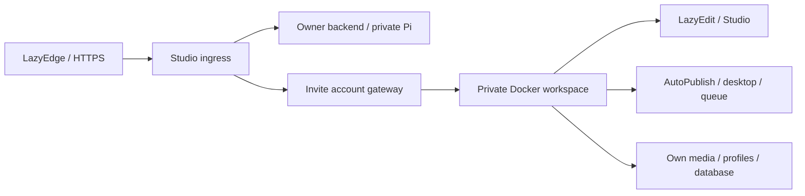

[English](../README.md) · [العربية](README.ar.md) · [Español](README.es.md) · [Français](README.fr.md) · [日本語](README.ja.md) · [한국어](README.ko.md) · [Tiếng Việt](README.vi.md) · [中文 (简体)](README.zh-Hans.md) · [中文（繁體）](README.zh-Hant.md) · [Deutsch](README.de.md) · [Русский](README.ru.md)

[](https://github.com/lachlanchen/lachlanchen/blob/main/figs/banner.png)

# AutoPublication

*개인 작업 공간에서 동영상과 음악을 편집하고 교정하여 게시합니다.*

[](https://edit.lazying.art) [](https://github.com/sponsors/lachlanchen)

AutoPublication은 고정된 소스 저장소로 LazyEdit, AutoPublish, AutoPubMonitor와 다국어 전사를 통합합니다. 초대 전용 Docker 서비스는 사용자마다 플랫폼 로그인용 Linux 데스크톱, 편집 백엔드 및 영구 게시 큐를 제공합니다.

| Donate | PayPal | Stripe |
| --- | --- | --- |
| [](https://chat.lazying.art/donate) | [](https://paypal.me/RongzhouChen) | [](https://buy.stripe.com/aFadR8gIaflgfQV6T4fw400) |

## 작동 방식

현재 서비스는 [edit.lazying.art](https://edit.lazying.art)이며 초대 사용자는 [/accounts](https://edit.lazying.art/accounts)로 들어갑니다. 기존 소유자는 현재 백엔드와 전용 Pi 게시기를 계속 사용합니다. 다른 사용자의 Docker 워커, 미디어, 설정, 데이터베이스, 브라우저 프로필은 분리됩니다. 신뢰할 수 있는 초대 시험 운영에는 별도 도메인이 필수는 아닙니다.


```mermaid
flowchart LR
    E[LazyEdge / HTTPS] --> R[Studio ingress]
    R --> O[Owner backend / private Pi]
    R --> G[Invite account gateway]
    G --> W[Private Docker workspace]
    W --> L[LazyEdit / Studio]
    W --> A[AutoPublish / desktop / queue]
    W --> D[Own media / profiles / database]
```

## 고정된 구성 요소

| 구성 요소 | 커밋 | |
| --- | --- | --- |
| `LazyEdit` | `00e1d9c` | 편집·교정·Studio API·컨테이너 |
| `AutoPublish` | `3cc34fd` | 플랫폼 어댑터·로그인·영구 브라우저 큐 |
| `AutoPubMonitor` | `a097a054` | 기존 감시와 동기화 |
| `whisper_with_lang_detect` | `5b02dceb` | 독립 전사 및 VAD |

[docs/hosted-service.md](../docs/hosted-service.md) · [LazyEdit](https://github.com/lachlanchen/LazyEdit) · [AutoPublish](https://github.com/lachlanchen/AutoPublish) · [AutoPubMonitor](https://github.com/lachlanchen/AutoPubMonitor) · [MultilingualWhisper](https://github.com/lachlanchen/MultilingualWhisper)

## 빠른 시작

운영에는 Linux x86-64, Docker/Compose, Node 22와 적합한 Python 환경이 필요합니다. 빌드, 초기화, 시작과 LazyEdge 경로는 배포 가이드를 참고하세요. 복제만으로 서비스가 배포되지는 않습니다.

```bash
git clone https://github.com/lachlanchen/AutoPublication.git
cd AutoPublication
git submodule update --init --recursive
scripts/autopublication --help
```

## 운영과 개인정보

비밀번호, 키, 토큰, 쿠키, 프로필, 계정 데이터베이스, 비공개 미디어는 Git 밖에 둡니다. 편집과 게시가 하나의 미디어 저장소를 공유하며 완료된 업로드는 이동하고 종료 작업의 압축 해제 임시 파일은 삭제합니다. 원본, 편집본, 재사용 ZIP은 서로 다른 산출물입니다. 이 저장소 변경은 기존 파이프라인을 재시작하지 않습니다.

[AGENTS.md](../AGENTS.md) · [docs/hosted-service.md](../docs/hosted-service.md)

## 검증

코드 공개 전에 계정·전송 테스트와 공개 파일 검사를 실행하세요. 실제 소셜 게시물은 스모크 테스트에서 제외됩니다. 담당 저장소에서 수정·검증·push한 뒤 여기의 고정 커밋을 갱신합니다.

```bash
npm ci --prefix LazyEdit/app --no-audit --no-fund
scripts/autopublication test
python scripts/check_public_files.py
```

## 현재 범위

기존 HTTPS/LazyEdge 경로에 배포한 초대 전용 파일럿입니다. 계정 생성, 개인 WSS 데스크톱, 범위 제한 API 로그인, 재개 업로드와 소유자 분리를 검증했습니다. CPU Whisper가 검증된 런타임입니다. 새 플랫폼 계정은 본인의 QR/2FA 로그인이 필요합니다. 과금, 계정 복구, 엄격한 저장 한도 및 악의적 사용자를 위한 강화 격리는 구현되지 않았습니다.

## 인용

GitHub는 [CITATION.cff](../CITATION.cff)를 읽습니다. 소프트웨어 인용에는 아래의 동일한 항목을 사용하세요.

```bibtex
@software{chen_autopublication_2026,
  author = {Chen, Lachlan},
  title = {AutoPublication: account-isolated video and music publishing},
  year = {2026},
  url = {https://github.com/lachlanchen/AutoPublication}
}
```

## 지원

[GitHub Sponsors](https://github.com/sponsors/lachlanchen) 또는 위 링크로 유지보수를 지원해 주세요.
