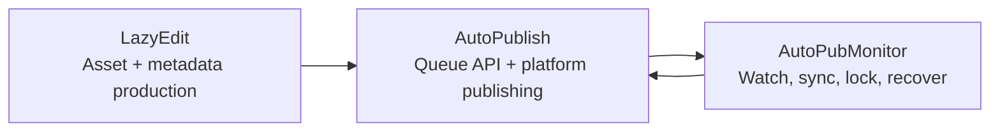

[English](../README.md) · [العربية](README.ar.md) · [Español](README.es.md) · [Français](README.fr.md) · [日本語](README.ja.md) · [한국어](README.ko.md) · [Tiếng Việt](README.vi.md) · [中文 (简体)](README.zh-Hans.md) · [中文（繁體）](README.zh-Hant.md) · [Deutsch](README.de.md) · [Русский](README.ru.md)


[](https://github.com/lachlanchen/lachlanchen/blob/main/figs/banner.png)

# AutoPublication


Каноническая корневая документация для закрепленного AI-стека видеоработы на базе подмодулей.

## 📌 Кратко

| Область | Детали |
| --- | --- |
| Тип репозитория | Мета-репозиторий с закрепленными git submodules |
| Роль корневого runtime | Документация + точка входа оркестрации |
| Ключевые подмодули | `AutoPubMonitor`, `LazyEdit`, `AutoPublish` |
| Канонический источник документации | Корневой `README.md` |
| Языковые версии | `i18n/README.*.md` |
| Последний снимок артефактов пайплайна | `.auto-readme-work/20260302_124338/` |

## 🧭 Обзор

`AutoPublication` координирует сквозной пайплайн автоматизации контента:

1. Подготовка, редактирование и генерация ассетов в `LazyEdit`.
2. Публикация ассетов на целевых платформах через `AutoPublish`.
3. Поддержание здоровья очередей/наблюдения/синхронизации с `AutoPubMonitor`.

Корневой репозиторий намеренно закрепляет коммиты подмодулей, чтобы сохранить воспроизводимость между окружениями и хостами развертывания.

### Чем является этот репозиторий

- Каноническая корневая документация по настройке, эксплуатации и интеграции.
- Слой закрепления версий подмодулей через gitlink.
- Источник многоязычной документации (`i18n/README.*.md`).
- Трассировка пайплайна и история артефактов (`.auto-readme-work/*`).

### Чем этот репозиторий не является

- Это не единый runtime-пакет с одним корневым dependency manifest.
- Это не замена `README`/скриптам каждого подмодуля.
- Здесь пока нет единой корневой схемы `.env`.

## ✨ Возможности

- Воспроизводимая архитектура благодаря закрепленным коммитам подмодулей.
- Четкие границы ответственности между редактированием, публикацией и мониторингом.
- Linux-first эксплуатация (`tmux`, опционально `systemd`, FFmpeg, browser automation).
- Документационно-ориентированный рабочий процесс с i18n-вариантами.
- Отслеживаемый контекст генерации README в `.auto-readme-work/`.

## 🧱 Архитектура подмодулей

### Карта корневых модулей

| Модуль | Роль | Профиль runtime | Типовые точки входа |
| --- | --- | --- | --- |
| `AutoPubMonitor` | Оркестрация очередей/наблюдения/синхронизации вокруг публикационных процессов | Преимущественно shell + Python-хелперы + `tmux`/опционально `systemd` | `autopub_monitor/autopub_monitor_tmux_session.sh`, `autopub_monitor/process_queue.sh`, `autopub_monitor/monitor_autopublish.sh` |
| `LazyEdit` | AI-пайплайн генерации/редактирования медиа/субтитров/метаданных | Tornado backend + Expo frontend + модули обработки | `app.py`, `start_lazyedit.sh`, `app/`, `lazyedit/` |
| `AutoPublish` | Browser-driven публикация на несколько платформ и queue API service | Python-скрипты + Selenium + Tornado queue API | `autopub.py`, `app.py`, `pub_*.py`, `login_*.py` |

### Границы зависимостей

| Граница | В рамках зоны ответственности | Вне зоны ответственности |
| --- | --- | --- |
| `LazyEdit` | Пайплайн редактирования/генерации, UI/backend, подготовка субтитров и метаданных | Автоматизация логина на платформах и публикация по платформам |
| `AutoPublish` | Адаптеры публикации, auth/session handling, queue API, выполнение публикации | UI редактирования/транскрибации и большинство апстрим-трансформаций |
| `AutoPubMonitor` | Наблюдатели очередей, lock-файлы, jobs синхронизации, supervision через tmux/service | Поведение UI редактора и глубокие browser flow конкретных платформ |
| Root (`AutoPublication`) | Документация, оркестрация версий, политика закрепления подмодулей | Единое управление runtime-зависимостями |

### Контракты интеграции

| Передача | Producer | Consumer | Фокус контракта |
| --- | --- | --- | --- |
| Подготовленные медиа-ассеты | `LazyEdit` | `AutoPublish` | Соглашения по директориям, именам файлов, готовности медиа |
| Метаданные/субтитры | `LazyEdit` | `AutoPublish` | Схема title/description/tags и доступность caption |
| Состояние публикации и здоровье очереди | `AutoPublish` | `AutoPubMonitor` | Доступность API endpoint и семантика очереди |
| Управление sync/watchdog | `AutoPubMonitor` | `AutoPublish` + ops | Дисциплина lock, целостность очереди, восстанавливаемые перезапуски |

### Поток ответственности во runtime



1. `LazyEdit` производит видео и пакеты метаданных.
2. `AutoPublish` выполняет публикацию на каналах/платформах.
3. `AutoPubMonitor` контролирует циклы очереди и синхронизации.

## 📦 Текущие закрепленные версии подмодулей

Текущие корневые pins (`git submodule status`):

- `AutoPubMonitor`: `6daa87ce612c2dab75fac9478d4523abd418f69d`
- `AutoPublish`: `4f348ac342bfaff7bc435985085cedd9b448e1e8`
- `LazyEdit`: `dc503d6db63b13db812fef5d9c8ffe0a882d725e`

Проверка локально:

```bash
git submodule status
git submodule status --recursive
```

Примечание о вложенности: `LazyEdit` содержит дополнительные вложенные подмодули (например `whisper_with_lang_detect`, `furigana`, репозитории captioning), поэтому многие корневые операции стоит запускать с `--recursive`.

## 🗂️ Структура проекта

```text
AutoPublication/
├── README.md
├── .gitmodules
├── .gitignore
├── i18n/
│   ├── README.ar.md
│   ├── README.de.md
│   ├── README.es.md
│   ├── README.fr.md
│   ├── README.ja.md
│   ├── README.ko.md
│   ├── README.ru.md
│   ├── README.vi.md
│   ├── README.zh-Hans.md
│   └── README.zh-Hant.md
├── AutoPubMonitor/                  # submodule
│   ├── README.md
│   └── autopub_monitor/
├── LazyEdit/                        # submodule
│   ├── README.md
│   ├── app.py
│   ├── app/
│   └── lazyedit/
├── AutoPublish/                     # submodule
│   ├── README.md
│   ├── app.py
│   ├── autopub.py
│   └── pub_*.py
└── .auto-readme-work/
    └── <timestamp>/
        ├── pipeline-context.md
        ├── language-nav-root.md
        ├── language-nav-i18n.md
        ├── translation-plan.txt
        └── repo-structure-analysis.md
```

### Важные пути

| Path | Назначение |
| --- | --- |
| `.gitmodules` | Объявляет remotes и пути подмодулей |
| `i18n/README.*.md` | Локализованные варианты корневого README |
| `.auto-readme-work/*` | Трассировка/артефакты генерации README |
| `AutoPubMonitor/autopub_monitor/autopub.config` | Конфиг очереди/синхронизации/runtime монитора |
| `LazyEdit/config.py` | Дефолты окружения/путей LazyEdit |
| `AutoPublish/.env.example` | Шаблон credential/env для AutoPublish |

## 🧰 Предварительные требования

Базовый Linux-first набор для всех модулей:

- `git` (с поддержкой submodule)
- `bash`
- Python `3.10+` (часть install-скриптов monitor все еще предполагает имена env для `3.8`)
- `tmux`
- `ffmpeg` / `ffprobe`
- `inotify-tools`
- `rsync`
- Chrome/Chromium + совместимый WebDriver
- Node.js + npm (для frontend `LazyEdit/app`)
- Опционально: `systemd`, `conda`

Предположение: для macOS/Windows потребуется адаптация скриптов/путей/сервисов.

## 🛠️ Установка и начальная настройка

### 1. Клонирование с подмодулями

```bash
git clone --recurse-submodules git@github.com:lachlanchen/AutoPublication.git
cd AutoPublication
```

Если репозиторий уже клонирован:

```bash
git submodule update --init --recursive
```

### 2. Синхронизация и проверка выравнивания подмодулей

```bash
git submodule sync --recursive
git submodule status --recursive
git submodule foreach --recursive 'git rev-parse --abbrev-ref HEAD; git rev-parse --short HEAD'
```

### 3. Поток настройки по подмодулям

| Подмодуль | Основной конфиг | Фокус настройки | Первая валидация |
| --- | --- | --- | --- |
| `LazyEdit` | `config.py` (+ опционально `.env`) | Python/backend deps, frontend deps, пути upload/output/API | `cd LazyEdit && python app.py` |
| `AutoPublish` | `.env` (из `.env.example`) | Credentials, browser driver, queue/API mode | `cd AutoPublish && python app.py --port 8081` |
| `AutoPubMonitor` | `autopub_monitor/autopub.config` | Пути queue/sync/lock, целевой API, настройка tmux/service | `cd AutoPubMonitor && ./autopub_monitor/autopub_monitor_tmux_session.sh start` |

Авторитетная документация модулей:

- `AutoPubMonitor/README.md`
- `LazyEdit/README.md`
- `AutoPublish/README.md`

## ▶️ Использование и эксплуатация

Использование root в основном сводится к оркестрации и выравниванию версий.

### Ежедневный рабочий цикл оператора

```bash
# Keep checkout aligned to root pins
git submodule sync --recursive
git submodule update --init --recursive

# Verify current state
git submodule status --recursive
```

### Сквозной runtime-поток

1. Запустите `LazyEdit` и подготовьте ассеты.
2. Запустите `AutoPublish` в API mode или CLI watcher mode.
3. Запустите `AutoPubMonitor` для непрерывности queue/sync/watchdog.

### Команды быстрого старта

```bash
# LazyEdit
cd LazyEdit
python app.py
# optional frontend in second terminal:
# cd app && npx expo start --web

# AutoPublish
cd ../AutoPublish
python app.py --port 8081
# or CLI watcher mode:
# python autopub.py --help

# AutoPubMonitor
cd ../AutoPubMonitor
./autopub_monitor/autopub_monitor_tmux_session.sh start
```

## 🧪 Локальный workflow разработки

### Рекомендуемый цикл

1. Перед кодингом выровняйтесь с root pins.
2. Разрабатывайте и тестируйте внутри одного подмодуля за раз.
3. Проверяйте межмодульные handoff (`LazyEdit -> AutoPublish -> AutoPubMonitor`).
4. Сначала коммитьте изменения реализации в репозитории подмодулей.
5. В конце коммитьте обновления root pointer (`gitlinks`).

### Поток обновления pointer (пример)

```bash
# root align first
git submodule sync --recursive
git submodule update --init --recursive

# edit and commit in submodule
cd LazyEdit
git switch -c feature/<name>
# ...change/test...
git add -A && git commit -m "feat: <summary>"
cd ..

# capture new pointer in root
git add LazyEdit
git commit -m "chore(submodule): bump LazyEdit pointer"
```

### Правила границ коммитов

- Root-коммиты должны фокусироваться на документации, соглашениях оркестрации и обновлении pointers.
- Изменения реализации сначала коммитьте в репозиториях подмодулей.
- По возможности держите root pointer-коммиты отдельно от крупных правок документации/контента.

## ⚙️ Конфигурация

Единого корневого runtime-config нет. Настраивайте каждый подмодуль напрямую:

### `AutoPubMonitor`

- Файл: `AutoPubMonitor/autopub_monitor/autopub.config`
- Типичные значения: queue files, lock files, sync paths, API base URL, conda env, script paths

### `LazyEdit`

- Файл: `LazyEdit/config.py` (плюс опционально `.env`)
- Типичные значения: upload/output directories, backend port, endpoint AutoPublish, subtitle/caption tools, timeouts

### `AutoPublish`

- Файл: `AutoPublish/.env.example` (скопируйте в локальный `.env`)
- Типичные значения: platform credentials, browser/driver paths, SMTP/email settings, captcha service keys

Рекомендация по безопасности: храните machine-specific config и секреты в игнорируемых файлах/переменных окружения.

## 🔄 Стратегия обновления подмодулей

### A. Инициализация и синхронизация с текущими pins

```bash
git submodule sync --recursive
git submodule update --init --recursive
```

### B. Осознанное обновление до remote tips

Используйте только если вы явно хотите сдвинуть закрепленные версии:

```bash
git submodule update --remote --recursive
```

Затем проверьте и закоммитьте pointers:

```bash
git add AutoPubMonitor LazyEdit AutoPublish
git commit -m "chore(submodules): bump submodule pointers"
```

### C. Закрепление на конкретный commit или tag

```bash
cd LazyEdit
git fetch origin
git checkout <commit-or-tag>
cd ..
git add LazyEdit
git commit -m "chore(submodule): pin LazyEdit to <commit-or-tag>"
```

Повторите для `AutoPubMonitor` и `AutoPublish` при необходимости.

### D. Проверка изменений pointers перед merge

```bash
git diff --submodule=log
git submodule status --recursive
```

### E. Рекомендуемый release playbook

1. Синхронизируйте/инициализируйте рекурсивно.
2. Обновляйте по одному подмодулю за раз.
3. Запустите smoke tests на уровне подмодуля.
4. Запустите интеграционные smoke-check между границами handoff.
5. Добавьте в staging только запланированные изменения gitlink.
6. Коммитьте с явным указанием модулей и обоснования.

### F. Политика pinning

- Держите root закрепленным на known-good коммитах.
- Избегайте широких одновременных bump всех модулей без интеграционной валидации.
- Используйте явные сообщения pin (`chore(submodule): pin <module> to <sha>`).
- Рассматривайте root как release manifest, а ветки подмодулей как implementation streams.

## 🔧 Устранение неполадок (синхронизация и состояние подмодулей)

### Директория подмодуля пустая или в ней отсутствуют файлы

```bash
git submodule sync --recursive
git submodule update --init --recursive
```

### `fatal: no submodule mapping found in .gitmodules`

Обычно это устаревшие метаданные или несовпадение пути:

```bash
cat .gitmodules
git submodule sync --recursive
git submodule update --init --recursive
```

### `git submodule status` показывает `-`, `+` или `U`

- `-`: подмодуль не инициализирован.
- `+`: checked-out commit отличается от root pin.
- `U`: merge conflict в pointer подмодуля.

Восстановление:

```bash
git submodule update --init --recursive
```

Если расхождение намеренное, закоммитьте обновления gitlink в root.

### Detached HEAD внутри подмодуля

Detached HEAD нормален для закрепленных подмодулей. Перед разработкой создайте ветку:

```bash
cd <submodule>
git switch -c feature/<name>
```

### Некорректный remote URL у подмодуля

```bash
git submodule sync --recursive
git submodule foreach --recursive 'git remote -v'
```

Если `.gitmodules` изменился, закоммитьте его и повторно выполните sync.

### Конфликты merge в pointers подмодулей

Выберите нужные commit pointers, затем:

```bash
git add AutoPubMonitor LazyEdit AutoPublish
git commit
```

Проверьте выбранные SHAs:

```bash
git diff --submodule=log
git submodule status --recursive
```

### Ошибки аутентификации при clone/update

В root `.gitmodules` сейчас используются SSH remotes (`git@github.com:...`).

- Убедитесь, что SSH-ключи GitHub настроены.
- Или переключитесь на HTTPS remotes в `.gitmodules`, затем запустите `git submodule sync --recursive`.

### Подмодуль неожиданно отображается как dirty

```bash
git submodule foreach --recursive 'git status --short --branch'
```

Сначала закоммитьте намеренные изменения в каждом подмодуле, затем обновите root pointers.

### Вложенные подмодули в `LazyEdit` не инициализированы

```bash
git submodule update --init --recursive
```

Если нужно обновить только вложенные модули `LazyEdit`:

```bash
git -C LazyEdit submodule update --init --recursive
```

### Жесткая повторная синхронизация при устаревших метаданных

Используйте, когда обычные sync/update не восстанавливают состояние:

```bash
git submodule deinit -f --all
git submodule sync --recursive
git submodule update --init --recursive
```

## 🛠️ Заметки по разработке

### Политика i18n

- Сверху должна быть ровно одна строка выбора языка.
- Считайте корневой английский `README.md` каноническим.
- Распространяйте структурные изменения на `i18n/README.*.md`.

### Артефакты контекста пайплайна

- Артефакты пайплайна хранятся в `.auto-readme-work/<timestamp>/`.
- Используйте их для трассируемости и истории генерации документации, а не как runtime-входы.

## 🗺️ Дорожная карта

- [ ] Добавить root-скрипты оркестрации для общих межмодульных задач.
- [ ] Добавить CI-проверки состояния синхронизации подмодулей и pin drift.
- [ ] Добавить автоматические проверки паритета root/i18n README.
- [ ] Добавить архитектурную диаграмму сквозного runtime-потока.
- [ ] Добавить корневой файл политики `LICENSE`, если предполагается лицензирование на уровне репозитория.

## 🤝 Участие в разработке

Приветствуются вклады в документацию, ясность архитектуры и надежность workflow.

```bash
# 1) create branch
git checkout -b docs/<short-description>

# 2) stage docs and/or intended pointer updates
git add README.md i18n/README.fr.md AutoPubMonitor LazyEdit AutoPublish

# 3) commit
git commit -m "docs: improve root architecture and submodule workflows"

# 4) push
git push -u origin docs/<short-description>
```

Чеклист для PR:

- Держите root `README.md` каноническим.
- Сохраняйте одну строку выбора языков и одну панель поддержки.
- При обновлении pins включайте `git submodule status` в заметки PR.
- Документируйте обоснование каждого обновления pointer подмодуля.

## Submodules

Этот репозиторий включает следующие git submodules верхнего уровня:

| Submodule | Repository |
| --- | --- |
| `AutoPubMonitor` | https://github.com/lachlanchen/AutoPubMonitor |
| `LazyEdit` | https://github.com/lachlanchen/LazyEdit |
| `AutoPublish` | https://github.com/lachlanchen/AutoPublish |

## ❤️ Support

| Donate | PayPal | Stripe |
| --- | --- | --- |
| [](https://chat.lazying.art/donate) | [](https://paypal.me/RongzhouChen) | [](https://buy.stripe.com/aFadR8gIaflgfQV6T4fw400) |

## Contact

Используйте issues репозитория для вопросов, правок документации и координации вкладов.

## 📄 Лицензия

В текущем снимке этого репозитория отсутствует корневой файл `LICENSE`.

Предположения:

- Лицензирование может быть делегировано отдельным подмодулям.
- Перед перераспространением или коммерческим использованием проверьте лицензию каждого подмодуля.
