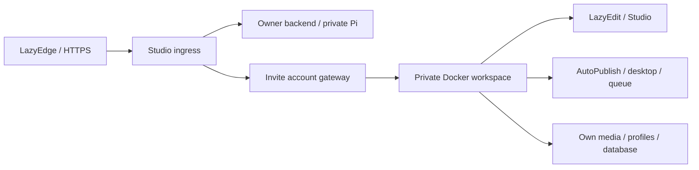

[English](../README.md) · [العربية](README.ar.md) · [Español](README.es.md) · [Français](README.fr.md) · [日本語](README.ja.md) · [한국어](README.ko.md) · [Tiếng Việt](README.vi.md) · [中文 (简体)](README.zh-Hans.md) · [中文（繁體）](README.zh-Hant.md) · [Deutsch](README.de.md) · [Русский](README.ru.md)

[](https://github.com/lachlanchen/lachlanchen/blob/main/figs/banner.png)

# AutoPublication

*Редактируйте, исправляйте и публикуйте видео или музыку в личном пространстве.*

[](https://edit.lazying.art) [](https://github.com/sponsors/lachlanchen)

AutoPublication объединяет LazyEdit, AutoPublish, AutoPubMonitor и многоязычную транскрипцию через закреплённые исходные репозитории. Docker-сервис по приглашениям даёт каждому пользователю личный Linux-десктоп для входа на платформы, сервер редактирования и постоянную очередь публикаций.

| Donate | PayPal | Stripe |
| --- | --- | --- |
| [](https://chat.lazying.art/donate) | [](https://paypal.me/RongzhouChen) | [](https://buy.stripe.com/aFadR8gIaflgfQV6T4fw400) |

## Как это работает

Текущий сервис — [edit.lazying.art](https://edit.lazying.art), приглашённые входят через [/accounts](https://edit.lazying.art/accounts). Владелец сохраняет свой сервер и личный Pi. Другие получают отдельные Docker-воркеры, медиа, настройки, базы и профили браузера. Отдельный домен необязателен для этого доверенного пилота.

Нативные интерфейсы iOS, Android и Mac поддерживают 11 языков, управление входом на платформы в личном пространстве и удаление учётной записи участника. Исходный Pi доступен только lachlanchen. Вход через Apple/Google и платежи в магазинах подготовлены, но выключены до настройки провайдеров, лимитов использования и реальных проверок магазинов.


```mermaid
flowchart LR
    E[LazyEdge / HTTPS] --> R[Studio ingress]
    R --> O[Owner backend / private Pi]
    R --> G[Invite account gateway]
    G --> W[Private Docker workspace]
    W --> L[LazyEdit / Studio]
    W --> A[AutoPublish / desktop / queue]
    W --> D[Own media / profiles / database]
```

## Закреплённые компоненты

| Компонент | Коммит | |
| --- | --- | --- |
| `LazyEdit` | `8f2378e` | Редактирование, исправление, Studio API и контейнеры |
| `AutoPublish` | `c7bcbe9` | Адаптеры платформ, вход и постоянная очередь браузера |
| `AutoPubMonitor` | `a097a054` | Существующее наблюдение и синхронизация |
| `whisper_with_lang_detect` | `5b02dceb` | Отдельная транскрипция и VAD |

[docs/hosted-service.md](../docs/hosted-service.md) · [LazyEdit](https://github.com/lachlanchen/LazyEdit) · [AutoPublish](https://github.com/lachlanchen/AutoPublish) · [AutoPubMonitor](https://github.com/lachlanchen/AutoPubMonitor) · [MultilingualWhisper](https://github.com/lachlanchen/MultilingualWhisper)

## Быстрый старт

Нужны Linux x86-64, Docker/Compose, Node 22 и подходящее окружение Python. Сборка, инициализация, запуск и маршруты LazyEdge описаны в руководстве. Клонирование само не развёртывает сервис.

```bash
git clone https://github.com/lachlanchen/AutoPublication.git
cd AutoPublication
git submodule update --init --recursive
scripts/autopublication --help
```

## Работа и конфиденциальность

Пароли, ключи, токены, cookies, профили, базы аккаунтов и личные медиа остаются вне Git. Редактирование и публикация используют единое хранилище; завершённые загрузки переименовываются, временная распаковка законченных задач очищается. Исходник, обработанный мастер и ZIP — разные артефакты. Обновление этого репозитория не перезапускает процесс владельца.

[AGENTS.md](../AGENTS.md) · [docs/hosted-service.md](../docs/hosted-service.md)

## Проверка

Перед публикацией кода запускайте тесты аккаунтов/транспорта и проверку публичных файлов. Smoke-тесты не создают реальные посты. Сначала исправляйте, проверяйте и отправляйте код в отвечающий репозиторий, затем обновляйте закреплённые коммиты.

```bash
npm ci --prefix LazyEdit/app --no-audit --no-fund
scripts/autopublication test
python scripts/check_public_files.py
```

## Статус и границы

Пилот по приглашениям развёрнут через существующий HTTPS/LazyEdge. Проверены создание аккаунта, личный WSS-десктоп, ограниченный API-вход, возобновляемая загрузка и отделение владельца. Проверенная среда — CPU Whisper. Новые платформенные аккаунты требуют своего QR/2FA. Оплата, восстановление, жёсткие квоты и защита от враждебных пользователей не реализованы.

## Цитирование

GitHub читает [CITATION.cff](../CITATION.cff). Для ссылки на программу используйте стабильную запись ниже.

```bibtex
@software{chen_autopublication_2026,
  author = {Chen, Lachlan},
  title = {AutoPublication: account-isolated video and music publishing},
  year = {2026},
  url = {https://github.com/lachlanchen/AutoPublication}
}
```

## Поддержка

Поддержите сопровождение через [GitHub Sponsors](https://github.com/sponsors/lachlanchen) или ссылки выше.
