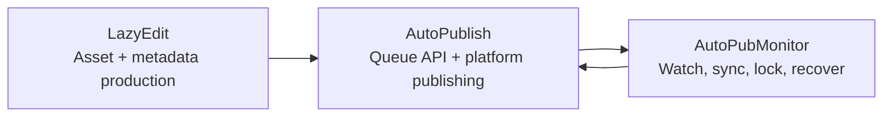

[English](../README.md) · [العربية](README.ar.md) · [Español](README.es.md) · [Français](README.fr.md) · [日本語](README.ja.md) · [한국어](README.ko.md) · [Tiếng Việt](README.vi.md) · [中文 (简体)](README.zh-Hans.md) · [中文（繁體）](README.zh-Hant.md) · [Deutsch](README.de.md) · [Русский](README.ru.md)


[](https://github.com/lachlanchen/lachlanchen/blob/main/figs/banner.png)

# AutoPublication


Tài liệu chuẩn ở cấp root cho bộ quy trình video AI dùng kiến trúc submodule được pin commit.

## 📌 Tổng Quan Nhanh

| Khu vực | Chi tiết |
| --- | --- |
| Loại repository | Meta-repository với git submodule được pin commit |
| Vai trò runtime của root | Tài liệu + điểm vào điều phối |
| Submodule cốt lõi | `AutoPubMonitor`, `LazyEdit`, `AutoPublish` |
| Nguồn tài liệu chuẩn | Root `README.md` |
| Biến thể ngôn ngữ | `i18n/README.*.md` |
| Snapshot artifact pipeline mới nhất | `.auto-readme-work/20260302_124338/` |

## 🧭 Tổng Quan

`AutoPublication` điều phối pipeline tự động hóa nội dung đầu-cuối:

1. Chuẩn bị, chỉnh sửa và tạo tài sản trong `LazyEdit`.
2. Xuất bản tài sản lên các nền tảng đích bằng `AutoPublish`.
3. Giữ các vòng lặp queue/watch/sync ổn định với `AutoPubMonitor`.

Repository root chủ đích pin commit submodule để đảm bảo khả năng tái lập giữa các môi trường và máy chủ triển khai.

### Repository này là gì

- Tài liệu chuẩn ở root cho cài đặt, vận hành và tích hợp.
- Lớp pin phiên bản submodule bằng gitlink.
- Nguồn tài liệu đa ngôn ngữ (`i18n/README.*.md`).
- Lịch sử trace và artifact pipeline (`.auto-readme-work/*`).

### Repository này không phải là gì

- Không phải một gói runtime đơn với một manifest dependency ở root.
- Không thay thế README/script riêng của từng submodule.
- Hiện chưa phải schema `.env` hợp nhất ở root.

## ✨ Tính Năng

- Kiến trúc có thể tái lập nhờ commit submodule được pin.
- Ranh giới trách nhiệm rõ ràng giữa chỉnh sửa, xuất bản và giám sát.
- Vận hành ưu tiên Linux (`tmux`, `systemd` tùy chọn, FFmpeg, tự động hóa trình duyệt).
- Quy trình ưu tiên tài liệu với các biến thể i18n.
- Bối cảnh tạo README có thể truy vết dưới `.auto-readme-work/`.

## 🧱 Kiến Trúc Submodule

### Bản đồ module ở root

| Module | Vai trò | Hồ sơ runtime | Entrypoint điển hình |
| --- | --- | --- | --- |
| `AutoPubMonitor` | Điều phối queue/watch/sync quanh luồng xuất bản | Shell-first + helper Python + `tmux`/`systemd` tùy chọn | `autopub_monitor/autopub_monitor_tmux_session.sh`, `autopub_monitor/process_queue.sh`, `autopub_monitor/monitor_autopublish.sh` |
| `LazyEdit` | Quy trình tạo/chỉnh sửa media/phụ đề/metadata có AI hỗ trợ | Backend Tornado + frontend Expo + module xử lý | `app.py`, `start_lazyedit.sh`, `app/`, `lazyedit/` |
| `AutoPublish` | Xuất bản đa nền tảng bằng trình duyệt và dịch vụ queue API | Script Python + Selenium + queue API Tornado | `autopub.py`, `app.py`, `pub_*.py`, `login_*.py` |

### Ranh giới phụ thuộc

| Ranh giới | Trong phạm vi | Ngoài phạm vi |
| --- | --- | --- |
| `LazyEdit` | Pipeline chỉnh sửa/tạo nội dung, UI/backend, chuẩn bị phụ đề và metadata | Tự động hóa đăng nhập nền tảng và hành động publish theo từng nền tảng |
| `AutoPublish` | Adapter publisher, xử lý auth/session, queue API, thực thi publish | UI chỉnh sửa/chuyển lời nói thành văn bản và phần lớn transform ở upstream |
| `AutoPubMonitor` | Queue watcher, lock, job sync, giám sát tmux/service | Hành vi UI editor và luồng trình duyệt chuyên sâu theo từng nền tảng |
| Root (`AutoPublication`) | Tài liệu, điều phối phiên bản, chính sách pin submodule | Quản lý dependency runtime hợp nhất |

### Hợp đồng tích hợp

| Điểm bàn giao | Bên tạo | Bên nhận | Trọng tâm hợp đồng |
| --- | --- | --- | --- |
| Tài sản media đã chuẩn bị | `LazyEdit` | `AutoPublish` | Quy ước thư mục, tên file, trạng thái sẵn sàng của media |
| Metadata/phụ đề | `LazyEdit` | `AutoPublish` | Schema title/description/tag và tính sẵn có của caption |
| Trạng thái publish và sức khỏe queue | `AutoPublish` | `AutoPubMonitor` | Tính sẵn sàng endpoint API và ngữ nghĩa queue |
| Điều khiển sync/watchdog | `AutoPubMonitor` | `AutoPublish` + vận hành | Kỷ luật lock, toàn vẹn queue, restart có thể khôi phục |

### Luồng runtime theo quyền sở hữu



1. `LazyEdit` tạo video và gói metadata.
2. `AutoPublish` thực thi hành động xuất bản theo kênh/nền tảng.
3. `AutoPubMonitor` giám sát queue và các vòng lặp đồng bộ.

## 📦 Pin Submodule Hiện Tại

Pin hiện tại ở root (`git submodule status`):

- `AutoPubMonitor`: `6daa87ce612c2dab75fac9478d4523abd418f69d`
- `AutoPublish`: `4f348ac342bfaff7bc435985085cedd9b448e1e8`
- `LazyEdit`: `dc503d6db63b13db812fef5d9c8ffe0a882d725e`

Kiểm tra ở local:

```bash
git submodule status
git submodule status --recursive
```

Lưu ý nested: `LazyEdit` có thêm các submodule lồng nhau (ví dụ `whisper_with_lang_detect`, `furigana`, các repo captioning), nên nhiều thao tác ở root cần dùng `--recursive`.

## 🗂️ Cấu Trúc Dự Án

```text
AutoPublication/
├── README.md
├── .gitmodules
├── .gitignore
├── i18n/
│   ├── README.ar.md
│   ├── README.de.md
│   ├── README.es.md
│   ├── README.fr.md
│   ├── README.ja.md
│   ├── README.ko.md
│   ├── README.ru.md
│   ├── README.vi.md
│   ├── README.zh-Hans.md
│   └── README.zh-Hant.md
├── AutoPubMonitor/                  # submodule
│   ├── README.md
│   └── autopub_monitor/
├── LazyEdit/                        # submodule
│   ├── README.md
│   ├── app.py
│   ├── app/
│   └── lazyedit/
├── AutoPublish/                     # submodule
│   ├── README.md
│   ├── app.py
│   ├── autopub.py
│   └── pub_*.py
└── .auto-readme-work/
    └── <timestamp>/
        ├── pipeline-context.md
        ├── language-nav-root.md
        ├── language-nav-i18n.md
        ├── translation-plan.txt
        └── repo-structure-analysis.md
```

### Đường dẫn đáng chú ý

| Đường dẫn | Mục đích |
| --- | --- |
| `.gitmodules` | Khai báo remote và path submodule |
| `i18n/README.*.md` | Các biến thể README root đã bản địa hóa |
| `.auto-readme-work/*` | Trace/artifact của quá trình tạo README |
| `AutoPubMonitor/autopub_monitor/autopub.config` | Cấu hình queue/sync/runtime của monitor |
| `LazyEdit/config.py` | Mặc định môi trường/đường dẫn của LazyEdit |
| `AutoPublish/.env.example` | Mẫu credential/env của AutoPublish |

## 🧰 Điều Kiện Tiên Quyết

Baseline ưu tiên Linux cho toàn bộ module:

- `git` (hỗ trợ submodule)
- `bash`
- Python `3.10+` (một số trình cài monitor vẫn giả định tên env `3.8`)
- `tmux`
- `ffmpeg` / `ffprobe`
- `inotify-tools`
- `rsync`
- Chrome/Chromium + WebDriver tương thích
- Node.js + npm (cho frontend `LazyEdit/app`)
- Tùy chọn: `systemd`, `conda`

Giả định: macOS/Windows cần điều chỉnh script/path/service.

## 🛠️ Cài Đặt và Bootstrap

### 1. Clone kèm submodule

```bash
git clone --recurse-submodules git@github.com:lachlanchen/AutoPublication.git
cd AutoPublication
```

Nếu đã clone trước đó:

```bash
git submodule update --init --recursive
```

### 2. Đồng bộ và xác minh trạng thái submodule

```bash
git submodule sync --recursive
git submodule status --recursive
git submodule foreach --recursive 'git rev-parse --abbrev-ref HEAD; git rev-parse --short HEAD'
```

### 3. Luồng thiết lập theo từng submodule

| Submodule | Cấu hình chính | Trọng tâm thiết lập | Kiểm tra đầu tiên |
| --- | --- | --- | --- |
| `LazyEdit` | `config.py` (+ `.env` tùy chọn) | Dependency Python/backend, dependency frontend, đường dẫn upload/output/API | `cd LazyEdit && python app.py` |
| `AutoPublish` | `.env` (từ `.env.example`) | Credential, browser driver, chế độ queue/API | `cd AutoPublish && python app.py --port 8081` |
| `AutoPubMonitor` | `autopub_monitor/autopub.config` | Đường dẫn queue/sync/lock, API target, thiết lập tmux/service | `cd AutoPubMonitor && ./autopub_monitor/autopub_monitor_tmux_session.sh start` |

Tài liệu chuẩn theo module:

- `AutoPubMonitor/README.md`
- `LazyEdit/README.md`
- `AutoPublish/README.md`

## ▶️ Sử Dụng và Vận Hành

Ở root, cách dùng chủ yếu là điều phối và đồng bộ phiên bản.

### Luồng vận hành hằng ngày

```bash
# Giữ checkout đồng bộ với pin ở root
git submodule sync --recursive
git submodule update --init --recursive

# Xác minh trạng thái hiện tại
git submodule status --recursive
```

### Luồng runtime đầu-cuối

1. Khởi chạy `LazyEdit` và chuẩn bị tài sản.
2. Khởi chạy `AutoPublish` ở API mode hoặc CLI watcher mode.
3. Khởi chạy `AutoPubMonitor` để duy trì queue/sync/watchdog.

### Lệnh quick start

```bash
# LazyEdit
cd LazyEdit
python app.py
# optional frontend in second terminal:
# cd app && npx expo start --web

# AutoPublish
cd ../AutoPublish
python app.py --port 8081
# or CLI watcher mode:
# python autopub.py --help

# AutoPubMonitor
cd ../AutoPubMonitor
./autopub_monitor/autopub_monitor_tmux_session.sh start
```

## 🧪 Quy Trình Phát Triển Local

### Vòng lặp khuyến nghị

1. Căn chỉnh lại về pin ở root trước khi code.
2. Phát triển và test trong từng submodule, từng cái một.
3. Xác minh bàn giao liên submodule (`LazyEdit -> AutoPublish -> AutoPubMonitor`).
4. Commit thay đổi triển khai trong repo submodule trước.
5. Commit cập nhật con trỏ root (`gitlinks`) sau cùng.

### Luồng bump pointer (ví dụ)

```bash
# root align first
git submodule sync --recursive
git submodule update --init --recursive

# edit and commit in submodule
cd LazyEdit
git switch -c feature/<name>
# ...change/test...
git add -A && git commit -m "feat: <summary>"
cd ..

# capture new pointer in root
git add LazyEdit
git commit -m "chore(submodule): bump LazyEdit pointer"
```

### Quy tắc ranh giới commit

- Commit ở root nên tập trung vào tài liệu, quy ước điều phối và pointer bump.
- Thay đổi triển khai nên được commit trong repo submodule trước.
- Khi có thể, tách riêng commit pointer ở root khỏi các chỉnh sửa tài liệu/nội dung lớn.

## ⚙️ Cấu Hình

Không có cấu hình runtime hợp nhất ở root. Hãy cấu hình trực tiếp theo từng submodule:

### `AutoPubMonitor`

- File: `AutoPubMonitor/autopub_monitor/autopub.config`
- Giá trị điển hình: file queue, file lock, đường dẫn sync, API base URL, conda env, đường dẫn script

### `LazyEdit`

- File: `LazyEdit/config.py` (kèm `.env` tùy chọn)
- Giá trị điển hình: thư mục upload/output, backend port, endpoint AutoPublish, công cụ subtitle/caption, timeout

### `AutoPublish`

- File: `AutoPublish/.env.example` (copy sang `.env` local)
- Giá trị điển hình: credential nền tảng, đường dẫn browser/driver, thiết lập SMTP/email, khóa dịch vụ captcha

Khuyến nghị bảo mật: giữ cấu hình và secret theo máy trong file bị ignore/biến môi trường.

## 🔄 Chiến Lược Cập Nhật Submodule

### A. Khởi tạo và đồng bộ theo pin hiện tại

```bash
git submodule sync --recursive
git submodule update --init --recursive
```

### B. Cập nhật có chủ đích lên remote tip

Chỉ dùng khi bạn thực sự muốn di chuyển phiên bản đã pin:

```bash
git submodule update --remote --recursive
```

Sau đó xác minh và commit pointer:

```bash
git add AutoPubMonitor LazyEdit AutoPublish
git commit -m "chore(submodules): bump submodule pointers"
```

### C. Pin vào commit hoặc tag cụ thể

```bash
cd LazyEdit
git fetch origin
git checkout <commit-or-tag>
cd ..
git add LazyEdit
git commit -m "chore(submodule): pin LazyEdit to <commit-or-tag>"
```

Lặp lại cho `AutoPubMonitor` và `AutoPublish` khi cần.

### D. Rà soát chênh lệch pointer trước khi merge

```bash
git diff --submodule=log
git submodule status --recursive
```

### E. Playbook phát hành khuyến nghị

1. Sync/init dạng recursive.
2. Cập nhật từng submodule một.
3. Chạy smoke test ở cấp submodule.
4. Chạy smoke check tích hợp qua các ranh giới bàn giao.
5. Chỉ stage các thay đổi gitlink có chủ đích.
6. Commit với tên module và lý do rõ ràng.

### F. Chính sách pin

- Giữ root pin vào các commit đã kiểm chứng ổn định.
- Tránh bump đồng loạt mọi module nếu chưa có xác minh tích hợp.
- Dùng thông điệp pin tường minh (`chore(submodule): pin <module> to <sha>`).
- Xem root là release manifest; xem branch của submodule là luồng triển khai.

## 🔧 Khắc Phục Sự Cố (Đồng Bộ và Trạng Thái Submodule)

### Thư mục submodule trống hoặc thiếu file

```bash
git submodule sync --recursive
git submodule update --init --recursive
```

### `fatal: no submodule mapping found in .gitmodules`

Thường do metadata cũ hoặc path không khớp:

```bash
cat .gitmodules
git submodule sync --recursive
git submodule update --init --recursive
```

### `git submodule status` hiển thị `-`, `+`, hoặc `U`

- `-`: submodule chưa được khởi tạo.
- `+`: commit checkout khác với pin ở root.
- `U`: xung đột merge tại pointer submodule.

Khôi phục:

```bash
git submodule update --init --recursive
```

Nếu độ lệch là chủ đích, commit cập nhật gitlink ở root.

### Detached HEAD trong submodule

Detached HEAD là trạng thái bình thường với submodule pin commit. Tạo branch trước khi phát triển:

```bash
cd <submodule>
git switch -c feature/<name>
```

### Remote URL submodule không đúng

```bash
git submodule sync --recursive
git submodule foreach --recursive 'git remote -v'
```

Nếu `.gitmodules` thay đổi, hãy commit rồi đồng bộ lại.

### Xung đột merge trên pointer submodule

Chọn commit pointer mong muốn, rồi:

```bash
git add AutoPubMonitor LazyEdit AutoPublish
git commit
```

Xác minh SHA đã chọn:

```bash
git diff --submodule=log
git submodule status --recursive
```

### Lỗi xác thực khi clone/update

`.gitmodules` ở root hiện dùng SSH remotes (`git@github.com:...`).

- Đảm bảo GitHub SSH key đã được cấu hình.
- Hoặc chuyển sang HTTPS remotes trong `.gitmodules`, sau đó chạy `git submodule sync --recursive`.

### Submodule xuất hiện dirty ngoài ý muốn

```bash
git submodule foreach --recursive 'git status --short --branch'
```

Commit thay đổi có chủ đích trong từng submodule trước, rồi cập nhật pointer ở root.

### Nested submodule trong `LazyEdit` chưa được khởi tạo

```bash
git submodule update --init --recursive
```

Nếu chỉ cần refresh nested module của `LazyEdit`:

```bash
git -C LazyEdit submodule update --init --recursive
```

### Hard resync khi metadata đã cũ

Dùng khi sync/update thông thường vẫn không phục hồi được trạng thái:

```bash
git submodule deinit -f --all
git submodule sync --recursive
git submodule update --init --recursive
```

## 🛠️ Ghi Chú Phát Triển

### Chính sách i18n

- Giữ đúng một dòng tùy chọn ngôn ngữ ở đầu file.
- Lan truyền thay đổi cấu trúc sang `i18n/README.*.md`.

### Artifact bối cảnh pipeline

- Artifact pipeline được lưu tại `.auto-readme-work/<timestamp>/`.
- Dùng để truy vết và lưu lịch sử tạo tài liệu, không dùng làm đầu vào runtime.

## 🗺️ Lộ Trình

- [ ] Thêm script điều phối ở root cho các tác vụ liên submodule thường gặp.
- [ ] Thêm kiểm tra CI cho sức khỏe đồng bộ submodule và độ lệch pin.
- [ ] Thêm kiểm tra tương đương README giữa root/i18n tự động.
- [ ] Thêm sơ đồ kiến trúc cho luồng runtime đầu-cuối.
- [ ] Thêm file chính sách `LICENSE` ở root nếu có chủ đích cấp phép cấp repository.

## 🤝 Đóng Góp

Hoan nghênh đóng góp cho tài liệu, độ rõ ràng kiến trúc và độ tin cậy quy trình.

```bash
# 1) create branch
git checkout -b docs/<short-description>

# 2) stage docs and/or intended pointer updates
git add README.md i18n/README.fr.md AutoPubMonitor LazyEdit AutoPublish

# 3) commit
git commit -m "docs: improve root architecture and submodule workflows"

# 4) push
git push -u origin docs/<short-description>
```

PR checklist:

- Giữ root `README.md` là nguồn chuẩn.
- Giữ một dòng tùy chọn ngôn ngữ và một support panel.
- Thêm `git submodule status` vào ghi chú PR khi bump pin.
- Ghi rõ lý do cho từng lần cập nhật pointer submodule.

## Submodules

Repository này bao gồm các git submodule ở root sau:

| Submodule | Repository |
| --- | --- |
| `AutoPubMonitor` | https://github.com/lachlanchen/AutoPubMonitor |
| `LazyEdit` | https://github.com/lachlanchen/LazyEdit |
| `AutoPublish` | https://github.com/lachlanchen/AutoPublish |

## ❤️ Support

| Donate | PayPal | Stripe |
| --- | --- | --- |
| [](https://chat.lazying.art/donate) | [](https://paypal.me/RongzhouChen) | [](https://buy.stripe.com/aFadR8gIaflgfQV6T4fw400) |

## Contact

Dùng repository issues cho câu hỏi, chỉnh sửa tài liệu và phối hợp đóng góp.

## 📄 Giấy Phép

Hiện snapshot repository này chưa có file `LICENSE` ở root.

Giả định:

- Việc cấp phép có thể được giao cho từng submodule.
- Hãy kiểm tra license của từng submodule trước khi phân phối lại hoặc dùng cho mục đích thương mại.
