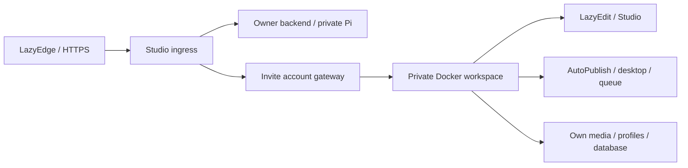

[English](../README.md) · [العربية](README.ar.md) · [Español](README.es.md) · [Français](README.fr.md) · [日本語](README.ja.md) · [한국어](README.ko.md) · [Tiếng Việt](README.vi.md) · [中文 (简体)](README.zh-Hans.md) · [中文（繁體）](README.zh-Hant.md) · [Deutsch](README.de.md) · [Русский](README.ru.md)

[](https://github.com/lachlanchen/lachlanchen/blob/main/figs/banner.png)

# AutoPublication

*Biên tập, sửa và xuất bản video hoặc nhạc trong không gian riêng.*

[](https://edit.lazying.art) [](https://github.com/sponsors/lachlanchen)

AutoPublication tích hợp LazyEdit, AutoPublish, AutoPubMonitor và phiên âm đa ngôn ngữ bằng các kho mã được ghim. Dịch vụ Docker theo lời mời cung cấp cho mỗi người một màn hình Linux riêng để đăng nhập nền tảng, máy xử lý biên tập và hàng đợi xuất bản bền vững.

Thành viên thông thường có thể chỉnh sửa và xem trước video mà không cần tài khoản mạng xã hội. Người vận hành bật tính năng đăng riêng cho các tài khoản được duyệt. Người xét duyệt có không gian chỉnh sửa riêng, không được truy cập Pi, kênh hay nội dung riêng của chủ sở hữu. Giới hạn hằng tháng là 10/60/150 phút video gốc; thanh toán vẫn tắt cho đến khi kiểm thử mua hàng thực tế.

| Donate | PayPal | Stripe |
| --- | --- | --- |
| [](https://chat.lazying.art/donate) | [](https://paypal.me/RongzhouChen) | [](https://buy.stripe.com/aFadR8gIaflgfQV6T4fw400) |

## Cách hoạt động

Dịch vụ hiện tại là [edit.lazying.art](https://edit.lazying.art); người được mời vào [/accounts](https://edit.lazying.art/accounts). Chủ sở hữu giữ máy xử lý và Pi riêng hiện có. Những người khác có Docker worker, dữ liệu, thiết lập, cơ sở dữ liệu và hồ sơ trình duyệt độc lập. Tên miền riêng là tùy chọn cho đợt thử nghiệm tin cậy này.

Giao diện gốc iOS, Android và Mac có 11 ngôn ngữ, điều khiển đăng nhập nền tảng riêng và xóa tài khoản thành viên. Pi của chủ sở hữu chỉ dành cho lachlanchen. Liên kết, đăng nhập và thu hồi Google đã qua kiểm tra trình duyệt thực tế trong dự án thử nghiệm chỉ xác thực danh tính. Apple đã cấu hình nhưng còn chờ đăng nhập thực tế. Thanh toán vẫn tắt, chờ xác định hạn mức và thử nghiệm mua hàng thực tế.


```mermaid
flowchart LR
    E[LazyEdge / HTTPS] --> R[Studio ingress]
    R --> O[Owner backend / private Pi]
    R --> G[Invite account gateway]
    G --> W[Private Docker workspace]
    W --> L[LazyEdit / Studio]
    W --> A[AutoPublish / desktop / queue]
    W --> D[Own media / profiles / database]
```

## Thành phần cố định

| Thành phần | Commit | |
| --- | --- | --- |
| `LazyEdit` | `cb80417` | Biên tập, sửa, API Studio và container |
| `AutoPublish` | `c7bcbe9` | Bộ kết nối nền tảng, đăng nhập và hàng đợi trình duyệt |
| `AutoPubMonitor` | `a097a054` | Giám sát và đồng bộ hiện có |
| `whisper_with_lang_detect` | `5b02dceb` | Phiên âm độc lập và VAD |

[docs/hosted-service.md](../docs/hosted-service.md) · [LazyEdit](https://github.com/lachlanchen/LazyEdit) · [AutoPublish](https://github.com/lachlanchen/AutoPublish) · [AutoPubMonitor](https://github.com/lachlanchen/AutoPubMonitor) · [MultilingualWhisper](https://github.com/lachlanchen/MultilingualWhisper)

## Bắt đầu nhanh

Cần Linux x86-64, Docker/Compose, Node 22 và môi trường Python phù hợp. Hướng dẫn triển khai mô tả xây dựng, khởi tạo, chạy và tuyến LazyEdge. Sao chép mã không tự triển khai dịch vụ.

```bash
git clone https://github.com/lachlanchen/AutoPublication.git
cd AutoPublication
git submodule update --init --recursive
scripts/autopublication --help
```

## Vận hành và riêng tư

Không đưa mật khẩu, khóa, token, cookie, hồ sơ, cơ sở dữ liệu tài khoản hay nội dung riêng vào Git. Biên tập và xuất bản dùng một kho dữ liệu chuẩn; tệp tải lên hoàn tất được đổi tên, thư mục giải nén tạm của tác vụ kết thúc được dọn. Nguồn, bản xử lý và ZIP tái sử dụng là các sản phẩm khác nhau. Kho này không khởi động lại quy trình của chủ sở hữu.

[AGENTS.md](../AGENTS.md) · [docs/hosted-service.md](../docs/hosted-service.md)

## Kiểm chứng

Chạy kiểm thử tài khoản/truyền tải và kiểm tra tệp công khai trước khi đẩy mã. Kiểm thử nhanh không đăng bài thật. Sửa, kiểm chứng và push trong kho phụ trách trước, rồi cập nhật các commit ghim ở đây.

```bash
npm ci --prefix LazyEdit/app --no-audit --no-fund
scripts/autopublication test
python scripts/check_public_files.py
```

## Trạng thái và phạm vi

Thử nghiệm theo lời mời đã chạy qua HTTPS/LazyEdge hiện có. Đã kiểm chứng tạo tài khoản, màn hình WSS riêng, đăng nhập API giới hạn, tải lên tiếp tục và tách biệt chủ sở hữu. CPU Whisper là môi trường đã thử. Tài khoản nền tảng mới cần QR/2FA riêng. Chưa có tính phí, khôi phục, hạn mức lưu trữ cứng hay bảo vệ trước người dùng thù địch.

## Trích dẫn

GitHub đọc [CITATION.cff](../CITATION.cff). Dùng mục ổn định dưới đây để trích dẫn phần mềm.

```bibtex
@software{chen_autopublication_2026,
  author = {Chen, Lachlan},
  title = {AutoPublication: account-isolated video and music publishing},
  year = {2026},
  url = {https://github.com/lachlanchen/AutoPublication}
}
```

## Ủng hộ

Ủng hộ bảo trì qua [GitHub Sponsors](https://github.com/sponsors/lachlanchen) hoặc các liên kết trên.
