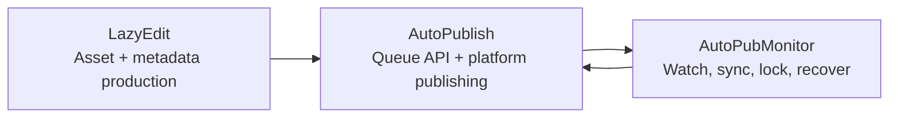

[English](../README.md) · [العربية](README.ar.md) · [Español](README.es.md) · [Français](README.fr.md) · [日本語](README.ja.md) · [한국어](README.ko.md) · [Tiếng Việt](README.vi.md) · [中文 (简体)](README.zh-Hans.md) · [中文（繁體）](README.zh-Hant.md) · [Deutsch](README.de.md) · [Русский](README.ru.md)


[](https://github.com/lachlanchen/lachlanchen/blob/main/figs/banner.png)

# AutoPublication


这是一个基于固定子模块（pinned submodules）的 AI 视频工作流技术栈规范根文档。

## 📌 一览

| 区域 | 详情 |
| --- | --- |
| 仓库类型 | 使用固定 git 子模块的元仓库 |
| 根仓库运行时角色 | 文档 + 编排入口 |
| 核心子模块 | `AutoPubMonitor`、`LazyEdit`、`AutoPublish` |
| 规范文档来源 | 根目录 `README.md` |
| 多语言版本 | `i18n/README.*.md` |
| 最新流水线产物快照 | `.auto-readme-work/20260302_124338/` |

## 🧭 概述

`AutoPublication` 协调一条端到端内容自动化流水线：

1. 在 `LazyEdit` 中准备、编辑并生成素材。
2. 在 `AutoPublish` 中将素材发布到目标平台。
3. 使用 `AutoPubMonitor` 保持队列/监控/同步链路健康。

根仓库有意固定子模块提交，以便在不同环境和部署主机上保持可复现性。

### 这个仓库是什么

- 用于安装、运维与集成的规范根文档。
- 子模块版本的 gitlink 固定层。
- 多语言文档源（`i18n/README.*.md`）。
- 流水线追踪与产物历史（`.auto-readme-work/*`）。

### 这个仓库不是什么

- 不是一个带单一根依赖清单的统一运行时包。
- 不是各子模块 README/脚本的替代品。
- 当前不提供根级统一 `.env` 模式。

## ✨ 特性

- 通过固定子模块提交实现可复现架构。
- 编辑、发布、监控之间具备清晰的职责边界。
- Linux 优先运维（`tmux`、可选 `systemd`、FFmpeg、浏览器自动化）。
- 文档优先工作流，并提供 i18n 版本。
- 在 `.auto-readme-work/` 下可追踪 README 生成上下文。

## 🧱 子模块架构

### 根模块映射

| 模块 | 角色 | 运行时画像 | 常见入口 |
| --- | --- | --- | --- |
| `AutoPubMonitor` | 围绕发布工作流的队列/监控/同步编排 | Shell 优先 + Python 辅助 + `tmux`/可选 `systemd` | `autopub_monitor/autopub_monitor_tmux_session.sh`, `autopub_monitor/process_queue.sh`, `autopub_monitor/monitor_autopublish.sh` |
| `LazyEdit` | AI 辅助媒体生成/编辑/字幕/元数据工作流 | Tornado 后端 + Expo 前端 + 处理模块 | `app.py`, `start_lazyedit.sh`, `app/`, `lazyedit/` |
| `AutoPublish` | 基于浏览器的多平台发布与队列 API 服务 | Python 脚本 + Selenium + Tornado 队列 API | `autopub.py`, `app.py`, `pub_*.py`, `login_*.py` |

### 依赖边界

| 边界 | 范围内 | 范围外 |
| --- | --- | --- |
| `LazyEdit` | 编辑/生成流水线、UI/后端、字幕与元数据准备 | 平台登录自动化与各平台发布动作 |
| `AutoPublish` | 发布适配器、鉴权/会话处理、队列 API、发布执行 | 编辑/转录 UI 及多数上游转换 |
| `AutoPubMonitor` | 队列监视、锁、同步任务、tmux/service 监管 | 编辑器 UI 行为与深层平台浏览器流程 |
| Root (`AutoPublication`) | 文档、版本编排、子模块固定策略 | 统一运行时依赖管理 |

### 集成契约

| 交接项 | 生产方 | 消费方 | 契约重点 |
| --- | --- | --- | --- |
| 已准备媒体素材 | `LazyEdit` | `AutoPublish` | 目录约定、文件名、媒体可发布就绪性 |
| 元数据/字幕 | `LazyEdit` | `AutoPublish` | 标题/描述/标签结构与字幕可用性 |
| 发布状态与队列健康 | `AutoPublish` | `AutoPubMonitor` | API 端点可用性与队列语义 |
| 同步/看门狗控制 | `AutoPubMonitor` | `AutoPublish` + ops | 锁机制纪律、队列完整性、可恢复重启 |

### 运行时职责流



1. `LazyEdit` 产出视频与元数据包。
2. `AutoPublish` 执行频道/平台发布动作。
3. `AutoPubMonitor` 监管队列与同步循环。

## 📦 当前子模块 Pin

当前根仓库固定版本（`git submodule status`）：

- `AutoPubMonitor`: `6daa87ce612c2dab75fac9478d4523abd418f69d`
- `AutoPublish`: `4f348ac342bfaff7bc435985085cedd9b448e1e8`
- `LazyEdit`: `dc503d6db63b13db812fef5d9c8ffe0a882d725e`

本地检查：

```bash
git submodule status
git submodule status --recursive
```

嵌套说明：`LazyEdit` 含有额外嵌套子模块（例如 `whisper_with_lang_detect`、`furigana`、字幕相关仓库），因此根仓库很多操作应使用 `--recursive`。

## 🗂️ 项目结构

```text
AutoPublication/
├── README.md
├── .gitmodules
├── .gitignore
├── i18n/
│   ├── README.ar.md
│   ├── README.de.md
│   ├── README.es.md
│   ├── README.fr.md
│   ├── README.ja.md
│   ├── README.ko.md
│   ├── README.ru.md
│   ├── README.vi.md
│   ├── README.zh-Hans.md
│   └── README.zh-Hant.md
├── AutoPubMonitor/                  # submodule
│   ├── README.md
│   └── autopub_monitor/
├── LazyEdit/                        # submodule
│   ├── README.md
│   ├── app.py
│   ├── app/
│   └── lazyedit/
├── AutoPublish/                     # submodule
│   ├── README.md
│   ├── app.py
│   ├── autopub.py
│   └── pub_*.py
└── .auto-readme-work/
    └── <timestamp>/
        ├── pipeline-context.md
        ├── language-nav-root.md
        ├── language-nav-i18n.md
        ├── translation-plan.txt
        └── repo-structure-analysis.md
```

### 关键路径

| 路径 | 用途 |
| --- | --- |
| `.gitmodules` | 声明子模块远程仓库与路径 |
| `i18n/README.*.md` | 根 README 的本地化版本 |
| `.auto-readme-work/*` | README 生成追踪/产物 |
| `AutoPubMonitor/autopub_monitor/autopub.config` | Monitor 队列/同步/运行时配置 |
| `LazyEdit/config.py` | LazyEdit 环境/路径默认值 |
| `AutoPublish/.env.example` | AutoPublish 凭据/环境模板 |

## 🧰 前置条件

跨模块的 Linux 优先基线：

- `git`（支持子模块）
- `bash`
- Python `3.10+`（部分 monitor 安装脚本仍假设 `3.8` 环境命名）
- `tmux`
- `ffmpeg` / `ffprobe`
- `inotify-tools`
- `rsync`
- Chrome/Chromium + 匹配版本的 WebDriver
- Node.js + npm（用于 `LazyEdit/app` 前端）
- 可选：`systemd`、`conda`

假设：macOS/Windows 需要自行适配脚本/路径/服务。

## 🛠️ 安装与初始化

### 1. 连同子模块克隆

```bash
git clone --recurse-submodules git@github.com:lachlanchen/AutoPublication.git
cd AutoPublication
```

如果仓库已克隆：

```bash
git submodule update --init --recursive
```

### 2. 同步并验证子模块对齐

```bash
git submodule sync --recursive
git submodule status --recursive
git submodule foreach --recursive 'git rev-parse --abbrev-ref HEAD; git rev-parse --short HEAD'
```

### 3. 按子模块完成配置流程

| 子模块 | 主要配置 | 配置重点 | 首次验证 |
| --- | --- | --- | --- |
| `LazyEdit` | `config.py`（+ 可选 `.env`） | Python/后端依赖、前端依赖、上传/输出/API 路径 | `cd LazyEdit && python app.py` |
| `AutoPublish` | `.env`（由 `.env.example` 复制） | 凭据、浏览器 driver、队列/API 模式 | `cd AutoPublish && python app.py --port 8081` |
| `AutoPubMonitor` | `autopub_monitor/autopub.config` | 队列/同步/锁路径、API 目标、tmux/service 设置 | `cd AutoPubMonitor && ./autopub_monitor/autopub_monitor_tmux_session.sh start` |

权威模块文档：

- `AutoPubMonitor/README.md`
- `LazyEdit/README.md`
- `AutoPublish/README.md`

## ▶️ 使用与运维

根仓库的使用主要是编排与版本对齐。

### 日常操作流程

```bash
# 保持检出状态与根仓库 pin 一致
git submodule sync --recursive
git submodule update --init --recursive

# 验证当前状态
git submodule status --recursive
```

### 端到端运行流程

1. 启动 `LazyEdit` 并准备素材。
2. 启动 `AutoPublish`（API 模式或 CLI watcher 模式）。
3. 启动 `AutoPubMonitor`，维持队列/同步/看门狗连续性。

### 快速启动命令

```bash
# LazyEdit
cd LazyEdit
python app.py
# optional frontend in second terminal:
# cd app && npx expo start --web

# AutoPublish
cd ../AutoPublish
python app.py --port 8081
# or CLI watcher mode:
# python autopub.py --help

# AutoPubMonitor
cd ../AutoPubMonitor
./autopub_monitor/autopub_monitor_tmux_session.sh start
```

## 🧪 本地开发工作流

### 推荐循环

1. 编码前先对齐根仓库 pin。
2. 一次只在一个子模块内开发和测试。
3. 验证跨模块交接（`LazyEdit -> AutoPublish -> AutoPubMonitor`）。
4. 先在子模块仓库提交实现改动。
5. 最后在根仓库提交指针更新（`gitlinks`）。

### 指针升级流程（示例）

```bash
# root align first
git submodule sync --recursive
git submodule update --init --recursive

# edit and commit in submodule
cd LazyEdit
git switch -c feature/<name>
# ...change/test...
git add -A && git commit -m "feat: <summary>"
cd ..

# capture new pointer in root
git add LazyEdit
git commit -m "chore(submodule): bump LazyEdit pointer"
```

### 提交边界规则

- 根仓库提交应聚焦文档、编排约定与指针升级。
- 实现层改动应先在子模块仓库提交。
- 可能情况下，将根仓库指针提交与大体量文档改动分离。

## ⚙️ 配置

根仓库没有统一运行时配置。请直接配置各子模块：

### `AutoPubMonitor`

- 文件：`AutoPubMonitor/autopub_monitor/autopub.config`
- 常见项：队列文件、锁文件、同步路径、API base URL、conda 环境、脚本路径

### `LazyEdit`

- 文件：`LazyEdit/config.py`（+ 可选 `.env`）
- 常见项：上传/输出目录、后端端口、AutoPublish endpoint、字幕工具、超时

### `AutoPublish`

- 文件：`AutoPublish/.env.example`（复制为本地 `.env`）
- 常见项：平台凭据、浏览器/driver 路径、SMTP/email 设置、验证码服务密钥

安全建议：机器相关配置与密钥请保存在被忽略的本地文件/环境变量中。

## 🔄 子模块更新策略

### A. 初始化并同步到当前 pin

```bash
git submodule sync --recursive
git submodule update --init --recursive
```

### B. 有意更新到远程最新

仅在你明确要推进固定版本时使用：

```bash
git submodule update --remote --recursive
```

然后验证并提交指针：

```bash
git add AutoPubMonitor LazyEdit AutoPublish
git commit -m "chore(submodules): bump submodule pointers"
```

### C. 固定到指定 commit 或 tag

```bash
cd LazyEdit
git fetch origin
git checkout <commit-or-tag>
cd ..
git add LazyEdit
git commit -m "chore(submodule): pin LazyEdit to <commit-or-tag>"
```

按需对 `AutoPubMonitor` 与 `AutoPublish` 重复。

### D. 合并前审查指针差异

```bash
git diff --submodule=log
git submodule status --recursive
```

### E. 推荐发布流程

1. 递归同步/初始化。
2. 一次仅更新一个子模块。
3. 运行子模块级冒烟测试。
4. 运行跨交接边界的集成冒烟检查。
5. 只暂存预期的 gitlink 改动。
6. 提交信息明确模块名与原因。

### F. 固定策略

- 根仓库应固定在已验证可用的提交。
- 未完成集成验证前，避免一次性全模块大升级。
- 使用明确的 pin 提交信息（`chore(submodule): pin <module> to <sha>`）。
- 将根仓库视为发布清单，将子模块分支视为实现流。

## 🔧 故障排查（子模块同步与状态）

### 子模块目录为空或缺少文件

```bash
git submodule sync --recursive
git submodule update --init --recursive
```

### `fatal: no submodule mapping found in .gitmodules`

通常是元数据陈旧或路径不匹配：

```bash
cat .gitmodules
git submodule sync --recursive
git submodule update --init --recursive
```

### `git submodule status` 显示 `-`、`+` 或 `U`

- `-`：子模块未初始化。
- `+`：检出提交与根仓库 pin 不一致。
- `U`：子模块指针存在合并冲突。

恢复方式：

```bash
git submodule update --init --recursive
```

若差异是有意行为，请在根仓库提交 gitlink 更新。

### 子模块内是 Detached HEAD

对固定子模块来说，Detached HEAD 是正常状态。开发前先建分支：

```bash
cd <submodule>
git switch -c feature/<name>
```

### 子模块远程 URL 错误

```bash
git submodule sync --recursive
git submodule foreach --recursive 'git remote -v'
```

如果 `.gitmodules` 有变更，请提交后重新同步。

### 子模块指针合并冲突

选择目标提交指针后执行：

```bash
git add AutoPubMonitor LazyEdit AutoPublish
git commit
```

验证最终 SHA：

```bash
git diff --submodule=log
git submodule status --recursive
```

### 克隆/更新认证失败

根仓库 `.gitmodules` 目前使用 SSH 远程地址（`git@github.com:...`）。

- 确认已配置 GitHub SSH key。
- 或将 `.gitmodules` 改为 HTTPS 远程后执行 `git submodule sync --recursive`。

### 子模块意外显示 dirty

```bash
git submodule foreach --recursive 'git status --short --branch'
```

若是有意修改，请先在各子模块提交，再更新根仓库指针。

### `LazyEdit` 内嵌套子模块未初始化

```bash
git submodule update --init --recursive
```

如果仅需刷新 `LazyEdit` 的嵌套模块：

```bash
git -C LazyEdit submodule update --init --recursive
```

### 元数据陈旧时的强制重同步

当常规 sync/update 无法恢复时使用：

```bash
git submodule deinit -f --all
git submodule sync --recursive
git submodule update --init --recursive
```

## 🛠️ 开发备注

### i18n 策略

- 顶部仅保留一行语言导航。
- 根目录英文 `README.md` 作为规范源。
- 结构变更同步到 `i18n/README.*.md`。

### 流水线上下文产物

- 流水线产物保存在 `.auto-readme-work/<timestamp>/`。
- 这些文件用于可追踪性与文档生成历史，不是运行时输入。

## 🗺️ 路线图

- [ ] 为常见跨子模块任务增加根级编排脚本。
- [ ] 增加子模块同步健康与 pin 漂移的 CI 检查。
- [ ] 增加根 README 与 i18n README 一致性自动检查。
- [ ] 增加端到端运行流架构图。
- [ ] 若计划仓库级授权，增加根级 `LICENSE` 策略文件。

## 🤝 贡献

欢迎针对文档、架构清晰度和工作流可靠性提交贡献。

```bash
# 1) create branch
git checkout -b docs/<short-description>

# 2) stage docs and/or intended pointer updates
git add README.md i18n/README.fr.md AutoPubMonitor LazyEdit AutoPublish

# 3) commit
git commit -m "docs: improve root architecture and submodule workflows"

# 4) push
git push -u origin docs/<short-description>
```

PR 检查清单：

- 保持根 `README.md` 为规范源。
- 保持一行语言选项和一个支持面板。
- bump pin 时在 PR 说明中包含 `git submodule status`。
- 记录每次子模块指针更新的原因。

## Submodules

此仓库包含以下根级 git 子模块：

| Submodule | Repository |
| --- | --- |
| `AutoPubMonitor` | https://github.com/lachlanchen/AutoPubMonitor |
| `LazyEdit` | https://github.com/lachlanchen/LazyEdit |
| `AutoPublish` | https://github.com/lachlanchen/AutoPublish |

## ❤️ Support

| Donate | PayPal | Stripe |
| --- | --- | --- |
| [](https://chat.lazying.art/donate) | [](https://paypal.me/RongzhouChen) | [](https://buy.stripe.com/aFadR8gIaflgfQV6T4fw400) |

## Contact

如有问题、文档修正或协作需求，请使用仓库 Issues。

## 📄 许可证

当前仓库快照尚未提供根级 `LICENSE` 文件。

假设：

- 许可证策略可能由各子模块独立定义。
- 在再分发或商用前，请先审查每个子模块的许可证。
