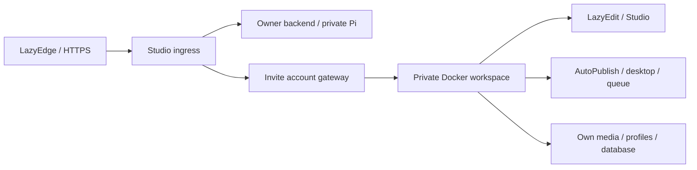

[English](../README.md) · [العربية](README.ar.md) · [Español](README.es.md) · [Français](README.fr.md) · [日本語](README.ja.md) · [한국어](README.ko.md) · [Tiếng Việt](README.vi.md) · [中文 (简体)](README.zh-Hans.md) · [中文（繁體）](README.zh-Hant.md) · [Deutsch](README.de.md) · [Русский](README.ru.md)

[](https://github.com/lachlanchen/lachlanchen/blob/main/figs/banner.png)

# AutoPublication

*在自己的工作空间里编辑、校正并发布视频或音乐。*

[](https://edit.lazying.art) [](https://github.com/sponsors/lachlanchen)

AutoPublication 通过固定源码版本整合 LazyEdit、AutoPublish、AutoPubMonitor 和多语言转录。邀请制 Docker 服务为每位用户提供独立的 Linux 平台登录桌面、编辑后端和持久化发布队列。

| Donate | PayPal | Stripe |
| --- | --- | --- |
| [](https://chat.lazying.art/donate) | [](https://paypal.me/RongzhouChen) | [](https://buy.stripe.com/aFadR8gIaflgfQV6T4fw400) |

## 系统流程

当前服务是 [edit.lazying.art](https://edit.lazying.art)，受邀用户从 [/accounts](https://edit.lazying.art/accounts) 进入。原有用户继续使用既有后端和专属 Pi 发布端；其他用户使用独立 Docker 工作端、媒体、设置、数据库和浏览器配置。这个可信邀请制试点不需要另一个域名。


```mermaid
flowchart LR
    E[LazyEdge / HTTPS] --> R[Studio ingress]
    R --> O[Owner backend / private Pi]
    R --> G[Invite account gateway]
    G --> W[Private Docker workspace]
    W --> L[LazyEdit / Studio]
    W --> A[AutoPublish / desktop / queue]
    W --> D[Own media / profiles / database]
```

## 固定组件

| 组件 | 提交 | |
| --- | --- | --- |
| `LazyEdit` | `00e1d9c` | 编辑、校正、Studio API 与容器 |
| `AutoPublish` | `3cc34fd` | 平台适配、登录配置与持久化浏览器队列 |
| `AutoPubMonitor` | `a097a054` | 既有监控和同步 |
| `whisper_with_lang_detect` | `5b02dceb` | 独立转录与 VAD |

[docs/hosted-service.md](../docs/hosted-service.md) · [LazyEdit](https://github.com/lachlanchen/LazyEdit) · [AutoPublish](https://github.com/lachlanchen/AutoPublish) · [AutoPubMonitor](https://github.com/lachlanchen/AutoPubMonitor) · [MultilingualWhisper](https://github.com/lachlanchen/MultilingualWhisper)

## 快速开始

托管运行需要 Linux x86-64、Docker/Compose、Node 22 和合适的 Python 环境。构建、初始化、启动以及现有 LazyEdge 路由见部署指南；克隆源码不会部署服务。

```bash
git clone https://github.com/lachlanchen/AutoPublication.git
cd AutoPublication
git submodule update --init --recursive
scripts/autopublication --help
```

## 运行与隐私

密码、密钥、令牌、Cookie、浏览器配置、账户数据库及私人媒体都放在 Git 之外。编辑和发布共享唯一的标准媒体存储；上传完成后重命名归档，任务结束后清理临时解压目录。源视频、加工成片和可复用 ZIP 是不同的必要产物。更新本仓库不会重启原有发布流程。

[AGENTS.md](../AGENTS.md) · [docs/hosted-service.md](../docs/hosted-service.md)

## 验证

推送前运行账户及传输测试和公开文件检查。冒烟测试不会实际发布社交内容。先在对应源码仓库修复、验证并推送，再更新这里的固定提交。

```bash
npm ci --prefix LazyEdit/app --no-audit --no-fund
scripts/autopublication test
python scripts/check_public_files.py
```

## 状态与范围

邀请制试点已通过既有 HTTPS/LazyEdge 部署。已验证账户创建、专属 WSS 桌面、限定 API 登录、断点上传和与原有账户的隔离。测试运行环境使用 CPU Whisper。新平台账户仍需自行扫码或完成 2FA。计费、账户恢复、硬性存储配额及针对不可信租户的强化隔离尚未实现。

## 引用

GitHub 读取 [CITATION.cff](../CITATION.cff) 生成引用入口。引用本软件时可使用下面的固定条目。

```bibtex
@software{chen_autopublication_2026,
  author = {Chen, Lachlan},
  title = {AutoPublication: account-isolated video and music publishing},
  year = {2026},
  url = {https://github.com/lachlanchen/AutoPublication}
}
```

## 支持

可以通过 [GitHub Sponsors](https://github.com/sponsors/lachlanchen) 或上方链接支持维护。
