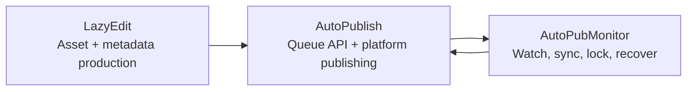

[English](../README.md) · [العربية](README.ar.md) · [Español](README.es.md) · [Français](README.fr.md) · [日本語](README.ja.md) · [한국어](README.ko.md) · [Tiếng Việt](README.vi.md) · [中文 (简体)](README.zh-Hans.md) · [中文（繁體）](README.zh-Hant.md) · [Deutsch](README.de.md) · [Русский](README.ru.md)


[](https://github.com/lachlanchen/lachlanchen/blob/main/figs/banner.png)

# AutoPublication


用於固定版本（pinned）、以子模組為核心的 AI 影片工作流程堆疊之標準根層文件。

## 📌 快速摘要

| 區域 | 詳細資訊 |
| --- | --- |
| 儲存庫類型 | 以固定 git submodule 組成的 meta-repository |
| Root 執行角色 | 文件 + 協作流程入口 |
| 核心子模組 | `AutoPubMonitor`、`LazyEdit`、`AutoPublish` |
| 標準文件來源 | Root `README.md` |
| 多語系版本 | `i18n/README.*.md` |
| 最新 pipeline 產物快照 | `.auto-readme-work/20260302_124338/` |

## 🧭 概覽

`AutoPublication` 協調端到端內容自動化流程：

1. 在 `LazyEdit` 中準備、編輯並產生素材。
2. 於 `AutoPublish` 將素材發布到目標平台。
3. 由 `AutoPubMonitor` 維持佇列／監控／同步的健康狀態。

Root 儲存庫會刻意固定子模組提交點，以確保跨環境與部署主機的可重現性。

### 這個儲存庫是什麼

- 用於安裝、營運與整合的標準 root 文件。
- 子模組版本的 gitlink pinning 層。
- 多語文件來源（`i18n/README.*.md`）。
- Pipeline 追蹤與產物歷史（`.auto-readme-work/*`）。

### 這個儲存庫不是什麼

- 不是只有一份 root 相依清單的單一執行套件。
- 不是各子模組 README/scripts 的替代品。
- 目前不是 root 層統一 `.env` 規格。

## ✨ 功能

- 透過固定子模組提交點提供可重現架構。
- 清楚劃分編輯、發布與監控的權責邊界。
- 以 Linux 為優先的營運方式（`tmux`、可選 `systemd`、FFmpeg、瀏覽器自動化）。
- 以文件為中心並提供 i18n 版本。
- 在 `.auto-readme-work/` 下可追溯 README 生成脈絡。

## 🧱 子模組架構

### Root 模組地圖

| 模組 | 角色 | 執行型態 | 常見進入點 |
| --- | --- | --- | --- |
| `AutoPubMonitor` | 圍繞發布流程的佇列/監看/同步協調 | 以 Shell 為主 + Python 輔助 + `tmux`/可選 `systemd` | `autopub_monitor/autopub_monitor_tmux_session.sh`, `autopub_monitor/process_queue.sh`, `autopub_monitor/monitor_autopublish.sh` |
| `LazyEdit` | AI 輔助媒體生成/編輯/字幕/中繼資料流程 | Tornado 後端 + Expo 前端 + 處理模組 | `app.py`, `start_lazyedit.sh`, `app/`, `lazyedit/` |
| `AutoPublish` | 由瀏覽器驅動的多平台發布與佇列 API 服務 | Python 腳本 + Selenium + Tornado queue API | `autopub.py`, `app.py`, `pub_*.py`, `login_*.py` |

### 相依邊界

| 邊界 | 範圍內 | 範圍外 |
| --- | --- | --- |
| `LazyEdit` | 編輯/生成流程、UI/後端、字幕與中繼資料準備 | 平台登入自動化與各平台發布動作 |
| `AutoPublish` | 發布器適配器、認證/工作階段處理、queue API、發布執行 | 編輯/轉錄 UI 與多數上游轉換 |
| `AutoPubMonitor` | 佇列監看、鎖管理、同步工作、tmux/service 監管 | 編輯器 UI 行為與深層平台瀏覽器流程 |
| Root (`AutoPublication`) | 文件、版本協調、子模組 pinning 策略 | 統一執行期相依管理 |

### 整合契約

| 交接項目 | 生產端 | 消費端 | 契約重點 |
| --- | --- | --- | --- |
| 已準備媒體素材 | `LazyEdit` | `AutoPublish` | 目錄慣例、檔名、媒體就緒性 |
| 中繼資料/字幕 | `LazyEdit` | `AutoPublish` | 標題/描述/標籤格式與字幕可用性 |
| 發布狀態與佇列健康 | `AutoPublish` | `AutoPubMonitor` | API endpoint 可用性與佇列語義 |
| 同步/看門狗控制 | `AutoPubMonitor` | `AutoPublish` + ops | 鎖紀律、佇列完整性、可恢復重啟 |

### 執行責任流



1. `LazyEdit` 產出影片與中繼資料封包。
2. `AutoPublish` 執行頻道/平台發布操作。
3. `AutoPubMonitor` 監督佇列與同步循環。

## 📦 目前子模組 Pin 狀態

目前 root pin（`git submodule status`）：

- `AutoPubMonitor`: `6daa87ce612c2dab75fac9478d4523abd418f69d`
- `AutoPublish`: `4f348ac342bfaff7bc435985085cedd9b448e1e8`
- `LazyEdit`: `dc503d6db63b13db812fef5d9c8ffe0a882d725e`

在本機檢查：

```bash
git submodule status
git submodule status --recursive
```

巢狀提示：`LazyEdit` 內含額外巢狀子模組（例如 `whisper_with_lang_detect`、`furigana`、captioning repos），因此許多 root 操作應使用 `--recursive`。

## 🗂️ 專案結構

```text
AutoPublication/
├── README.md
├── .gitmodules
├── .gitignore
├── i18n/
│   ├── README.ar.md
│   ├── README.de.md
│   ├── README.es.md
│   ├── README.fr.md
│   ├── README.ja.md
│   ├── README.ko.md
│   ├── README.ru.md
│   ├── README.vi.md
│   ├── README.zh-Hans.md
│   └── README.zh-Hant.md
├── AutoPubMonitor/                  # submodule
│   ├── README.md
│   └── autopub_monitor/
├── LazyEdit/                        # submodule
│   ├── README.md
│   ├── app.py
│   ├── app/
│   └── lazyedit/
├── AutoPublish/                     # submodule
│   ├── README.md
│   ├── app.py
│   ├── autopub.py
│   └── pub_*.py
└── .auto-readme-work/
    └── <timestamp>/
        ├── pipeline-context.md
        ├── language-nav-root.md
        ├── language-nav-i18n.md
        ├── translation-plan.txt
        └── repo-structure-analysis.md
```

### 重要路徑

| 路徑 | 用途 |
| --- | --- |
| `.gitmodules` | 宣告子模組遠端與路徑 |
| `i18n/README.*.md` | Root README 的在地化版本 |
| `.auto-readme-work/*` | README 生成追蹤/產物 |
| `AutoPubMonitor/autopub_monitor/autopub.config` | Monitor 佇列/同步/執行設定 |
| `LazyEdit/config.py` | LazyEdit 環境/路徑預設 |
| `AutoPublish/.env.example` | AutoPublish 憑證/env 範本 |

## 🧰 先決條件

模組共用、以 Linux 為主的基準：

- `git`（支援 submodule）
- `bash`
- Python `3.10+`（部分 monitor 安裝器仍假設 `3.8` env 名稱）
- `tmux`
- `ffmpeg` / `ffprobe`
- `inotify-tools`
- `rsync`
- Chrome/Chromium + 相容 WebDriver
- Node.js + npm（供 `LazyEdit/app` 前端）
- 可選：`systemd`、`conda`

假設：macOS/Windows 需要調整 script/path/service。

## 🛠️ 安裝與啟動

### 1. 以子模組方式 clone

```bash
git clone --recurse-submodules git@github.com:lachlanchen/AutoPublication.git
cd AutoPublication
```

若已經 clone：

```bash
git submodule update --init --recursive
```

### 2. 同步並驗證子模組一致性

```bash
git submodule sync --recursive
git submodule status --recursive
git submodule foreach --recursive 'git rev-parse --abbrev-ref HEAD; git rev-parse --short HEAD'
```

### 3. 依子模組進行設定流程

| 子模組 | 主要設定 | 設定重點 | 首次驗證 |
| --- | --- | --- | --- |
| `LazyEdit` | `config.py`（+ 可選 `.env`） | Python/後端相依、前端相依、upload/output/API 路徑 | `cd LazyEdit && python app.py` |
| `AutoPublish` | `.env`（由 `.env.example` 複製） | 憑證、瀏覽器 driver、queue/API 模式 | `cd AutoPublish && python app.py --port 8081` |
| `AutoPubMonitor` | `autopub_monitor/autopub.config` | 佇列/同步/鎖路徑、API 目標、tmux/service 設定 | `cd AutoPubMonitor && ./autopub_monitor/autopub_monitor_tmux_session.sh start` |

權威模組文件：

- `AutoPubMonitor/README.md`
- `LazyEdit/README.md`
- `AutoPublish/README.md`

## ▶️ 使用與營運

Root 層使用方式主要是協調與版本對齊。

### 每日操作流程

```bash
# Keep checkout aligned to root pins
git submodule sync --recursive
git submodule update --init --recursive

# Verify current state
git submodule status --recursive
```

### 端到端執行流程

1. 啟動 `LazyEdit` 並準備素材。
2. 以 API 模式或 CLI watcher 模式啟動 `AutoPublish`。
3. 啟動 `AutoPubMonitor` 以維持佇列/同步/看門狗連續性。

### 快速啟動命令

```bash
# LazyEdit
cd LazyEdit
python app.py
# optional frontend in second terminal:
# cd app && npx expo start --web

# AutoPublish
cd ../AutoPublish
python app.py --port 8081
# or CLI watcher mode:
# python autopub.py --help

# AutoPubMonitor
cd ../AutoPubMonitor
./autopub_monitor/autopub_monitor_tmux_session.sh start
```

## 🧪 本地開發工作流程

### 建議循環

1. 開發前先對齊 root pins。
2. 一次只在單一子模組內開發與測試。
3. 驗證跨子模組交接（`LazyEdit -> AutoPublish -> AutoPubMonitor`）。
4. 先在子模組儲存庫提交實作變更。
5. 最後才提交 root 指標更新（`gitlinks`）。

### Pointer bump 流程（範例）

```bash
# root align first
git submodule sync --recursive
git submodule update --init --recursive

# edit and commit in submodule
cd LazyEdit
git switch -c feature/<name>
# ...change/test...
git add -A && git commit -m "feat: <summary>"
cd ..

# capture new pointer in root
git add LazyEdit
git commit -m "chore(submodule): bump LazyEdit pointer"
```

### Commit 邊界規則

- Root commit 應聚焦於文件、協調慣例與 pointer bump。
- 實作變更應先在子模組儲存庫提交。
- 可能的話，將 root pointer commit 與大型文件/內容編輯分開。

## ⚙️ 設定

目前沒有 root 層統一執行設定。請直接設定各子模組：

### `AutoPubMonitor`

- 檔案：`AutoPubMonitor/autopub_monitor/autopub.config`
- 常見值：queue files、lock files、sync paths、API base URL、conda env、script paths

### `LazyEdit`

- 檔案：`LazyEdit/config.py`（加上可選 `.env`）
- 常見值：upload/output directories、backend port、AutoPublish endpoint、subtitle/caption tools、timeouts

### `AutoPublish`

- 檔案：`AutoPublish/.env.example`（複製為本機 `.env`）
- 常見值：平台憑證、browser/driver paths、SMTP/email settings、captcha service keys

安全建議：機器特定設定與密鑰請放在已忽略檔案或環境變數中。

## 🔄 子模組更新策略

### A. 初始化並同步到目前 pins

```bash
git submodule sync --recursive
git submodule update --init --recursive
```

### B. 有意識地更新到遠端最新

僅在你明確要移動固定版本時使用：

```bash
git submodule update --remote --recursive
```

接著驗證並提交指標：

```bash
git add AutoPubMonitor LazyEdit AutoPublish
git commit -m "chore(submodules): bump submodule pointers"
```

### C. 固定到明確 commit 或 tag

```bash
cd LazyEdit
git fetch origin
git checkout <commit-or-tag>
cd ..
git add LazyEdit
git commit -m "chore(submodule): pin LazyEdit to <commit-or-tag>"
```

依需要對 `AutoPubMonitor` 與 `AutoPublish` 重複操作。

### D. 合併前檢查 pointer 差異

```bash
git diff --submodule=log
git submodule status --recursive
```

### E. 建議發版流程

1. 遞迴 sync/init。
2. 一次更新一個子模組。
3. 執行子模組層級 smoke tests。
4. 在交接邊界執行整合 smoke checks。
5. 只暫存預期的 gitlink 變更。
6. 以明確模組名稱與理由提交。

### F. Pinning 策略

- Root 維持固定於已驗證可用的 commits。
- 避免未經整合驗證就一次大幅更新全部模組。
- 使用明確 pin 訊息（`chore(submodule): pin <module> to <sha>`）。
- 將 root 視為 release manifest，將子模組分支視為實作流程。

## 🔧 疑難排解（子模組同步與狀態）

### 子模組目錄是空的或缺少檔案

```bash
git submodule sync --recursive
git submodule update --init --recursive
```

### `fatal: no submodule mapping found in .gitmodules`

通常是舊 metadata 或路徑不一致：

```bash
cat .gitmodules
git submodule sync --recursive
git submodule update --init --recursive
```

### `git submodule status` 顯示 `-`、`+` 或 `U`

- `-`：子模組未初始化。
- `+`：目前 checkout commit 與 root pin 不同。
- `U`：子模組指標有合併衝突。

復原：

```bash
git submodule update --init --recursive
```

若差異是刻意的，請在 root 提交 gitlink 更新。

### 子模組內是 Detached HEAD

對於固定子模組，Detached HEAD 是正常現象。開發前請先建立分支：

```bash
cd <submodule>
git switch -c feature/<name>
```

### 子模組的 remote URL 錯誤

```bash
git submodule sync --recursive
git submodule foreach --recursive 'git remote -v'
```

若 `.gitmodules` 有變更，請提交後再重新 sync。

### 子模組 pointer 合併衝突

挑選預期的 commit pointers 後：

```bash
git add AutoPubMonitor LazyEdit AutoPublish
git commit
```

驗證所選 SHA：

```bash
git diff --submodule=log
git submodule status --recursive
```

### Clone/update 認證失敗

目前 root `.gitmodules` 使用 SSH remotes（`git@github.com:...`）。

- 確保 GitHub SSH keys 已設定。
- 或改用 `.gitmodules` 中的 HTTPS remotes，然後執行 `git submodule sync --recursive`。

### 子模組看起來意外 dirty

```bash
git submodule foreach --recursive 'git status --short --branch'
```

先在每個子模組提交有意圖的變更，再更新 root pointers。

### `LazyEdit` 的巢狀子模組未初始化

```bash
git submodule update --init --recursive
```

若只要刷新 `LazyEdit` 的巢狀模組：

```bash
git -C LazyEdit submodule update --init --recursive
```

### metadata 過舊時的強制重同步

當一般 sync/update 無法恢復狀態時使用：

```bash
git submodule deinit -f --all
git submodule sync --recursive
git submodule update --init --recursive
```

## 🛠️ 開發備註

### i18n 策略

- 頂端僅保留一行語言選項。
- 以英語 root `README.md` 為標準來源。
- 將結構變更同步到 `i18n/README.*.md`。

### Pipeline context 產物

- Pipeline 產物存放於 `.auto-readme-work/<timestamp>/`。
- 僅用於可追溯性與文件生成歷史，不作為執行期輸入。

## 🗺️ 路線圖

- [ ] 為常見跨子模組任務新增 root 協調腳本。
- [ ] 新增子模組同步健康度與 pin drift 的 CI 檢查。
- [ ] 新增 root/i18n README 一致性自動檢查。
- [ ] 新增端到端執行流程的架構圖。
- [ ] 若儲存庫層級授權是預期目標，新增 root `LICENSE` 政策檔。

## 🤝 貢獻

歡迎對文件、架構清晰度與工作流程可靠性提出貢獻。

```bash
# 1) create branch
git checkout -b docs/<short-description>

# 2) stage docs and/or intended pointer updates
git add README.md i18n/README.fr.md AutoPubMonitor LazyEdit AutoPublish

# 3) commit
git commit -m "docs: improve root architecture and submodule workflows"

# 4) push
git push -u origin docs/<short-description>
```

PR 檢查清單：

- 維持 root `README.md` 為標準來源。
- 保持一行 language-options 與一個 support panel。
- 若 bump pins，於 PR 說明附上 `git submodule status`。
- 記錄每次子模組 pointer 更新的理由。

## Submodules

此儲存庫包含以下 root-level git submodules：

| Submodule | Repository |
| --- | --- |
| `AutoPubMonitor` | https://github.com/lachlanchen/AutoPubMonitor |
| `LazyEdit` | https://github.com/lachlanchen/LazyEdit |
| `AutoPublish` | https://github.com/lachlanchen/AutoPublish |

## ❤️ Support

| Donate | PayPal | Stripe |
| --- | --- | --- |
| [](https://chat.lazying.art/donate) | [](https://paypal.me/RongzhouChen) | [](https://buy.stripe.com/aFadR8gIaflgfQV6T4fw400) |

## Contact

若有問題、文件修正或協作事宜，請使用 repository issues。

## 📄 License

目前此儲存庫快照尚未提供 root-level `LICENSE` 檔。

假設：

- 授權可能由各子模組各自管理。
- 重新散布或商業使用前，請先確認各子模組授權。
