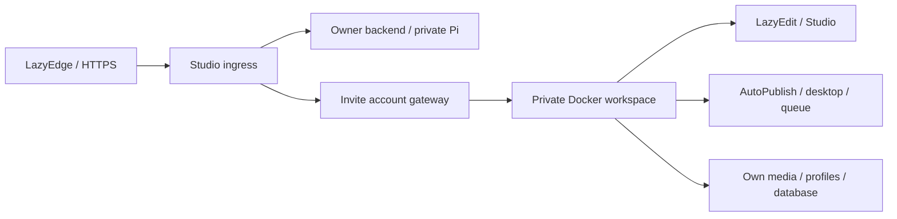

[English](../README.md) · [العربية](README.ar.md) · [Español](README.es.md) · [Français](README.fr.md) · [日本語](README.ja.md) · [한국어](README.ko.md) · [Tiếng Việt](README.vi.md) · [中文 (简体)](README.zh-Hans.md) · [中文（繁體）](README.zh-Hant.md) · [Deutsch](README.de.md) · [Русский](README.ru.md)

[](https://github.com/lachlanchen/lachlanchen/blob/main/figs/banner.png)

# AutoPublication

*在自己的工作空間裡編輯、校正並發布影片或音樂。*

[](https://edit.lazying.art) [](https://github.com/sponsors/lachlanchen)

AutoPublication 以固定原始碼版本整合 LazyEdit、AutoPublish、AutoPubMonitor 和多語言轉錄。邀請制 Docker 服務為每位使用者提供獨立的 Linux 平台登入桌面、編輯後端和持久化發布佇列。

| Donate | PayPal | Stripe |
| --- | --- | --- |
| [](https://chat.lazying.art/donate) | [](https://paypal.me/RongzhouChen) | [](https://buy.stripe.com/aFadR8gIaflgfQV6T4fw400) |

## 系統流程

目前服務是 [edit.lazying.art](https://edit.lazying.art)，受邀使用者從 [/accounts](https://edit.lazying.art/accounts) 進入。原有使用者繼續使用既有後端和專屬 Pi 發布端；其他使用者使用獨立 Docker 工作端、媒體、設定、資料庫與瀏覽器設定檔。此可信邀請制試點不需要另一個網域。

原生 iOS、Android 和 Mac 介面支援11種語言、私有平台登入控制及會員帳號刪除。原有 Pi 僅供 lachlanchen 使用。Apple/Google 登入與商店訂閱已準備，但在完成獨立供應商設定、使用限制和實際商店驗證前保持關閉。


```mermaid
flowchart LR
    E[LazyEdge / HTTPS] --> R[Studio ingress]
    R --> O[Owner backend / private Pi]
    R --> G[Invite account gateway]
    G --> W[Private Docker workspace]
    W --> L[LazyEdit / Studio]
    W --> A[AutoPublish / desktop / queue]
    W --> D[Own media / profiles / database]
```

## 固定元件

| 元件 | 提交 | |
| --- | --- | --- |
| `LazyEdit` | `8f2378e` | 編輯、校正、Studio API 與容器 |
| `AutoPublish` | `c7bcbe9` | 平台配接、登入設定與持久化瀏覽器佇列 |
| `AutoPubMonitor` | `a097a054` | 既有監控與同步 |
| `whisper_with_lang_detect` | `5b02dceb` | 獨立轉錄與 VAD |

[docs/hosted-service.md](../docs/hosted-service.md) · [LazyEdit](https://github.com/lachlanchen/LazyEdit) · [AutoPublish](https://github.com/lachlanchen/AutoPublish) · [AutoPubMonitor](https://github.com/lachlanchen/AutoPubMonitor) · [MultilingualWhisper](https://github.com/lachlanchen/MultilingualWhisper)

## 快速開始

託管運作需要 Linux x86-64、Docker/Compose、Node 22 和合適的 Python 環境。建構、初始化、啟動與既有 LazyEdge 路由見部署指南；複製原始碼不會部署服務。

```bash
git clone https://github.com/lachlanchen/AutoPublication.git
cd AutoPublication
git submodule update --init --recursive
scripts/autopublication --help
```

## 運作與私隱

密碼、金鑰、權杖、Cookie、瀏覽器設定檔、帳戶資料庫及私人媒體都放在 Git 之外。編輯與發布共享唯一的標準媒體儲存；上傳完成後重新命名歸檔，任務結束後清理暫存解壓目錄。來源影片、加工成片和可重用 ZIP 是不同的必要產物。更新本儲存庫不會重啟原有發布流程。

[AGENTS.md](../AGENTS.md) · [docs/hosted-service.md](../docs/hosted-service.md)

## 驗證

推送前執行帳戶及傳輸測試與公開檔案檢查。冒煙測試不會實際發布社交內容。先在對應原始碼儲存庫修復、驗證並推送，再更新這裡的固定提交。

```bash
npm ci --prefix LazyEdit/app --no-audit --no-fund
scripts/autopublication test
python scripts/check_public_files.py
```

## 狀態與範圍

邀請制試點已透過既有 HTTPS/LazyEdge 部署。已驗證帳戶建立、專屬 WSS 桌面、限定 API 登入、斷點上傳及與原有帳戶的隔離。測試環境使用 CPU Whisper。新平台帳戶仍需自行掃碼或完成 2FA。計費、帳戶復原、硬性容量配額及不可信租戶的強化隔離尚未實作。

## 引用

GitHub 讀取 [CITATION.cff](../CITATION.cff) 提供引用入口。引用本軟體時可使用以下固定條目。

```bibtex
@software{chen_autopublication_2026,
  author = {Chen, Lachlan},
  title = {AutoPublication: account-isolated video and music publishing},
  year = {2026},
  url = {https://github.com/lachlanchen/AutoPublication}
}
```

## 支持

可透過 [GitHub Sponsors](https://github.com/sponsors/lachlanchen) 或上方連結支持維護。
